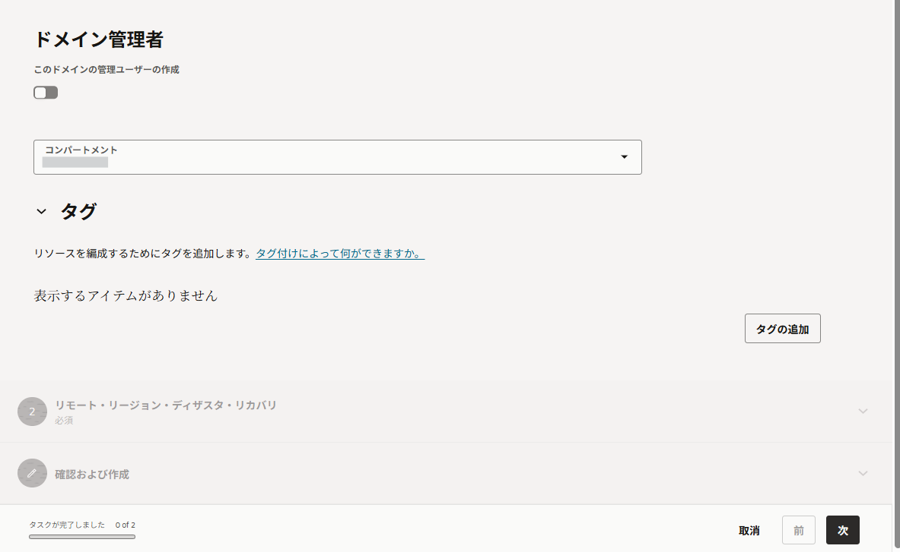
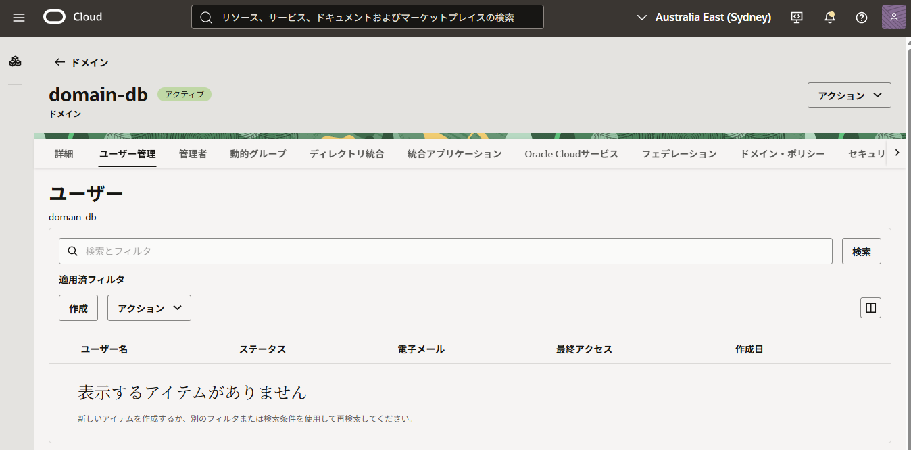
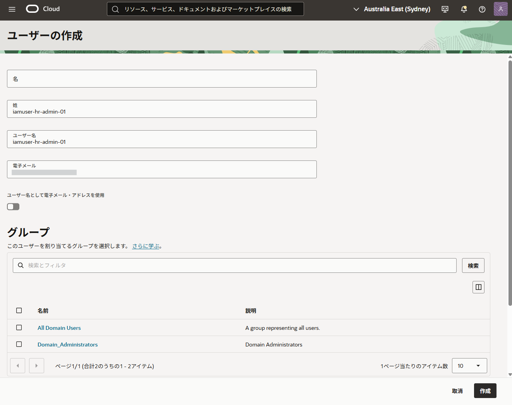
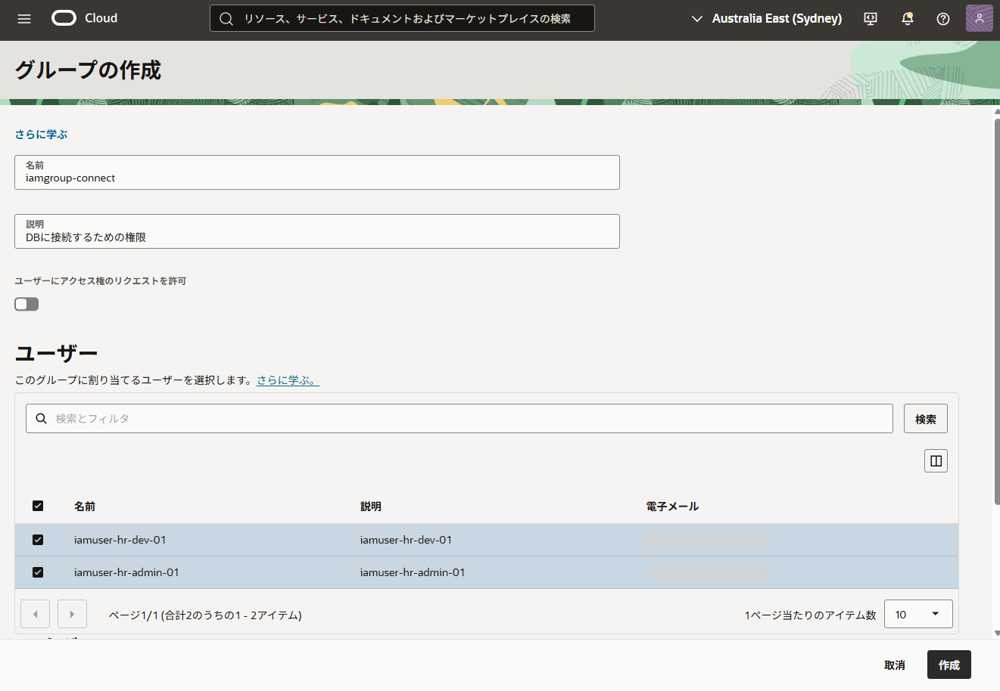
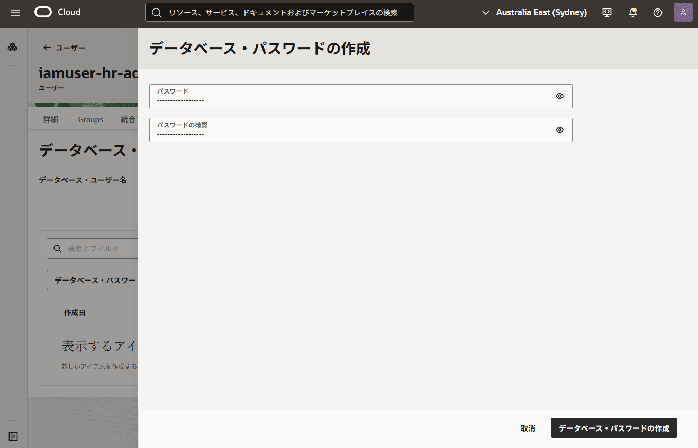

############################################
1. Identity Domain のセットアップ
############################################

本セクションでは、OCI IAM側でDB接続に必要なIdentity Domain、ユーザー、グループ、そしてDBパスワードを作成します。

.. topic:: 実施内容

    + Identity Domain の作成
    + IAMユーザー作成
    + IAMグループ作成
    + DBパスワードの設定

***************************************************
Identity Domain の作成
***************************************************

デフォルトのIdentity Domainを使用することも可能ですが、Database認証用のIAM設定を独立して管理するため、専用のドメインを作成することを推奨します。本手順では「domain-db」という名前のドメインを作成します。

OCIコンソールの左上のメニューボタンより、「アイデンティティとセキュリティ」→「ドメイン」と移動します。
「ドメインの作成」をクリック。

各入力項目を入力していきます。

１：ドメインの作成
======================================================

ドメインタイプは「FREE」で問題ありません。

.. figure:: ../_img/domain-create-01.png

「次」を選択

２：リモート・リージョン・ディザスタ・リカバリ
======================================================

今回は設定を行わずに、「次」を選択

.. figure:: ../_img/domain-create-03.png

３：確認および作成
======================================================

表示名と説明を確認して、「作成」を選択します。

.. figure:: ../_img/domain-create-04.png

***************************************************
IAMユーザーの作成
***************************************************

Databaseでの役割（権限）を分けるため、ここでは以下の2つのIAMユーザーを作成します。

- ``iamuser-hr-admin-01``
- ``iamuser-hr-dev-01``

ユーザーを作成します。ドメイン詳細画面の「ユーザー管理」タブを選択し、[ユーザー] セクションの「作成」をクリック

「姓」と「電子メール」が必要のため、どちらもユーザー名を入力しておきます。

入力できたら「作成」を選択し、ユーザーを作成します。

同じ手順を繰り返し、2人のユーザーを用意します。

***************************************************
IAMグループの作成
***************************************************

作成したユーザーを格納し、権限を管理するためのグループを作成します。

- ``iamgroup-hr-admin`` （admin用の権限を与える）
- ``iamgroup-hr-dev`` （dev用の権限を与える）

ユーザーの作成時と同じく「ユーザー管理」タブを選択し、[グループ] セクションの「グループの作成」をクリック

作成の際に、先程作成したユーザーを割り当てておきます

- ``iamgroup-hr-admin`` グループ
    - iamuser-hr-admin-01 ユーザー
- ``iamgroup-hr-dev`` グループ
    - iamuser-hr-dev-01 ユーザー

***************************************************
DBパスワードの作成
***************************************************

作成した各IAMユーザーに対し、Database接続用の専用パスワード（DBパスワード）を設定します。

ユーザー詳細画面の「データベース・パスワード」タブをクリックし、「データベース・パスワードの作成」を選択し、パスワードを作成します。

.. figure:: ../_img/domain-user-info-01.png

この手順を繰り返し、作成した2人のユーザーそれぞれにてDBパスワードを設定しておきます。

また、コンソール画面からわかるように「データベース・ユーザー名」を変更することも可能ですが、本手順ではデフォルトのIAMユーザー名を使用します。

次のステップは、Database側のセットアップになります。