############################################
1. MFAを設定する
############################################

このセクションでは、OCI IAMと連携し、Oracle Mobile Authenticator (OMA) を使用した多要素認証（MFA）を有効化するための設定を、Base Database ServiceのPDB（プラガブル・データベース）に対して行います。

.. topic:: 実施内容

    + Identity Domain クライアントの作成
    + 初期化パラメータの設定
    + 構成時シークレットの設定
    + DBユーザーの設定とMFAの有効化
    + 接続を試す

*****************************************
Identity Domain クライアントの作成
*****************************************

Oracle DatabaseがOCI IAMに対してMFAの認証要求を行うために、IAM側でOAuthクライアントを作成し、必要なロールを付与します。

Identity Domain 詳細画面の [統合アプリケーション] タブより、「アプリケーションの追加」をクリック。

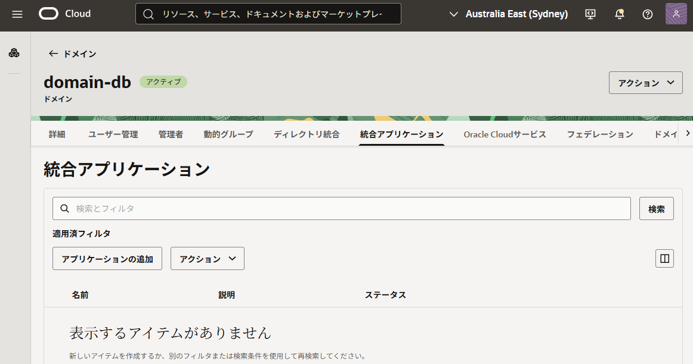

「機密アプリケーション」を選択し、[ワークフローの起動] をクリックします。

.. figure:: ../_img/domain-application-create-02.png

名前と説明を入力し、[送信] します。

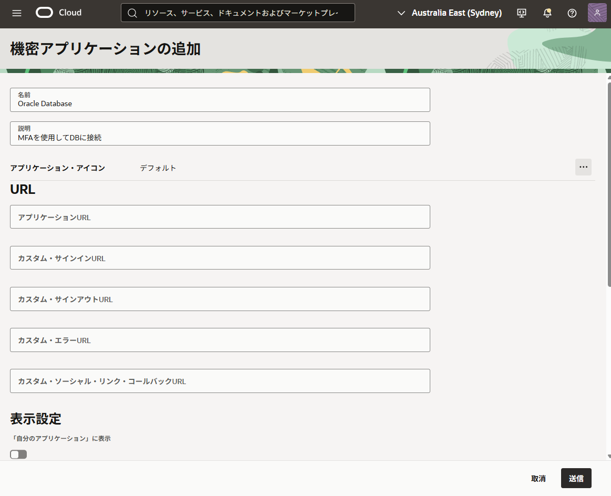

作成後、アプリケーションをアクティブ化します。

.. figure:: ../_img/domain-application-create-04.png

「OAuth構成」タブより、[OAuth構成の編集]をクリック。[このアプリケーションをクライアントとして今すぐ構成します]を選択します。

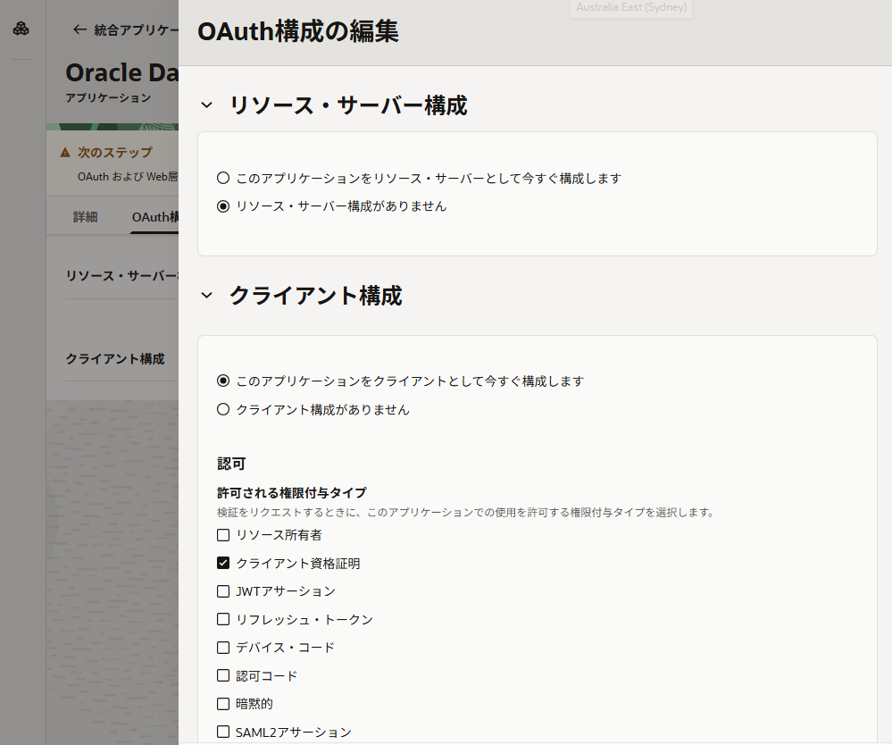

下にスクロールして、「アプリケーション・ロールの追加」を有効化し、
- MFA client
- User administrator
を追加し、「送信」で確定します。

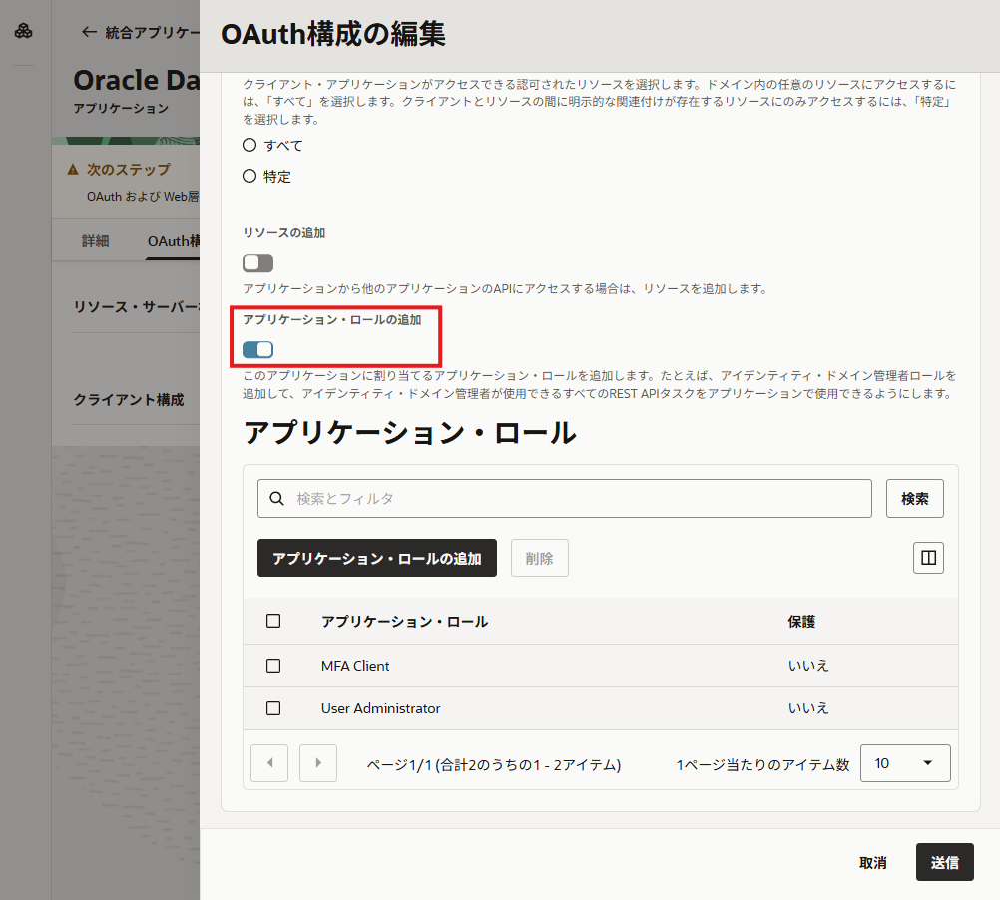

アプリケーション詳細画面に表示される クライアントID と クライアントシークレット を控えておきます。これらは次の手順で使用します。

.. figure:: ../_img/domain-application-create-07.png

また、MFAパラメータ設定のために、Identity DomainのURLも控えておきましょう。

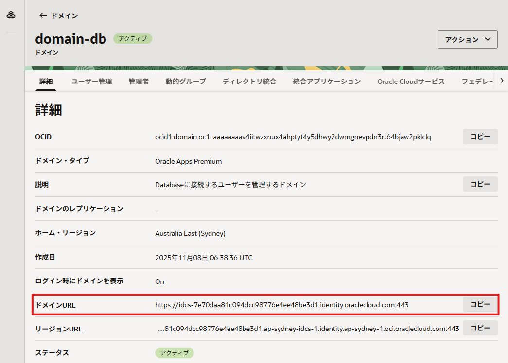

*****************************************
初期化パラメータの設定
*****************************************

PDBに接続し、MFAに必要な初期化パラメータを設定します。
システム管理者権限（sysdba）で接続し、対象のPDBにコンテナを切り替えてから実行してください。

OMAプッシュ通知を使用するIAM Identity DomainのURLを設定します。

.. code-block:: sql

    ALTER SYSTEM SET MFA_OMA_IAM_DOMAIN_URL = "<控えておいたIdentity DomainのURL>";

.. code-block:: sql
    :caption: 実行例

    SQL> alter system set MFA_OMA_IAM_DOMAIN_URL = "https://idcs-7e70daa81c094dcc98776e4ee48be3d1.identity.oraclecloud.com";

    System altered.

    SQL> sho parameter mfa
    NAME                         TYPE    VALUE                                                                  
    ---------------------------- ------- ---------------------------------------------------------------------- 
    mfa_duo_api_host string                                                                        
    mfa_oma_iam_domain_url string https://idcs-7e70daa81c094dcc98776e4ee48be3d1.identity.oraclecloud.com 
    mfa_sender_email_displayname string                                                                        
    mfa_sender_email_id string                                                                        
    mfa_smtp_host     string                                                                        
    mfa_smtp_port      integer 587      

.. note::
    SMTPサーバーを使用しない場合、MFA_SMTP_HOST、MFA_SMTP_PORT、MFA_SENDER_EMAIL_ID、および MFA_SENDER_EMAIL_DISPLAYNAMEの各パラメータは設定不要です。

    .. dropdown:: 設定例

        .. code-block:: sql
            
            -- SMTPホスト、ポートの設定
            ALTER SYSTEM SET MFA_SMTP_HOST = "smtp.email.us-sanjose-1.oci.oraclecloud.com";
            ALTER SYSTEM SET MFA_SMTP_PORT = 587;

            -- 送信元メールアドレスの設定例
            ALTER SYSTEM SET MFA_SENDER_EMAIL_ID = "db-admin@example.com";
            ALTER SYSTEM SET MFA_SENDER_EMAIL_DISPLAYNAME = "DB Admin";

*****************************************
構成時シークレットの設定
*****************************************

OAuthクライアント情報を、Database サーバー上のウォレットに安全に保存します。

まずはウォレットの場所とPDBのGUIDを確認します。

.. code-block:: sql

    SQL> sho parameter wallet_root
    NAME        TYPE   VALUE                                              
    ----------- ------ --------------------------------------------------                                               
    wallet_root string /opt/oracle/dcs/commonstore/wallets/DB1110_zsx_syd   

    SQL> select NAME, GUID from v$containers;

    NAME        GUID                             
    ___________ ________________________________ 
    DB1110_PDB1 40BA6EE05F8027C2E063B501F40ABC91 

ウォレットの場所は次のようになります。

- CDBルートの場合、ウォレットの場所は ``<WALLET_ROOT>/mfa`` 
- PDBの場合、 ``<WALLET_ROOT>/<PDBのguid>/mfa`` 

OSユーザーoracleに切り替え、対象パスにMFAウォレットを作成します。mfaディレクトリは自動で作成されます。

.. code-block:: bash

    orapki wallet create -wallet <wallet_path> -pwd <wallet_password> -auto_login -compat_v12

.. code-block:: bash
    :caption: 実行例(CDB)

    $ orapki wallet create -wallet /opt/oracle/dcs/commonstore/wallets/DB1110_zsx_syd/mfa -pwd Welcome123# -auto_login -compat_v12
    Oracle PKI Tool Release 23.0.0.0.0 - Production
    Version 23.0.0.0.0
    Copyright (c) 2004, 2025, Oracle and/or its affiliates. All rights reserved.

    Operation is successfully completed.

    $ ls /opt/oracle/dcs/commonstore/wallets/DB1110_zsx_syd/mfa
    cwallet.sso  cwallet.sso.lck  ewallet.p12  ewallet.p12.lck

.. code-block:: bash
    :caption: 実行例(PDB)

    $ orapki wallet create -wallet /opt/oracle/dcs/commonstore/wallets/DB1110_zsx_syd/40BA6EE05F8027C2E063B501F40ABC91/mfa -pwd Welcome123# -auto_login -compat_v12
    Oracle PKI Tool Release 23.0.0.0.0 - Production
    Version 23.0.0.0.0
    Copyright (c) 2004, 2025, Oracle and/or its affiliates. All rights reserved.

    Operation is successfully completed.

    $ ls -l /opt/oracle/dcs/commonstore/wallets/DB1110_zsx_syd/40BA6EE05F8027C2E063B501F40ABC91/mfa
    total 8
    -rw------- 1 oracle oinstall 270 Nov 10 04:22 cwallet.sso
    -rw------- 1 oracle oinstall   0 Nov 10 04:22 cwallet.sso.lck
    -rw------- 1 oracle oinstall 346 Nov 10 04:22 ewallet.p12
    -rw------- 1 oracle oinstall   0 Nov 10 04:22 ewallet.p12.lck

``orapki secretstore create_entry`` コマンドを使用して、クライアントIDとクライアントシークレットを上記で作成したウォレットに格納します。

.. code-block:: bash

    orapki secretstore create_entry -wallet <wallet_path> -pwd <wallet_password> -alias oracle.security.mfa.oma.clientid -secret <client id>

    orapki secretstore create_entry -wallet <wallet_path> -pwd <wallet_password> -alias oracle.security.mfa.oma.clientsecret -secret <client secret>

.. code-block:: bash
    :caption: 実行例

    $ orapki secretstore create_entry -wallet /opt/oracle/dcs/commonstore/wallets/DB1110_zsx_syd/40BA6EE05F8027C2E063B501F40ABC91/mfa -pwd Welcome123# -alias oracle.security.mfa.oma.clientid -secret f39484a10fe64c5196353b10667883cc
    Oracle PKI Tool Release 23.0.0.0.0 - Production
    Version 23.0.0.0.0
    Copyright (c) 2004, 2025, Oracle and/or its affiliates. All rights reserved.

    Operation is successfully completed.

    $ orapki secretstore create_entry -wallet /opt/oracle/dcs/commonstore/wallets/DB1110_zsx_syd/40BA6EE05F8027C2E063B501F40ABC91/mfa -pwd Welcome123# -alias oracle.security.mfa.oma.clientsecret -secret idcscs-xxxxxxxxxxxxxxxxxxxxxxxxxxxxxx
    Oracle PKI Tool Release 23.0.0.0.0 - Production
    Version 23.0.0.0.0
    Copyright (c) 2004, 2025, Oracle and/or its affiliates. All rights reserved.

    Operation is successfully completed.

    $ ls -l /opt/oracle/dcs/commonstore/wallets/DB1110_zsx_syd/40BA6EE05F8027C2E063B501F40ABC91/mfa
    total 8
    -rw------- 1 oracle oinstall 699 Nov 10 04:24 cwallet.sso
    -rw------- 1 oracle oinstall   0 Nov 10 04:22 cwallet.sso.lck
    -rw------- 1 oracle oinstall 654 Nov 10 04:24 ewallet.p12
    -rw------- 1 oracle oinstall   0 Nov 10 04:22 ewallet.p12.lck

.. node::
    
    SMTPサーバーを使用する場合は、SMTPのユーザーIDとパスワードも同様に以下のエイリアスでウォレットに格納します。

    .. code-block:: bash

        orapki secretstore create_entry -wallet <wallet_path> -pwd <wallet_password> -alias oracle.security.mfa.smtp.user -secret <smtp user id>

        orapki secretstore create_entry -wallet <wallet_path> -pwd <wallet_password> -alias oracle.security.mfa.smtp.password -secret <smtp password>

本手順では実施をいませんが、別途Database側の ``sqlnet.ora`` ファイルで、エンドツーエンド認証のタイムアウト設定である ``SQLNET.INBOUND_CONNECT_TIMEOUT`` パラメータを60秒より長く設定しておきます。この値がOMAのプッシュ認証タイムアウト(60秒)より小さい場合は、プッシュ通知の有効期限切れが原因で、失敗した認証の監査ログをサーバーが書き込まない可能性があります。

任意ですが、ウォレットの状態をDatabase側から確認します。

.. code-block:: sql
    
    SQL> alter session set container=DB1110_PDB1;
    SQL> SELECT WRL_TYPE,
    2         WRL_PARAMETER,
    3         STATUS,
    4         WALLET_TYPE
    5* FROM   V$ENCRYPTION_WALLET;

    WRL_TYPE WRL_PARAMETER STATUS WALLET_TYPE 
    ________ _____________ ______ ___________ 
    FILE                   OPEN   AUTOLOGIN   

*****************************************
DBユーザーの設定とMFAの有効化
*****************************************

DBユーザーを作成します。まずは PDB に接続します。

.. code-block:: sql

    $ sql / as sysdba

    SQL> show pdbs
    CON_ID CON_NAME    OPEN MODE  RESTRICTED 
    ______ ___________ __________ __________ 
        2 PDB$SEED    READ ONLY  NO         
        3 DB1110_PDB1 READ WRITE NO         
    
    SQL> alter session set container=DB1110_PDB1;
    Session altered.

    SQL> show con_name
    CON_NAME 
    ------------------------------
    DB1110_PDB1

DBユーザーを作成しつつ、MFAのためのメールアドレスを指定します。

.. code-block:: sql

    SQL> create user if not exists DBUSER_MFA_OMA identified by Y4K4#pQniv$vLt and FACTOR 'OMA_PUSH' as 'calico.drugcat@gmail.com';

    Error starting at line : 1 in command -
    create user if not exists DBUSER_MFA_OMA identified by Y4K4#pQniv$vLt and FACTOR 'OMA_PUSH' as 'calico.drugcat@gmail.com'
    Error report -
    ORA-28470: Failure to enroll the user for Oracle Mobile Authenticator (OMA) Push Notification
    Help: https://docs.oracle.com/error-help/db/ora-28470/

.. note::
    
    既存のユーザーにMFAを追加する場合は以下のように、ALTER USER コマンドを使います。

    .. code-block:: sql
        
        ALTER USER <user> ADD FACTOR 'OMA_PUSH' AS '<user.name@email.com>';

このコマンドを実行すると、OCI IAM側にユーザーを作成していない場合このタイミングでIAMユーザーが作成され、ユーザーのアクティベーションとOMA認証の設定のためのメールが送信されます。

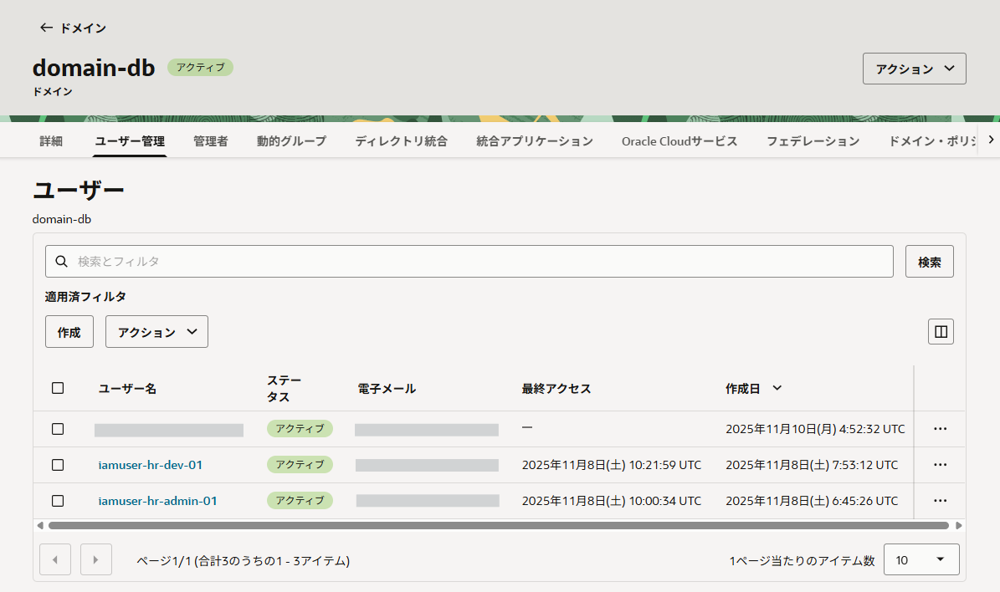

届いたメールに記載のあるリンクをクリックし、パスワードを設定した後、Authenticatorを設定します。

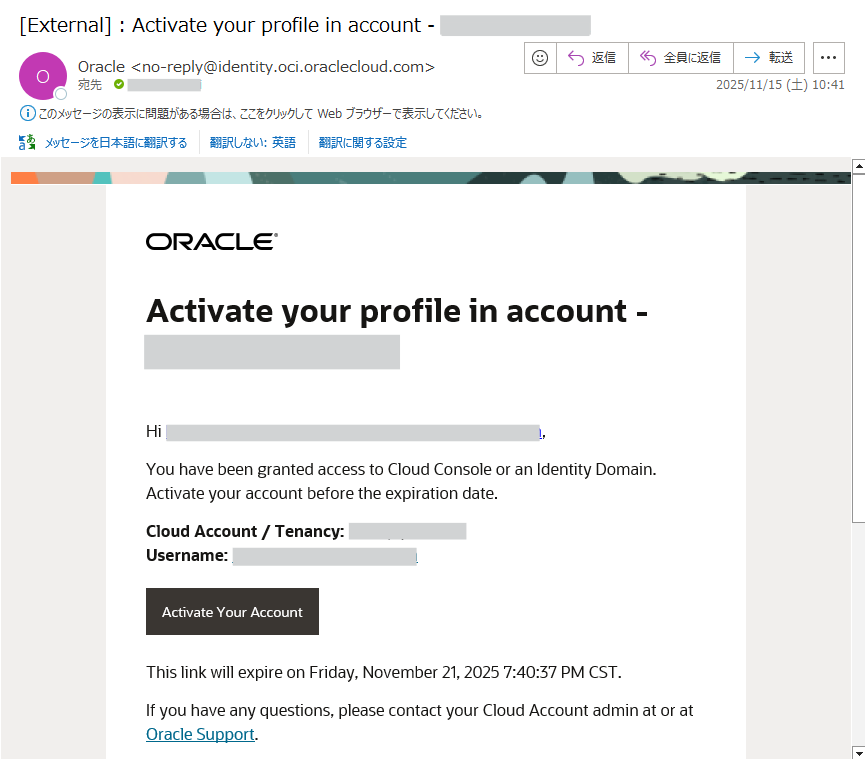

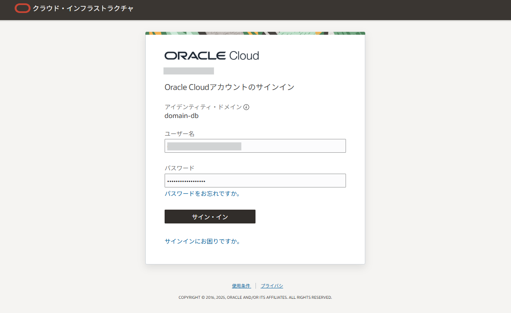

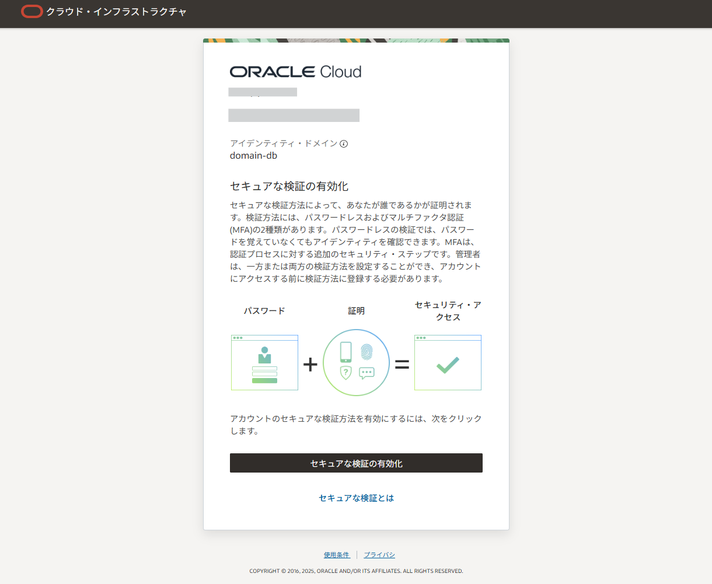

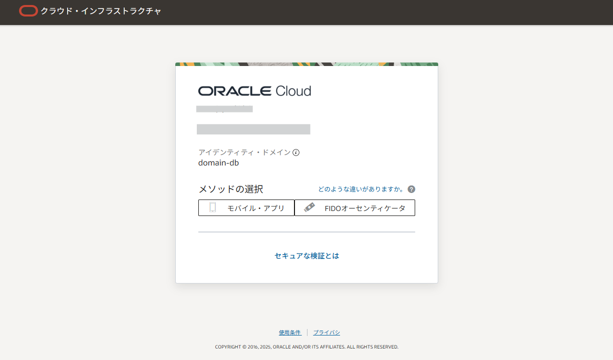

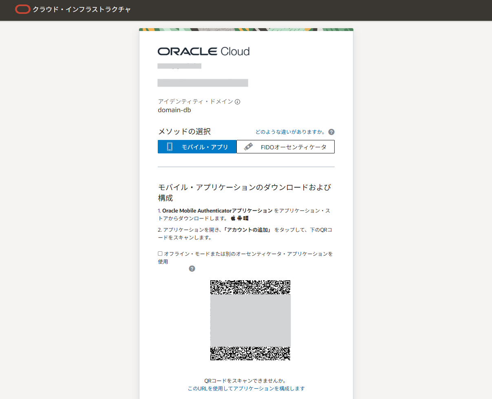

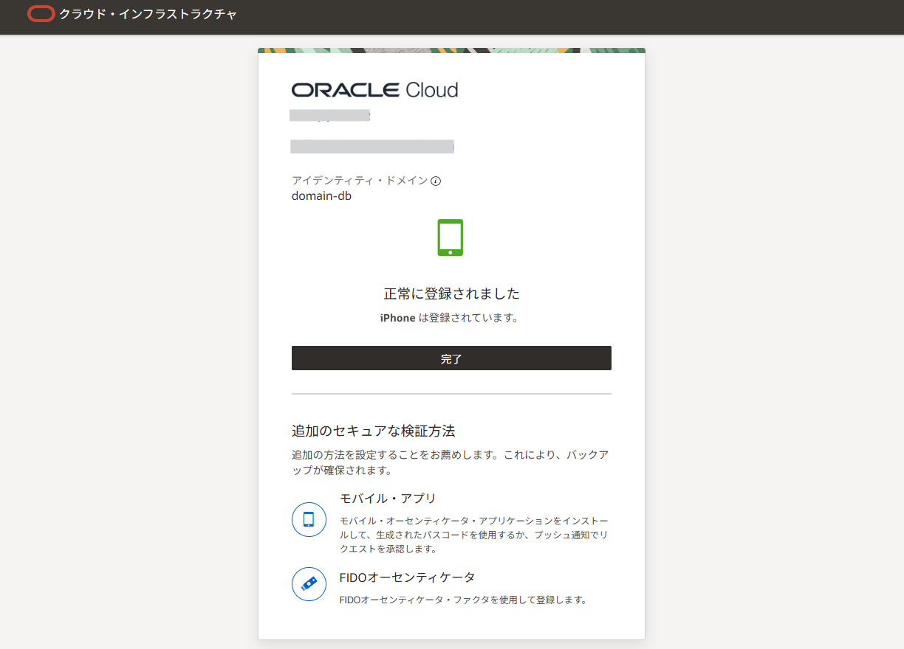

Identity Domainのユーザーを無事有効化できたら、まだDBユーザーは作成されていませんので再度DBユーザーを作成のコマンドを実行します。この際、接続権限も与えておきます。

.. code-block:: sql

    SQL> create user if not exists DBUSER_MFA_OMA identified by Y4K4#pQniv$vLt and FACTOR 'OMA_PUSH' as 'calico.drugcat@gmail.com';

    User DBUSER_MFA_OMA created.

    -- 接続のための権限を付与
    SQL> grant create session to DBUSER_MFA_OMA;

    Grant succeeded.

*****************************************
接続を試す
*****************************************

すべての準備が整ったので、MFAが有効なユーザーで接続を試みます。
接続をすると、アプリに通知が飛んでくるので「許可」を押すと接続できることが確認できます。

.. figure:: ../_img/iam-login-push-mobile.png
    :width: 30%

.. code-block:: sql

    SQL> conn DBUSER_MFA_OMA/<password>@basedb26ai.dbprisbnt.koivcnsydpoc.oraclevcn.com:1521/DB1110_pdb1.dbprisbnt.koivcnsydpoc.oraclevcn.com
    Connected.
    
    SQL> show user
    USER is "DBUSER_MFA_OMA"

パスワードに加えてOMAプッシュ通知による第二の認証要素が要求され、接続できたことが確認できました。

以上でMFAによる接続のチュートリアルは終了です。