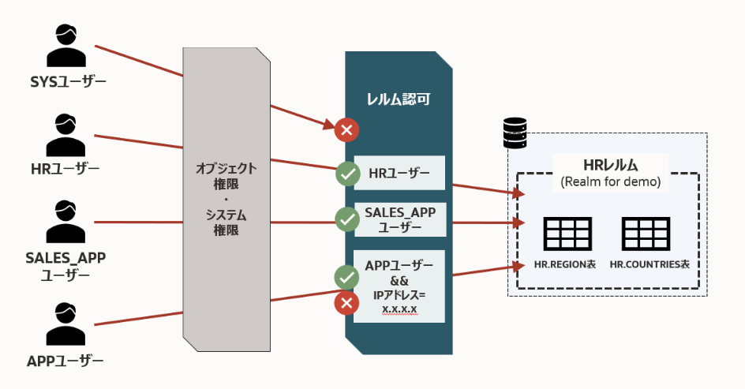

このページでは、Database Vault のレルムを作成し、指定したオブジェクトをレルムに追加します。 また、ユーザーにアクセス権を付与し、条件付きでアクセスを制御するレルム認可を設定します。

設定のイメージは以下図のようになります。



此処から先はC##DVOWNERユーザーやSYSユーザーなど実行するユーザーが混じります。それぞれのユーザーで接続した端末を用意しておくことを推奨します。

```
-- sysユーザー
sql sys/<password>@localhost:1521/freepdb1 as sysdba

-- C##DVOWNERユーザー
sql c##dvowner/<password>@localhost:1521/freepdb1

-- C##DVACCTMGR
sql c##dvowner/<password>@localhost:1521/freepdb1
```

## 前提条件
HRユーザー、SALES_APPユーザー、APPユーザーの作成および権限設定については以下の別ベージにありますので、まだ作成されていない場合はご参照ください。
- HRユーザーの設定 (サンプルスキーマ)
- SALES_APPユーザーの作成
- APPユーザーの作成

## 実施内容
- 有効化した状態でのSYSユーザーの制限確認
- レルムの作成
- オブジェクトのレルム登録
- レルム認可の設定

## 現時点でのSYSユーザーの制約を確認する

レルム設定の前にこの時点での特権ユーザーの制限を確認しておきます。
Database Vaultを有効化した時点でSYSユーザーによる管理操作が制限され、ユーザーが作成できないことが分かります。

```sql
-- PDB
-- SYSユーザーでユーザー作成を試みる
SQL> show user con_name
USER is "SYS"
CON_NAME
------------------------------
FREEPDB1

SQL> CREATE USER test;

Error starting at line : 1 in command -
CREATE USER test
Error report -
ORA-01031: insufficient privileges
Help: https://docs.oracle.com/error-help/db/ora-01031/

01031. 00000 -  "insufficient privileges"
*Document: YES
*Cause:    A database operation was attempted without the required
           privilege(s).
*Action:   Ask your database administrator or security administrator to grant
           you the required privilege(s).
```
ただ、この時点ではレルムはまだ作成していないため、表は参照することができます。

```sql
SQL> select count(*) from hr.jobs;

   COUNT(*)
___________
         19
```


## レルムの作成（Realm for demo）

以下のSQLで、デモ用のレルムを作成します。`(*)`がつくものはデフォルトで設定されるもののため、明示的に設定する必要はありません。
C##DVOWNERユーザーでPDBに接続し、以下を実行します。
```sql title="[PDB] C##DVOWNERユーザー"
BEGIN
  DBMS_MACADM.CREATE_REALM(
    realm_name        => 'Realm for demo',              -- レルム名
    description       => 'This realm is created for demonstration',  -- レルムの説明
    enabled           => DBMS_MACUTL.G_YES,             -- (*)作成直後から有効化
    audit_options     => DBMS_MACUTL.G_REALM_AUDIT_OFF, -- (*)レルムの監査を無効
    realm_type        => 1,                             -- 必須レルムを有効化
    realm_scope       => DBMS_MACUTL.G_SCOPE_LOCAL,     -- (*)レルムはローカルの範囲で動作
    pl_sql_stack      => FALSE                          -- (*)PL/SQLスタック検証は行わない
  );
END;
/
```

作成したレルムは `DVSYS.DBA_DV_REALM` から確認できます。

```sql title="[PDB] C##DVOWNERユーザー"
SQL> select name, description, realm_type from dvsys.dba_dv_realm;

NAME                                                 DESCRIPTION                                                                                                                                           REALM_TYPE
____________________________________________________ _____________________________________________________________________________________________________________________________________________________ _____________
Oracle Database Vault                                Defines the realm for the Oracle Database Vault schemas - DVSYS and DVF where Database Vault access control configuration and roles are contained.    MANDATORY
Oracle Label Security                                Defines the realm for the Oracle Label Security schemas and roles - LBACSYS and LBAC_DBA.                                                             MANDATORY
Database Vault Account Management                    Defines the realm for administrators who create and manage database accounts and profiles.                                                            REGULAR
Oracle Enterprise Manager                            Defines the Enterprise Manager monitoring and management realm.                                                                                       REGULAR
Oracle Default Schema Protection Realm               Defines the realm for the Oracle Default schemas.                                                                                                     REGULAR
Oracle System Privilege and Role Management Realm    Defines the realm to control granting of system privileges and database administrator roles.                                                          REGULAR
Oracle Default Component Protection Realm            Defines the realm to protect default components of the Oracle database.                                                                               REGULAR
Oracle Audit                                         Defines the realm to protect audit related objects of the Oracle database.                                                                            MANDATORY
Oracle GoldenGate Protection Realm                   Defines the realm to protect GoldenGate-related objects of the Oracle database.                                                                       MANDATORY
Realm for demo                                       This realm is created for demonstration                                                                                                               MANDATORY

10 rows selected.
```

## オブジェクトのレルムへの登録

保護したいオブジェクト（例：HR.COUNTRIES, HR.REGIONS）をレルムに登録します。
C##DVOWNERユーザーで実行します。

```sql title="[PDB] C##DVOWNERユーザー"
-- HR.COUNTRIES表を登録
BEGIN
  DBMS_MACADM.ADD_OBJECT_TO_REALM(
    realm_name        => 'Realm for demo',
    object_owner      => 'HR',
    object_name       => 'COUNTRIES',
    object_type       => 'TABLE'
  );
END;
/

-- HR.REGIONS表を登録
BEGIN
  DBMS_MACADM.ADD_OBJECT_TO_REALM(
    realm_name        => 'Realm for demo',
    object_owner      => 'HR',
    object_name       => 'REGIONS',
    object_type       => 'TABLE'
  );
END;
/
```
object_name, object_typeではワイルドカード `'%'` が使用することができますので、HRスキーマ内のオブジェクトを一括で登録することも可能です。

登録したオブジェクトは以下のコマンドで確認できます。

```sql title="[PDB] C##DVOWNERユーザー"
SQL> select REALM_NAME, OWNER, OBJECT_NAME, OBJECT_TYPE from DVSYS.DBA_DV_REALM_OBJECT where realm_name = 'Realm for demo';

REALM_NAME        OWNER    OBJECT_NAME    OBJECT_TYPE
_________________ ________ ______________ ______________
Realm for demo    HR       COUNTRIES      TABLE
Realm for demo    HR       REGIONS        TABLE
```

## レルム認可の設定

このままではオブジェクトの持ち主であるHRユーザーでさえも、レルム内のオブジェクトにアクセスすることができません。  
そのためレルム認可を設定し、レルム内のオブジェクトにアクセスする権限を付与します。

### 所有者 (HR)
```sql title="[PDB] C##DVOWNERユーザー"
BEGIN
  DBMS_MACADM.ADD_AUTH_TO_REALM(
    realm_name     => 'Realm for demo',   -- レルム名
    grantee        => 'HR',               -- 権限を付与するユーザ名またはロール名
    auth_options   => DBMS_MACUTL.G_REALM_AUTH_OWNER  -- ユーザーを「所有者」として認可する
  );
END;
/
```

### 参加者 (SALES_APP)
```sql title="[PDB] C##DVOWNERユーザー"
BEGIN
  DBMS_MACADM.ADD_AUTH_TO_REALM(
    realm_name        => 'Realm for demo',   -- レルム名
    grantee           => 'SALES_APP',        -- 権限を付与するユーザ名またはロール名
    auth_options      => DBMS_MACUTL.G_REALM_AUTH_PARTICIPANT  -- ユーザーを「参加者」として認可する
  );
END;
/
```

### 参加者 (APPユーザー)
APPユーザーに対してはIPアドレスでの制限を追加します。


```sql title="[PDB] C##DVOWNERユーザー"
-- ルールを作成
BEGIN
  DBMS_MACADM.CREATE_RULE(
    rule_name       => 'Rule to restrict APP to specific IP',
    rule_expr       => 'SYS_CONTEXT(''USERENV'',''IP_ADDRESS'') = ''159.13.49.55''',
    scope           => DBMS_MACUTL.G_SCOPE_LOCAL
  );
END;
/

-- ルールを束ねたルールセットを作成
BEGIN
  DBMS_MACADM.CREATE_RULE_SET(
    rule_set_name    => 'Ruleset for APP',
    description      => 'Rule to restrict APP to specific IP',
    enabled          => DBMS_MACUTL.G_YES,                 -- (*)
    eval_options     => DBMS_MACUTL.G_RULESET_EVAL_ALL,    -- (*)
    audit_options    => DBMS_MACUTL.G_RULESET_AUDIT_OFF,   -- (*)
    fail_options     => DBMS_MACUTL.G_RULESET_FAIL_SHOW,   -- (*)
    fail_message     => 'DV_Error: Can only be accessed from a specific IP address',
    fail_code        => 20000,
    handler_options  => DBMS_MACUTL.G_RULESET_HANDLER_OFF, -- (*)
    handler          => '',
    is_static        => FALSE,                             -- (*)
    scope            => DBMS_MACUTL.G_SCOPE_LOCAL
  );
END;
/

-- ルールセットにルールを追加します。
BEGIN
  DBMS_MACADM.ADD_RULE_TO_RULE_SET(
    rule_set_name  => 'Ruleset for APP',
    rule_name      => 'Rule to restrict APP to specific IP',
    rule_order     => 1,
    enabled        => DBMS_MACUTL.G_YES     -- (*)
  );
END;
/

-- ルールセットを指定してレルム認可を作成する
BEGIN
  DBMS_MACADM.ADD_AUTH_TO_REALM(
    realm_name        => 'Realm for demo',   -- レルム名
    grantee           => 'APP',           -- 権限を付与するユーザ名またはロール名
    rule_set_name     => 'Ruleset for APP',
    auth_options      => DBMS_MACUTL.G_REALM_AUTH_PARTICIPANT  -- ユーザーを「参加者」として認可する
  );
END;
/
```

設定したレルム認可を確認します。

```sql title="[PDB] C##DVOWNERユーザー"
SQL> select realm_name, grantee, AUTH_OPTIONS,AUTH_RULE_SET_NAME from DVSYS.DBA_DV_REALM_AUTH where realm_name = 'Realm for demo';

REALM_NAME        GRANTEE      AUTH_OPTIONS    AUTH_RULE_SET_NAME
_________________ ____________ _______________ _____________________
Realm for demo    APP          Participant     Ruleset for APP
Realm for demo    SALES_APP    Participant
Realm for demo    HR           Owner
```

これで、Database Vaultのレルム作成と認可設定が完了です。次の手順にて実際に確認してみましょう。

