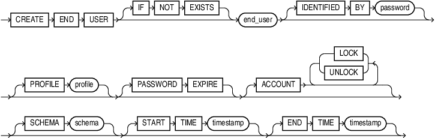
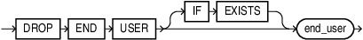

## エンドユーザー管理

### CREATE END USER

ローカル・エンドユーザーを作成します。

```sql
CREATE END USER "manderson" IDENTIFIED BY <password>;
```



- [CREATE END USER - SQL言語リファレンス](https://docs.oracle.com/en/database/oracle/oracle-database/26/sqlrf/create-end-user.html)

---

### ALTER END USER

エンドユーザーの認証方法やその他の属性を変更します。

```sql
ALTER END USER "manderson" IDENTIFIED BY <new_password>;
```

- [ALTER END USER - SQL言語リファレンス](https://docs.oracle.com/en/database/oracle/oracle-database/26/sqlrf/alter-end-user.html)

---

### DROP END USER

エンドユーザーを削除します。

```sql
DROP END USER "manderson";
```



- [DROP END USER - SQL言語リファレンス](https://docs.oracle.com/en/database/oracle/oracle-database/26/sqlrf/drop-end-user.html)

---

## Data Role 管理

### CREATE DATA ROLE

データアクセス制御に使用する Data Role を作成します。ローカル管理とOCI IAM グループへの外部マッピングの2種類があります。

```sql
-- ローカル管理 Data Role
CREATE DATA ROLE employee_role;

-- OCI IAM グループにマッピング
CREATE DATA ROLE employee_role MAPPED TO 'IAM_OAUTH_GROUP=EMPLOYEE';

-- 既存のものを置き換える場合
CREATE OR REPLACE DATA ROLE employee_role MAPPED TO 'IAM_OAUTH_GROUP=EMPLOYEE';
```

ローカル管理 Data Role と外部マップ Data Role は相互に `OR REPLACE` できません。切り替える場合は一度削除してから再作成してください。

- [CREATE DATA ROLE - SQL言語リファレンス](https://docs.oracle.com/en/database/oracle/oracle-database/26/sqlrf/create-data-role.html)

---

### DROP DATA ROLE

Data Role を削除します。

```sql
DROP DATA ROLE employee_role;

-- 存在しない場合にエラーを出さない
DROP DATA ROLE IF EXISTS employee_role;
```

- [DROP DATA ROLE - SQL言語リファレンス](https://docs.oracle.com/en/database/oracle/oracle-database/26/sqlrf/drop-data-role.html)

---

### GRANT DATA ROLE / REVOKE DATA ROLE

ローカル・エンドユーザーまたはアプリケーション ID に Data Role を付与・剥奪します。
外部マップ Data Role はトークンの claim から自動的に有効化されるため、`GRANT` での付与は不要です。

```sql
-- エンドユーザーへ付与
GRANT DATA ROLE manager_role TO "manderson";
GRANT DATA ROLE employee_role TO "manderson";
GRANT DATA ROLE employee_role TO "ebaker";

-- 剥奪
REVOKE DATA ROLE employee_role FROM "ebaker";
```

- [GRANT - SQL言語リファレンス](https://docs.oracle.com/en/database/oracle/oracle-database/26/sqlrf/GRANT.html)
- [REVOKE - SQL言語リファレンス](https://docs.oracle.com/en/database/oracle/oracle-database/26/sqlrf/REVOKE.html)

---

## Data Grant 管理

### CREATE DATA GRANT

テーブルに対するアクセス許可を定義します。アクセス対象の列（`AS SELECT` / `ALL COLUMNS EXCEPT` / 列指定）、対象行を絞るWHERE句、および付与先の Data Role を指定します。Data Grant は加算的に効きます。

```sql
-- 全列を SELECT できる（自分の行のみ）
CREATE DATA GRANT hr.employees_own_record
  AS SELECT
  ON hr.employees
  WHERE email = ORA_END_USER_CONTEXT.username
  TO employee_role;

-- SSN 列を除いた SELECT（部下の行）
CREATE DATA GRANT hr.manager_direct_reports
  AS SELECT (ALL COLUMNS EXCEPT ssn)
  ON hr.employees
  WHERE manager = ORA_END_USER_CONTEXT.username
  TO manager_role;

-- 特定列のみ SELECT
CREATE DATA GRANT hr.employees_basic_info
  AS SELECT (first_name, last_name, email)
  ON hr.employees
  TO employee_role;

-- SELECT と一部列の UPDATE を許可
CREATE DATA GRANT hr.employee_own_record_update
  AS SELECT, UPDATE (phone)
  ON hr.employees
  WHERE email = ORA_END_USER_CONTEXT.username
  TO employee_role;

-- 既存のものを置き換える
CREATE OR REPLACE DATA GRANT hr.employees_own_record
  AS SELECT
  ON hr.employees
  WHERE email = ORA_END_USER_CONTEXT.username
  TO employee_role;
```

- [CREATE DATA GRANT - SQL言語リファレンス](https://docs.oracle.com/en/database/oracle/oracle-database/26/sqlrf/create-data-grant.html)

---

### DROP DATA GRANT

Data Grant を削除します。

```sql
DROP DATA GRANT hr.employees_own_record;
```

- [DROP DATA GRANT - SQL言語リファレンス](https://docs.oracle.com/en/database/oracle/oracle-database/26/sqlrf/drop-data-grant.html)

---

## アプリケーション ID 管理

### CREATE APPLICATION IDENTITY

OAuth クライアント ID にマッピングされたアプリケーション ID を作成します。アプリケーション自体の権限（ローカル管理 Data Role）を付与するために使用します。

```sql
CREATE APPLICATION IDENTITY hr_app
  MAPPED TO 'IAM_OAUTH_CLIENT_ID=<client_id>';
```

アプリケーション ID に付与できるのはローカル管理 Data Role のみです。外部マップ Data Role はトークン claim によって自動有効化されます。

```sql
GRANT DATA ROLE compensation_analyst TO hr_app;
```

- [CREATE APPLICATION IDENTITY - SQL言語リファレンス](https://docs.oracle.com/en/database/oracle/oracle-database/26/sqlrf/create-application-identity.html)

---

### DROP APPLICATION IDENTITY

アプリケーション ID を削除します。

```sql
DROP APPLICATION IDENTITY hr_app;
```

- [DROP APPLICATION IDENTITY - SQL言語リファレンス](https://docs.oracle.com/en/database/oracle/oracle-database/26/sqlrf/drop-application-identity.html)

---

## カスタムコンテクスト管理

### CREATE END USER CONTEXT

エンドユーザーのセキュリティコンテキストに追加できるカスタム属性のスキーマを JSON Schema 形式で定義します。定義した属性は `ORA_END_USER_CONTEXT.<schema>.<context_name>.<attribute>` で参照できます。

```sql
CREATE OR REPLACE END USER CONTEXT hr.hcm_context
USING JSON SCHEMA '{
  "type": "object",
  "properties": {
    "emp_id":       { "type": "integer", "default": 0  },
    "manager_name": { "type": "string",  "default": "" }
  }
}';
```

サポートされる型は `integer`・`string`・`object`・`null` です。`boolean` は直接定義できないため、`integer`（0/1）か `string` に変換してください。

- [CREATE END USER CONTEXT - SQL言語リファレンス](https://docs.oracle.com/en/database/oracle/oracle-database/26/sqlrf/create-end-user-context.html)

---

### DROP END USER CONTEXT

カスタムコンテクスト定義を削除します。

```sql
DROP END USER CONTEXT hr.hcm_context;
```

- [DROP END USER CONTEXT - SQL言語リファレンス](https://docs.oracle.com/en/database/oracle/oracle-database/26/sqlrf/drop-end-user-context.html)

---

## テーブルアクセス設定

### SET USE DATA GRANTS ONLY

テーブルに対して Mandatory Access Control モードを設定します。有効化すると、Data Grant で明示的に許可されていないアクセスをすべて拒否します。

```sql
-- 有効化
SET USE DATA GRANTS ONLY ON hr.employees ENABLED;

-- 無効化
SET USE DATA GRANTS ONLY ON hr.employees DISABLED;
```

- [SET USE DATA GRANTS ONLY - SQL言語リファレンス](https://docs.oracle.com/en/database/oracle/oracle-database/26/sqlrf/set-use-data-grants-only.html)

---

## SQL 関数

### ORA_END_USER_CONTEXT

現在のエンドユーザー・セキュリティコンテキストを JSON として返す疑似列です。エンドユーザーセッション以外（通常のDBセッション）では NULL を返します。

```sql
-- ユーザー名を取得（ドット記法）
SELECT ORA_END_USER_CONTEXT.username FROM dual;

-- トークンの sub / iss / aud を取得
SELECT ORA_END_USER_CONTEXT.USER.TOKEN.sub   FROM dual;
SELECT ORA_END_USER_CONTEXT.USER.TOKEN.iss   FROM dual;
SELECT ORA_END_USER_CONTEXT.USER.TOKEN.aud   FROM dual;

-- カスタムコンテクスト属性を取得
SELECT ORA_END_USER_CONTEXT.hr.hcm_context.emp_id FROM dual;

-- JSON_VALUE でスカラー値として取得（SQLcl など型119問題の回避策）
SELECT JSON_VALUE(ORA_END_USER_CONTEXT, '$.USERNAME' RETURNING VARCHAR2(128)) FROM dual;

-- 全体を整形表示
SELECT JSON_SERIALIZE(ORA_END_USER_CONTEXT RETURNING VARCHAR2(4000) PRETTY) FROM dual;
```

`ORA_END_USER_CONTEXT.username` のようにドット記法でアイテムメソッドなしで参照すると、戻り値はSQLのスカラー型ではなくJSON値になります。スカラー値として扱うには、`.string()`/`.number()` などのアイテムメソッドを付けるか、`JSON_VALUE` を使ってください。

| 属性パス | 内容 |
|---|---|
| `.username` | エンドユーザー名（`USER.DEFAULT.USERNAME` の省略形） |
| `.LOGON_END_USER` | ログイン時のエンドユーザー名 |
| `.CURRENT_END_USER` | 現在のエンドユーザー名 |
| `.AUTHENTICATION_METHOD` | 認証方式（`PASSWORD` / `TOKEN_GLOBAL` など） |
| `.USER.TOKEN` | OAuthアクセストークン全体（iss / sub / aud のみ） |
| `.USER.TOKEN.sub` | トークンの subject（IAM ユーザー名など） |
| `.<schema>.<context>.<attr>` | カスタムコンテキストの属性 |

- [ORA_END_USER_CONTEXT - SQL言語リファレンス](https://docs.oracle.com/en/database/oracle/oracle-database/26/sqlrf/ora_end_user_context.html)

---

### ORA_IS_COLUMN_AUTHORIZED

現在のエンドユーザーが、指定した列の値を参照する権限を持つかどうかを `TRUE` / `FALSE` で返します。Data Grant で列が除外されている場合に `FALSE` を返すため、UI 側でマスク表示と実値表示を切り替えるために使用します。

```sql
SELECT first_name, last_name,
       DECODE(ORA_IS_COLUMN_AUTHORIZED(ssn),
              FALSE, '***-**-****',
              TRUE,  ssn) AS ssn
FROM hr.employees;
```

`FALSE` を返す場合（権限なし）はマスク文字列に置き換えることで、列が非表示になる代わりに代替値を表示できます。

- [ORA_IS_COLUMN_AUTHORIZED - SQL言語リファレンス](https://docs.oracle.com/en/database/oracle/oracle-database/26/sqlrf/ora_is_column_authorized.html)

---

## データディクショナリビュー

| ビュー | 内容 |
|---|---|
| `DBA_END_USERS` / `ALL_END_USERS` | エンドユーザーの一覧（名前・認証タイプ・作成日など） |
| `DBA_DATA_ROLES` / `ALL_DATA_ROLES` | Data Role の一覧（ローカル・外部マップの区別を含む） |
| `DBA_DATA_ROLE_PRIVS` / `ALL_DATA_ROLE_PRIVS` | エンドユーザーへの Data Role 付与状況 |
| `DBA_DATA_GRANTS` / `ALL_DATA_GRANTS` | Data Grant の一覧（対象オブジェクト・DML 種別・WHERE句など） |
| `DBA_APPLICATION_IDENTITIES` / `ALL_APPLICATION_IDENTITIES` | アプリケーション ID の一覧 |
| `DBA_END_USER_CONTEXTS` / `ALL_END_USER_CONTEXTS` | カスタムコンテキスト定義の一覧 |
| `SYS.END_USER_CONTEXT` | 現在のエンドユーザーセッションのカスタムコンテキスト（UPDATE 可能） |

### SYS.END_USER_CONTEXT の更新

カスタムコンテキストの属性は `UPDATE SYS.END_USER_CONTEXT` で変更できます。バインド変数はサポートされていません。

```sql
UPDATE SYS.END_USER_CONTEXT t
SET    t.CONTEXT.emp_id = 400
WHERE  owner = 'HR'
AND    name  = 'HCM_CONTEXT';
```

## 参考リンク

- [Deep Data Security 開発者ガイド - 26ai](https://docs.oracle.com/en/database/oracle/oracle-database/26/ddscg/index.html)
- [SQL言語リファレンス - 26ai](https://docs.oracle.com/en/database/oracle/oracle-database/26/sqlrf/index.html)
