このページでは OCI IAM Identity Domains を使用して Deep Data Security を構成する方法を説明します。
IAM グループを Data Role にマッピングすることで、OCI IAM トークンで接続したユーザーに対して自動的に適切なデータアクセス権が付与されます。

## 実施内容

- OCI IAM Identity Domains にリソース・サーバー（機密アプリケーション）と OAuth クライアントを作成する
- アクセストークンにグループ情報を含めるカスタム claim を設定する
- IAM ユーザーとグループを作成し、割り当てを行う
- Database 側で IAM 連携パラメータ・Credential・Data Role・Data Grant を設定する
- SQLクライアントをトークン認証用に構成し、OCI IAM ユーザーとして接続・確認する

## 前提条件

- [ローカル・エンドユーザーによる Deep Data Security](../tutorial/localenduser-dds#2-%E3%82%B5%E3%83%B3%E3%83%97%E3%83%AB%E3%82%B9%E3%82%AD%E3%83%BC%E3%83%9E%E3%81%A8%E3%83%87%E3%83%BC%E3%82%BF%E3%81%AE%E4%BD%9C%E6%88%9) のサンプルスキーマ（`hr.employees`）および表が作成されていること

## 1. OCI IAM Identity Domains の設定

### 1-1. Identity Domain の確認・作成

OCI コンソールで使用する Identity Domain を確認します。既存のものを使用する場合はこの手順は不要です。  
新規に作成する場合は [こちらの手順](/dbsec-tutorials/authentication/oci-iam-dbcredential/tutorial/1-setup-ocidomain/) を参照してください。


### 1-2. リソース・サーバーの作成

Database をリソース・サーバーとして登録する機密アプリケーションを作成します。

「統合アプリケーション」タブを選択し、「アプリケーションの追加」をクリックします。
「機密アプリケーション」を選択します。

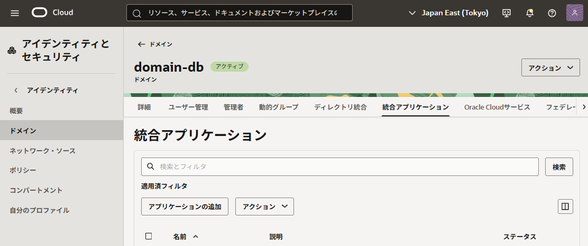

ここでは名前を「Oracle Database」としておきます。

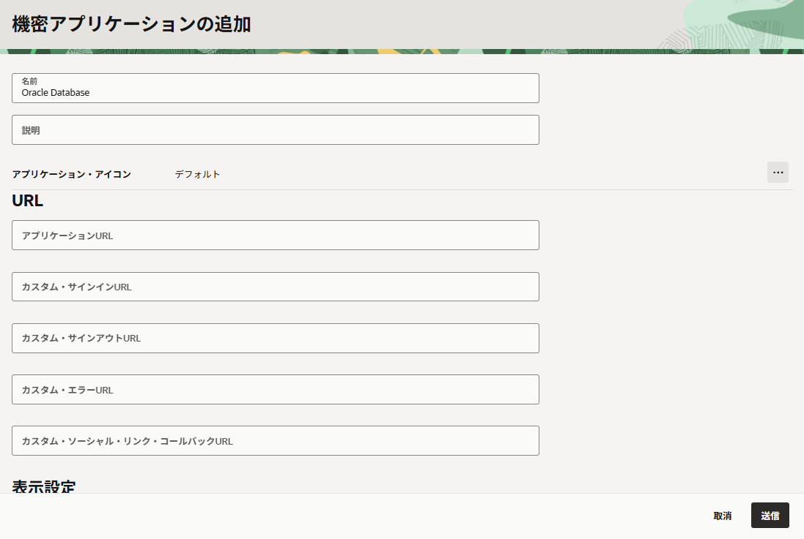

作成したら、「アクション」よりアクティブ化しておきます。

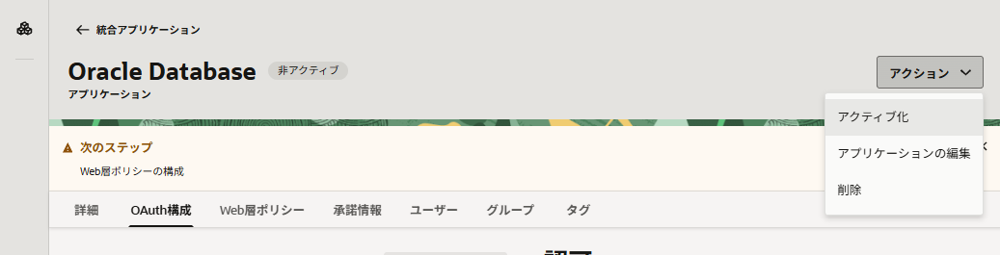

次に「OAuth 構成」タブより、「OAuth 構成の編集」をクリックし、「リソース・サーバーとして構成します」を選択します。

リソース・サーバーとして機能させるため、スコープも併せて作成しておきます。  
ここでは、プライマリ・オーディエンスを `ORACLEDB26AI/`、スコープを `DDS_DB_ACCESS` としていますが任意の値で構いません。

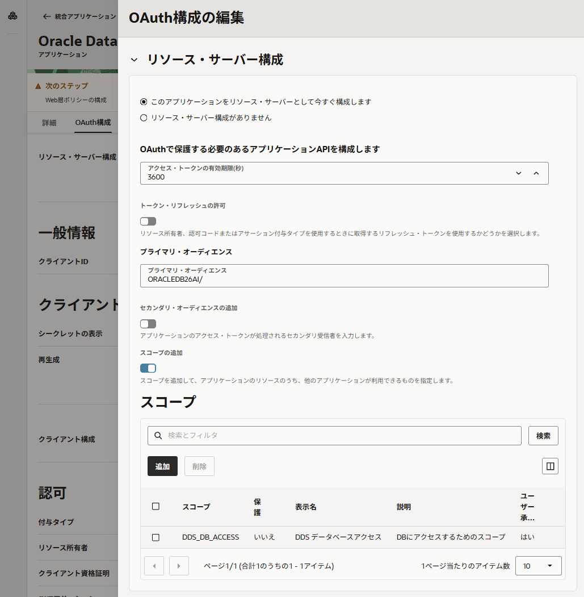


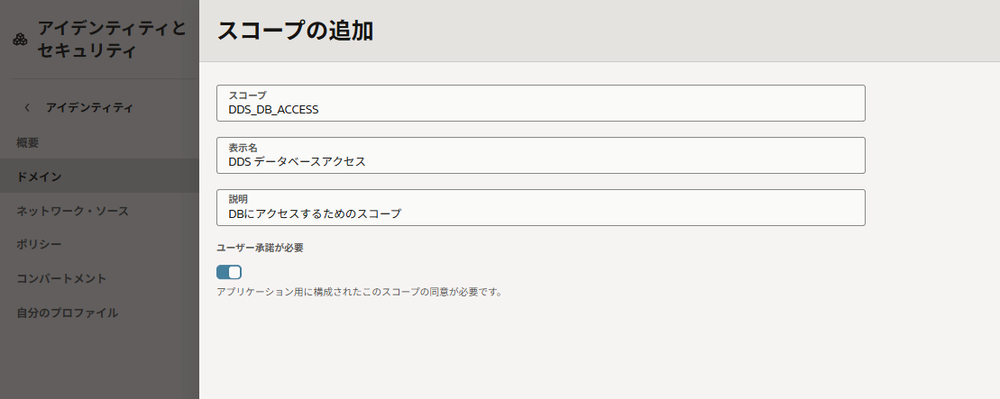

また、「クライアント構成」も有効化しておきます。これでクライアント ID とクライアントシークレットが払い出されます。  
この後の手順で使用するため、以下の３つを控えておきます。
- アプリケーション ID
- クライアント ID
- クライアントシークレット

### 1-3. OAuth クライアントの作成

> **注:** 1-2 で作成したアプリケーション自体を OAuth クライアントとしても使用できます。検証環境ではクライアントを分けると権限の分離がより明確になります。

同様に、統合アプリケーションを「機密アプリケーション」で新規作成します。

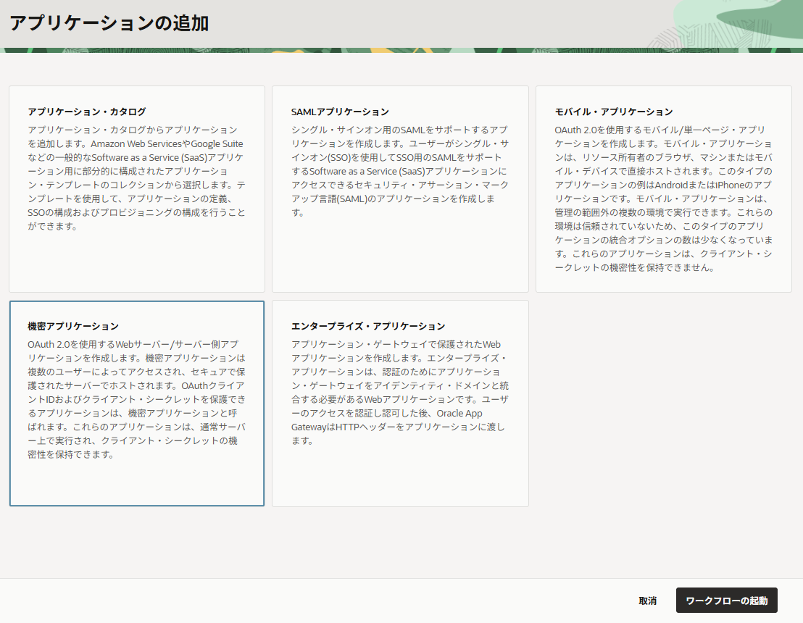

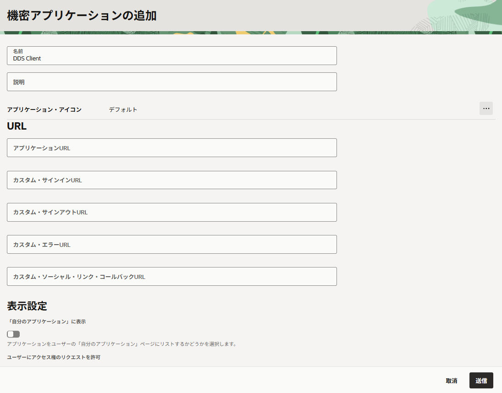

「アクション」よりアクティブ化しておきます。

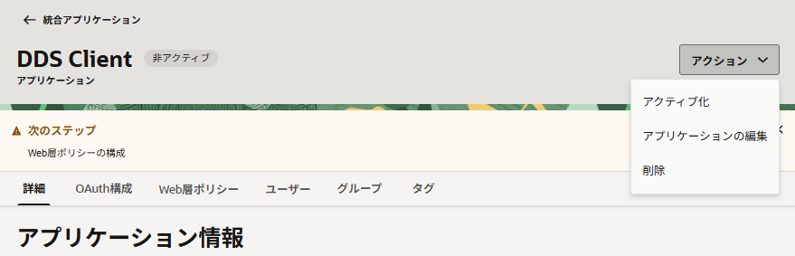

「クライアント構成」を有効化します。

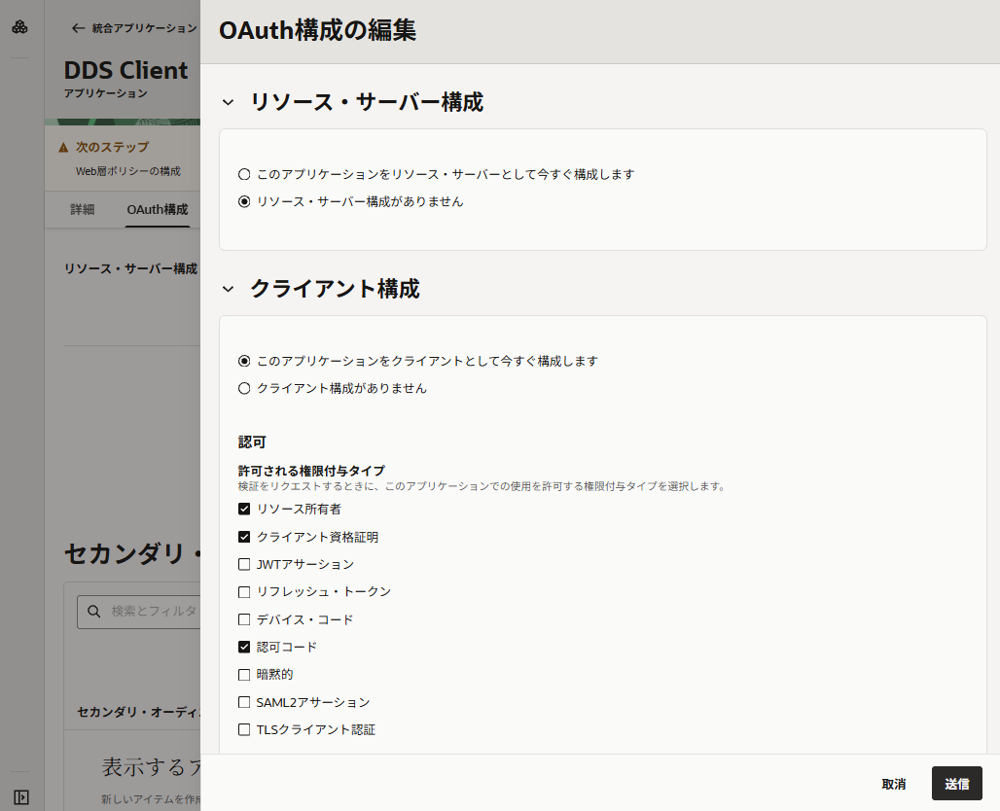

使用する grant_type を有効化します。ここでは「リソース所有者（ROPC）」を使用していますが、**本番環境では認可コードフローを使用してください**。

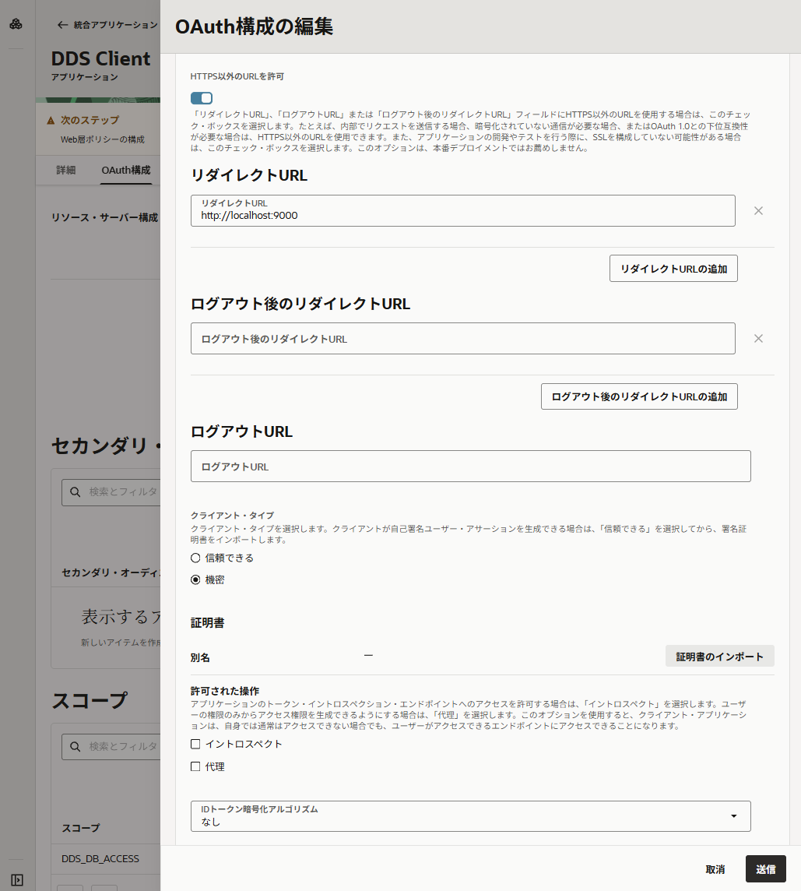

「リソースの追加」を有効化し、1-2 で作成したリソース・サーバーのスコープを要求できるようにしておきます。

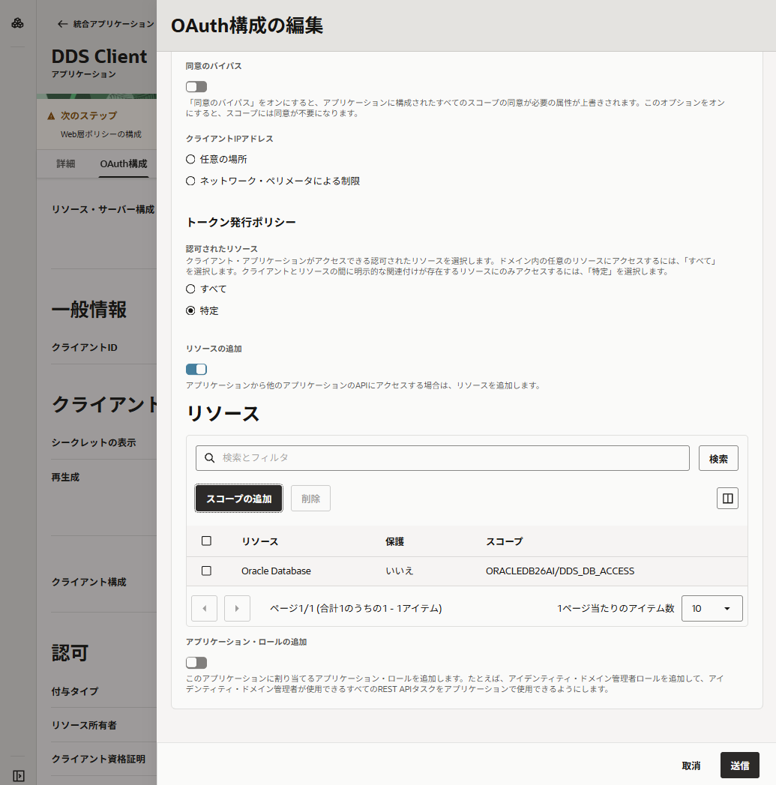

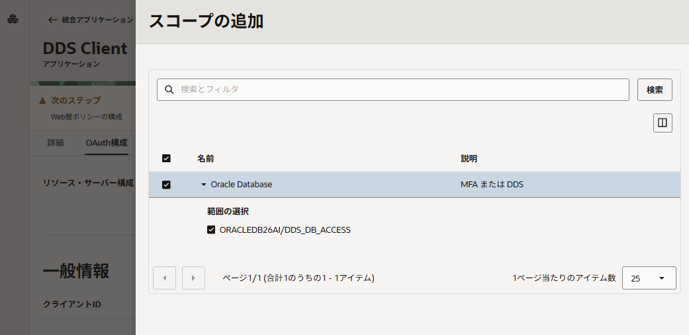

### 1-4. カスタム claim の作成

Identity Domains が発行するアクセストークン（JWT）にはデフォルトではグループ情報が含まれません。
Database がグループ情報を参照して Data Role を有効化できるよう、`group` をカスタム claim として追加します。

OCI コンソールに Identity Domain の管理権限を持つユーザーでログインし、詳細画面の「トークンおよびキー」タブからアイデンティティ・ドメイン API を呼び出すトークンを取得します。

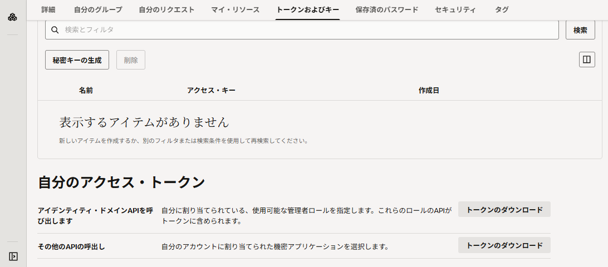

ダウンロードしたトークンを使用し、以下の `curl` コマンドを実行します。

```
curl -X POST https://<domain_url>/admin/v1/CustomClaims \
  -H "Authorization: Bearer <access_token>" \
  -H "Content-Type: application/scim+json" \
  -d '{
    "schemas": [
      "urn:ietf:params:scim:schemas:oracle:idcs:CustomClaim"
    ],
    "name": "group",
    "value": "$user.groups.*.display",
    "expression": true,
    "mode": "always",
    "tokenType": "AT",
    "allScopes": true
  }'
```

これでトークンにグループ情報が含まれるようになります。

### 1-5. ユーザーの作成

以下の 2 ユーザーを作成します。

- `manderson`（Marvin Anderson）
- `ebaker`（Emma Baker）

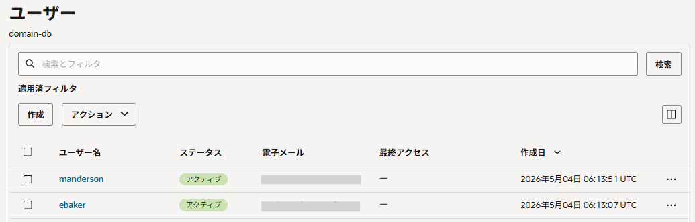

メールアドレスには自身のものを指定します。作成後、アクティベーション用のメールが届くので、リンクをクリックしてパスワードを設定しておきます。

### 1-6. グループの作成とユーザーの割り当て

以下の 2 グループを作成し、ユーザーを割り当てます。

| グループ名 | 割り当てユーザー |
|---|---|
| `EMPLOYEE` | manderson、ebaker（2人とも所属） |
| `MANAGER` | manderson のみ |

トークンに含まれるのはグループの display name です。Database 側の `CREATE DATA ROLE ... MAPPED TO 'IAM_OAUTH_GROUP=<group_name>'` と一致させるため、グループ名の大文字・小文字は運用中にぶれないよう注意します。

グループの割り当てが完了すると、`manderson` のトークンのペイロードは以下のような形式になります。
`sub`（ユーザー名）と `group`（グループ一覧）の値を確認しておきます。

```json
{
  "client_ocid": "ocid1.domainapp.oc1.ap-sydney-1.amaaaaaafdbha7aacptwt23l2aazaay2vpw427muf47wktbc5m7t4dgqej5a",
  ...
  "sub": "manderson",
  ...
  "iss": "https://identity.oraclecloud.com/",
  ...
  "client_id": "0ade767b9d9744e8bf717b05a6185212",
  ...
  "client_name": "Postman",
  ...
  "group": [
    "MANAGER",
    "EMPLOYEE"
  ],
  ...
  "user_displayname": "Marvin Anderson",
  ...
  "tok_type": "AT",
  "aud": [
    "https://idcs-7e70daa81c094dcc98776e4ee48be3d1.identity.oraclecloud.com",
    "https://idcs-7e70daa81c094dcc98776e4ee48be3d1.ap-sydney-idcs-1.secure.identity.oraclecloud.com",
    "urn:opc:lbaas:logicalguid=idcs-7e70daa81c094dcc98776e4ee48be3d1"
  ],
  ...
}
```

## 2. Database の設定

DBA ユーザーで対象 PDB に接続して以下の設定を行います。

### 2-1. OCI IAM 連携設定

Identity Domains 画面からドメイン URL と対象アプリケーションのアプリケーション ID を控えておき、パラメータを設定します。

設定前の状態を確認します。

```sql
SQL> sho parameter identity
NAME                           TYPE   VALUE
------------------------------ ------ -----
identity_provider_config       string
identity_provider_oauth_config string
identity_provider_type         string NONE
```

**Oracle AI Database（非 Autonomous）の場合**、対象 PDB で次を実行します。

```
ALTER SYSTEM SET IDENTITY_PROVIDER_TYPE = OCI_IAM SCOPE=BOTH;

ALTER SYSTEM SET IDENTITY_PROVIDER_OAUTH_CONFIG = '{
  "app_id": "<database_application_id>",
  "domain_url": "<oci_iam_domain_url>"
}' SCOPE=BOTH;
```

**Autonomous Database の場合**は `DBMS_CLOUD_ADMIN.ENABLE_EXTERNAL_AUTHENTICATION` を使います。

```
BEGIN
  DBMS_CLOUD_ADMIN.ENABLE_EXTERNAL_AUTHENTICATION(
    type   => 'OCI_IAM',
    params => JSON_OBJECT(
      'app_id'     VALUE '<database_application_id>',
      'domain_url' VALUE '<oci_iam_domain_url>'
    )
  );
END;
/
```

`app_id` は Database アプリケーションの Application ID、`domain_url` は Identity Domain URL です。

### 2-2. OCI IAM 署名鍵取得用 Credential の作成

`IDENTITY_PROVIDER_OAUTH_CONFIG` の設定に加え、IAM の 公開鍵エンドポイントにアクセスするための client_id_ / client_secret を Credential として Database に保存します。

**Oracle AI Database の場合**、SYS として実行します。

```
BEGIN
  DBMS_CREDENTIAL.CREATE_CREDENTIAL(
    credential_name => 'OCI_IAM_DOMAIN_DB_CRED$',
    username        => '<database_app_client_id>',
    password        => '<database_app_client_secret>'
  );
END;
/
```

**Autonomous Database の場合**、ADMIN として実行します。

```
BEGIN
  DBMS_CLOUD.CREATE_CREDENTIAL(
    credential_name => 'OCI_IAM_DOMAIN_DB_CRED$',
    username        => '<database_app_client_id>',
    password        => '<database_app_client_secret>'
  );
END;
/
```

設定後、パラメータが反映されていることを確認します。

```
show parameter identity
```

### 2-3. Data Role の作成

OCI IAM グループと Database 側の Data Role を対応付けます。**グループ名の大文字・小文字は IAM 側と正確に一致させてください。**

```
CREATE OR REPLACE DATA ROLE employee_role MAPPED TO 'IAM_OAUTH_GROUP=EMPLOYEE';
CREATE OR REPLACE DATA ROLE manager_role  MAPPED TO 'IAM_OAUTH_GROUP=MANAGER';
```

Database はトークン内の `group` claim と Data Role のマッピングを照合し、一致した Data Role をエンドユーザーのセキュリティコンテキストで有効化します。

> **注:** ローカルチュートリアルで同名の `employee_role` / `manager_role` をローカル Data Role として作成済みの場合、外部マップ Data Role への `OR REPLACE` ができないことがあります。その場合はローカル Data Role を先に削除してください。外部マップ Data Role とローカル Data Role は相互に置き換えることができません。
>
> ```
> DROP DATA ROLE [ IF EXISTS ] data_role;
> ```

### 2-4. 接続用ロールの作成

OCI IAM ユーザーが SQL クライアントで直接ログインするには、Data Role が Database への接続権限を持つ必要があります。
汎用の DB ロールを作成し、`CREATE SESSION` を付与したうえで Data Role へ付与します。

> **注:** チュートリアルで作成した `db_role` と同じ役割です。そのまま流用することも可能です。

```
CREATE ROLE deepsec_login_role;

GRANT CREATE SESSION TO deepsec_login_role;

GRANT deepsec_login_role TO employee_role;
```

これにより、`EMPLOYEE` グループの ebaker も、`EMPLOYEE` と `MANAGER` 両方に属する manderson も、Deep Data Security セッションとして接続できます。

### 2-5. Data Grant の作成

ローカルチュートリアルと同じ Data Grant を作成します。`ORA_END_USER_CONTEXT.username` には OCI IAM トークンの `sub`（IAM ユーザー名）が入ります。

```
-- employee_role へ自分の email と一致する行の全列を SELECT できる
CREATE OR REPLACE DATA GRANT hr.employees_own_record
  AS SELECT
  ON hr.employees
  WHERE email = ORA_END_USER_CONTEXT.username
  TO employee_role;

-- manager_role へ manager 列が自分と一致する行を SELECT（SSN 列は除く）
CREATE OR REPLACE DATA GRANT hr.manager_direct_reports
  AS SELECT (ALL COLUMNS EXCEPT ssn)
  ON hr.employees
  WHERE manager = ORA_END_USER_CONTEXT.username
  TO manager_role;
```

### 2-6. Mandatory Access Control の有効化（参考）

Data Grant だけでアクセスを制御する場合、以下のコマンドで対象テーブルを Mandatory Access Control モードにできます。

```
SET USE DATA GRANTS ONLY ON hr.employees ENABLED;
```

> **注:** 現時点では実行時にエラーが発生するケースがあります。本手順では参考として記載するにとどめます。

## 3. SQL クライアントの接続設定

SQL クライアントが Identity Domain から取得したトークンで接続するよう、`tnsnames.ora` を構成します。  
トークン認証には TLS（TCPS）接続と DN マッチングが必須です。[こちらの手順](/dbsec-tutorials/encryption/network/tutorial/tls-setup/) を参考として、必要に応じて Database へ TLS 接続のための構成をおこなってください。

`tnsnames.ora` に接続エントリを追加します。`TOKEN_AUTH=OAUTH` と `SSL_SERVER_DN_MATCH=YES` を設定してください。

```diff
oradb26ai_vm_pdb1_ocitoken =
  (DESCRIPTION=
    (ADDRESS=(PROTOCOL=tcps)(HOST=vm-db26)(PORT=1522))
    (CONNECT_DATA=(SERVICE_NAME=ORCLPDB1))
    (SECURITY=
+      (TOKEN_AUTH=OAUTH)
+			(TOKEN_LOCATION=/home/ubuntu/tnsfiles/token/oci/db-token)
      (WALLET_LOCATION=/home/ubuntu/tnsfiles/wallet/tls/db-vm26-ee)
+      (SSL_SERVER_DN_MATCH=YES) 
    )
  )
```

DN マッチングが有効になっていない場合は以下のエラーが発生します。

```
Connection failed
  USER          = 
  URL           = jdbc:oracle:thin:@oradb26ai_vm_pdb1_ocitoken
  Error Message = ORA-18718: Configuration for token-based authentication is invalid: Distinguished Name (DN) matching must be enabled for token-based authentication
https://docs.oracle.com/error-help/db/ora-18718/
```

## 4. 接続して確認する

### 4-1. トークンの取得

トークンの取得方法はいくつかありますが、ここでは Identity Domain ユーザーのユーザー名とパスワードを直接指定してトークンを取得する **Resource Owner Password Credentials（ROPC）** を使用します。

> **注:** ROPC は非本番環境での検証向けの手段です。本番環境では認可コードフローを使用してください。

以下のパラメータを事前に用意します。

| パラメータ | 内容 |
|---|---|
| `<encoded_app_credentials>` | OAuth クライアントの `client_id:client_secret` を Base64 エンコードした文字列 |
| `<domain_url>` | Identity Domain の URL |
| `<username>` / `<password>` | IAM ユーザーのユーザー名とパスワード |
| `<application_scope>` | リソース・サーバーのオーディエンスとスコープを結合した値（例: `ORACLEDB26AI/DDS_DB_ACCESS`） |

```text "<encoded_app_credentials>" "<domain_url>" "<username>" "<password>" "<application_scope>"
curl -i \
  -H "Authorization: Basic <encoded_app_credentials>" \
  -H "Content-Type: application/x-www-form-urlencoded;charset=UTF-8" \
  --request POST https://<domain_url>/oauth2/v1/token \
  -d "grant_type=password&username=<username>&password=<password>&scope=<application_scope>"
```

取得したトークンファイルを `tnsnames.ora` の `TOKEN_LOCATION` に指定したパスへ保存します。

トークン取得の詳細は以下のドキュメントやページも参照してください。

- [OCI IAM 構成の検証 - Deep Data Security 開発者ガイド](https://docs.oracle.com/en/database/oracle/oracle-database/26/ddscg/validate-oci-iam-configuration.html)
- [OCI IAM DBトークン認証](/dbsec-tutorials/authentication/oci-iam-dbtoken/)

### 4-2. データベースに接続する

`/@<tns_alias>` の形式でユーザー名・パスワードなしで接続します。

```shell
➜  ~ sql /@oradb26ai_vm_pdb1_ocitoken

SQLcl: Release 25.3 Production on Mon May 04 23:50:33 2026

Copyright (c) 1982, 2026, Oracle.  All rights reserved.

Connected to:
Oracle AI Database 26ai Enterprise Edition Release 23.26.2.0.0 - Production
Version 23.26.2.0.0

SQL> show user
USER is "XS$NULL"
```

### 4-3. データアクセスの確認

サンプルデータを参照し、アクセス制御が働いていることを確認します。
`manderson` は自分の行と部下の行（SSN 除く）が見え、`ebaker` は自分の行のみが見えます。

```sql
-- manderson でアクセスした場合
SQL> select * from hr.employees;

EMPLOYEE_ID FIRST_NAME LAST_NAME EMAIL     MANAGER   SSN         SALARY PHONE    
___________ __________ _________ _________ _________ ___________ ______ ________ 
        200 Marvin     Anderson  manderson vwilliams 457-55-5462  12030 555-0200 
        400 Emma       Baker     ebaker    manderson               8200 555-0400 
        500 Taylor     Mills     tmills    manderson               9000 555-0500 

-- ebaker でアクセスした場合
SQL> select * from hr.employees;

EMPLOYEE_ID FIRST_NAME LAST_NAME EMAIL  MANAGER   SSN         SALARY PHONE    
___________ __________ _________ ______ _________ ___________ ______ ________ 
        400 Emma       Baker     ebaker manderson 733-02-9821   8200 555-0400 
```

### 4-4. コンテキストの確認

トークン接続時のコンテキストを確認します。`USER.TOKEN` にトークンの `iss` / `sub` / `aud` が格納されています。

```sql
SQL> SELECT ORA_END_USER_CONTEXT.USER.TOKEN FROM DUAL;

TOKEN                                                                               
___________________________________________________________________________________ 
{"iss":"https://identity.oraclecloud.com/","sub":"manderson","aud":"ORACLEDB26AI/"} 
```

また参考までに、コンテクストの全体を以下にサンプルとして示します。

```sql
SQL> SELECT JSON_SERIALIZE(
  2           ORA_END_USER_CONTEXT
  3           RETURNING VARCHAR2(4000)
  4           PRETTY
  5         ) AS ctx
  6* FROM dual;

CTX                                                                                                      
________________________________________________________________________________________________________ 
{                                                                                                        
  "SERVER_HOST" : "vm-db26",                                                                             
  "NLS_DATE_FORMAT" : "DD-MON-RR",                                                                       
  "IS_DG_ROLLING_UPGRADE" : "FALSE",                                                                     
  "CURRENT_USER" : "XS$NULL",                                                                            
  "HOST" : "edge-dev",                                                                                   
  "USER" :                                                                                               
  {                                                                                                      
    "TOKEN" :                                                                                            
    {                                                                                                    
      "iss" : "https://identity.oraclecloud.com/",                                                       
      "sub" : "manderson",                                                                               
      "aud" : "ORACLEDB26AI/"                                                                            
    }                                                                                                    
  },                                                                                                     
  "NLS_CURRENCY" : "$",                                                                                  
  "INSTANCE_NAME" : "ORCLCDB",                                                                           
  "NLS_DATE_LANGUAGE" : "AMERICAN",                                                                      
  "PID" : "101",                                                                                         
  "NLS_TERRITORY" : "AMERICA",                                                                           
  "SCHEDULER_JOB" : "N",                                                                                 
  "AUTHENTICATION_METHOD" : "TOKEN_GLOBAL",                                                              
  "DB_NAME" : "ORCLPDB1",                                                                                
  "UNIFIED_AUDIT_SESSIONID" : "866957642826845769",                                                      
  "LANG" : "US",                                                                                         
  "ISDBA" : "FALSE",                                                                                     
  "OS_USER" : "ubuntu",                                                                                  
  "AUTHENTICATED_IDENTITY" : "manderson",                                                                
  "MODULE" : "SQLcl",                                                                                    
  "ORACLE_HOME" : "/opt/oracle/product/26ai/dbhome_2",                                                   
  "CURRENT_SCHEMA" : "XS$NULL",                                                                          
  "TLS_CIPHERSUITE" : "TLS_AES_256_GCM_SHA384",                                                    
  "CURRENT_USERID" : "2147483638",                                                                       
  "NETWORK_PROTOCOL" : "tcps",                                                                           
  "IP_ADDRESS" : "10.0.0.24",                                                                            
  "CLIENT_PROGRAM_NAME" : "SQLcl",                                                                       
  "SID" : "297",                                                                                         
  "LOGON_END_USER" : "manderson",                                                                        
  "SESSION_EDITION_ID" : "140",                                                                          
  "NLS_SORT" : "BINARY",                                                                                 
  "CURRENT_END_USER" : "manderson",                                                                      
  "SERVICE_NAME" : "orclpdb1",                                                                           
  "CDB_NAME" : "ORCLCDB",                                                                                
  "CON_ID" : "3",                                                                                        
  "INSTANCE" : "1",                                                                                      
  "SESSION_USERID" : "2147483638",                                                                       
  "SESSION_USER" : "XS$NULL",                                                                            
  "CLOUD_MIGRATION_MODE" : "OFF",                                                                        
  "CURRENT_EDITION_NAME" : "ORA$BASE",                                                                   
  "TERMINAL" : "unknown",                                                                                
  "TLS_VERSION" : "TLS 1.3",                                                                             
  "USERNAME" : "manderson",                                                                              
  "DATABASE_ROLE" : "PRIMARY",                                                                           
  "LANGUAGE" : "AMERICAN_AMERICA.AL32UTF8",                                                              
  "SESSION_EDITION_NAME" : "ORA$BASE",                                                                   
  "NLS_CALENDAR" : "GREGORIAN",                                                                          
  "IDENTIFICATION_TYPE" : "XS",                                                                          
  "DB_UNIQUE_NAME" : "ORCLCDB",                                                                          
  "CON_NAME" : "ORCLPDB1",                                                                               
  "PLATFORM_SLASH" : "/",                                                                                
  "IS_APPLY_SERVER" : "FALSE",                                                                           
  "SESSIONID" : "120242",                                                                                
  "DRAIN_STATUS" : "NONE",                                                                               
  "CURRENT_SCHEMAID" : "2147483638",                                                                     
  "GLOBAL_CONTEXT_MEMORY" : "0",                                                                         
  "RESET_STATE" : "NONE",                                                                                
  "CURRENT_EDITION_ID" : "140",                                                                          
  "FG_JOB_ID" : "0",                                                                                     
  "ENTERPRISE_IDENTITY" : "ocid1.user.oc1..aaxxxxefi27bmchsafq" 
}                   
```

以上で、OCI IAM Identity Domain を使用した Deep Data Security は終了です。

### トラブルシューティング：ORA-52604

同名のローカル・エンドユーザーが存在する場合、以下のエラーが発生します。同名のローカル・エンドユーザーを削除してから再接続してください。

```
Connection failed
  USER          = 
  URL           = jdbc:oracle:thin:@oradb26ai_vm_pdb1_ocitoken
  Error Message = ORA-52604: Unable to complete the operation with the specified external end-user "manderson"

https://docs.oracle.com/error-help/db/ora-52604/
```

