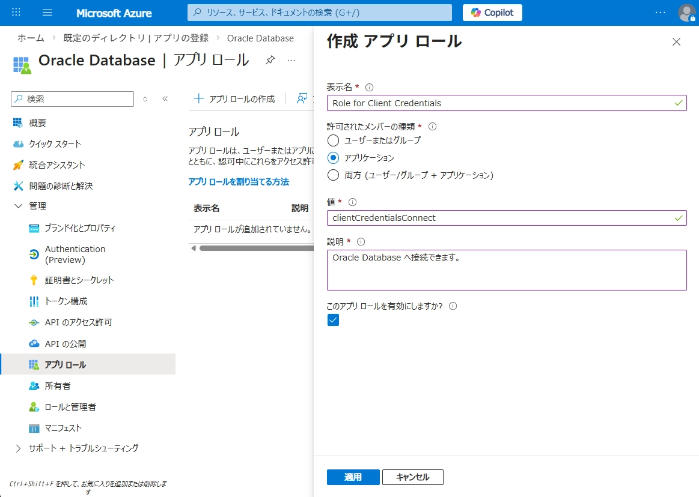
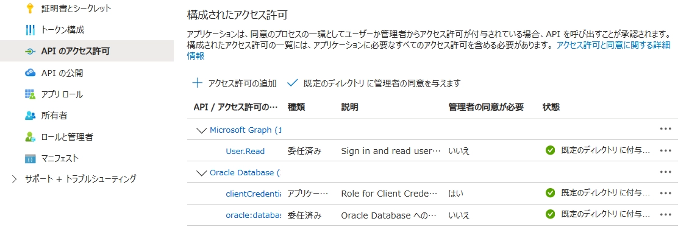
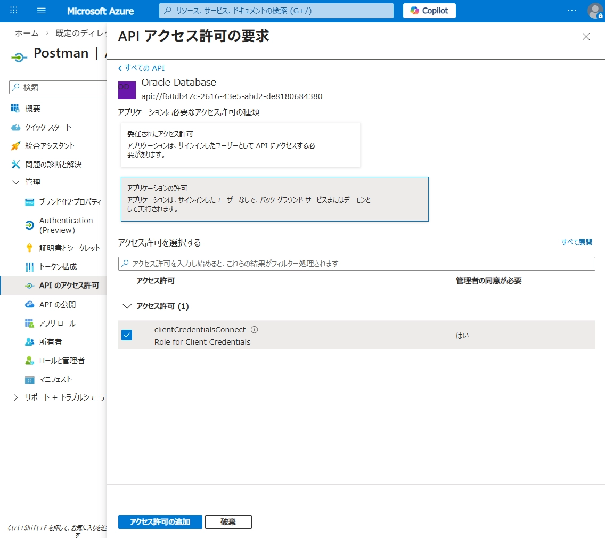

このセクションでは、Microsoft Entra ID のクライアントクレデンシャル フローを使用してアクセストークンを取得し、Oracle Database に接続する方法を説明します。

> **実施内容**
> - クライアントクレデンシャル フローのトークン要求方法の確認
> - Entra ID のアプリロールに対応する Database ユーザー / ロールの作成
> - トークン認証による接続確認

## 0. クライアントクレデンシャル フローでのトークン要求

クライアントクレデンシャル フローでは、ユーザーを介さずにクライアント アプリケーション自身の権限でトークンを取得します。  
そのため、認可コードフローや委任されたアクセス許可のときとは、トークン要求の指定方法が異なります。

v2 エンドポイントでは、個別の scope 名ではなく、次の形式で `/.default` を指定して要求します。

```
api://<API の App ID URI>/.default
```

この指定を行うと、そのクライアント アプリケーションに対して事前に付与されている app roles（アプリケーションのアクセス許可）がまとめてトークンに含まれます。

なお、Entra ID のクライアントクレデンシャル フローでは、個別の application permission を１つずつ scope 指定する方式はサポートされていません。  
https://learn.microsoft.com/en-us/entra/identity-platform/scopes-oidc

## 1. Entra ID ロールの作成
作成した、Oracle Database アプリケーションにアプリロールを作成します。  
ここでは `clientCredentialsConnect` という名前のアプリロールを作成します。



続いて、クライアントアプリケーションの設定にて、左メニューの「API のアクセス許可」より、作成したアプリロールに対してアクセス許可を行います。



その後、「規定のディレクトリに管理者の同意を与えます」をクリックします。



## 2. Database ユーザー / ロールの作成

Database 側では、Entra ID のアプリロールに対応するユーザーまたはロールを作成します。
ここでは、`clientCredentialsConnect` というアプリロールに対応付ける例を示します。

ユーザー作成には、以下のように定義します。
```
create user <DBユーザー> identified globally as 'AZURE_ROLE=<Entra ID ロール名>';
```

ロール作成には、以下のように定義します。
```
create role <DBロール> identified globally as 'AZURE_ROLE=<Entra ID ロール名>';
grant create session to <DBロール>;
```

## 3. トークンを取得する
クライアントクレデンシャルはユーザーの認証を介さないため、トークンの取得はシンプルです。  
Entra ID のトークンエンドポイントに対して、トークンリクエストを行うのみでトークンを取得できます。

例えば、curl を使用した例としては以下のようになります。
```text "client_credentials"
curl \
  --location 'https://login.microsoftonline.com/xxxxxxxxxxxx/oauth2/v2.0/token' \
  --header 'Content-Type: application/x-www-form-urlencoded' \
  --header 'Authorization: Basic base64(<client_id>:<client_secret>)' \
  --data-urlencode 'scope=api://<APIのApp ID>/.default' \
  --data-urlencode 'grant_type=client_credentials'
```

## 4. 接続を確認する

SQLcl を使用して接続すると、以下のようにアプリロールに対応する Database ユーザーで接続できることが確認できます。  
後の接続については、[認可コードフロー](./tutorial/3-login-entraid/#3-3-接続を試す) と同様です。

```shell
➜  ~ sql /@basedb26_nrt_azurepdb_token

SQLcl: Release 25.3 Production on Fri Mar 13 14:34:31 2026

Copyright (c) 1982, 2026, Oracle.  All rights reserved.

Connected to:
Oracle AI Database 26ai EE High Perf Release 23.26.0.0.0 - for Oracle Cloud and Engineered Systems
Version 23.26.0.0.0

SQL> sho user
USER is "ENTRAID_APP_USER"
SQL> select * from session_roles;

ROLE             
________________ 
ENTRAID_APP_ROLE 
```

接続コンテクストを確認します。
```
SELECT
  SYS_CONTEXT('USERENV','CURRENT_SCHEMA')         AS current_schema,
  SYS_CONTEXT('USERENV','CURRENT_USER')           AS current_user,
  SYS_CONTEXT('USERENV','SESSION_USER')           AS session_user,
  SYS_CONTEXT('USERENV','AUTHENTICATION_METHOD')  AS auth_method,
  SYS_CONTEXT('USERENV','AUTHENTICATED_IDENTITY') AS authenticated_identity,
  SYS_CONTEXT('USERENV','ENTERPRISE_IDENTITY')    AS enterprise_identity,
  SYS_CONTEXT('USERENV','IDENTIFICATION_TYPE')    AS identification_type
FROM dual;
```

実行結果の例は以下のとおりです。

```shell
SQL> SELECT
  2    SYS_CONTEXT('USERENV','CURRENT_SCHEMA')         AS current_schema,
  3    SYS_CONTEXT('USERENV','CURRENT_USER')           AS current_user,
  4    SYS_CONTEXT('USERENV','SESSION_USER')           AS session_user,
  5    SYS_CONTEXT('USERENV','AUTHENTICATION_METHOD')  AS auth_method,
  6    SYS_CONTEXT('USERENV','AUTHENTICATED_IDENTITY') AS authenticated_identity,
  7    SYS_CONTEXT('USERENV','ENTERPRISE_IDENTITY')    AS enterprise_identity,
  8    SYS_CONTEXT('USERENV','IDENTIFICATION_TYPE')    AS identification_type
  9* FROM dual;

CURRENT_SCHEMA   CURRENT_USER     SESSION_USER     AUTH_METHOD  AUTHENTICATED_IDENTITY               ENTERPRISE_IDENTITY                  IDENTIFICATION_TYPE 
________________ ________________ ________________ ____________ ____________________________________ ____________________________________ ___________________ 
ENTRAID_APP_USER ENTRAID_APP_USER ENTRAID_APP_USER TOKEN_GLOBAL 79e5fbb3-93bc-40f7-b424-262c5b3668c3 79e5fbb3-93bc-40f7-b424-262c5b3668c3 GLOBAL SHARED  
```

この結果から、Entra ID で認証されたユーザーが Database 上の ENTRAID_USER として接続できていることが確認できます。

以上で Entra ID を使用したログインは終了です。