このセクションでは、Oracle Database にアクセスするためのアクセストークンを Entra ID で発行できるように設定し、後続のDatabase側設定に必要な値を控えるまでを行います。

> **前提条件** 
> - TLS接続にて接続が可能なように構成されていること
> - 手順については [こちら](/dbsec-tutorials/encryption/network/tutorial/tls-setup) を参照ください


このセクションで実施する内容は以下の通りです。

> **実施内容**
> - Entra ID の API アプリケーションを作成し、スコープを公開する
> - Entra ID の OAuth クライアントを作成し、APIへのアクセス許可を設定する


## 1-1. Entra ID API アプリケーションの設定
まず、トークンの発行先となる APIアプリケーション（リソース）を作成します。

### ・Oracle Database アプリケーションの作成
Azure ポータルで Entra ID の画面に移動し、左側のメニューから「アプリの登録」を選択して、「新規登録」をクリックします。  
アプリケーション名は、ここでは「Oracle Database」とします。

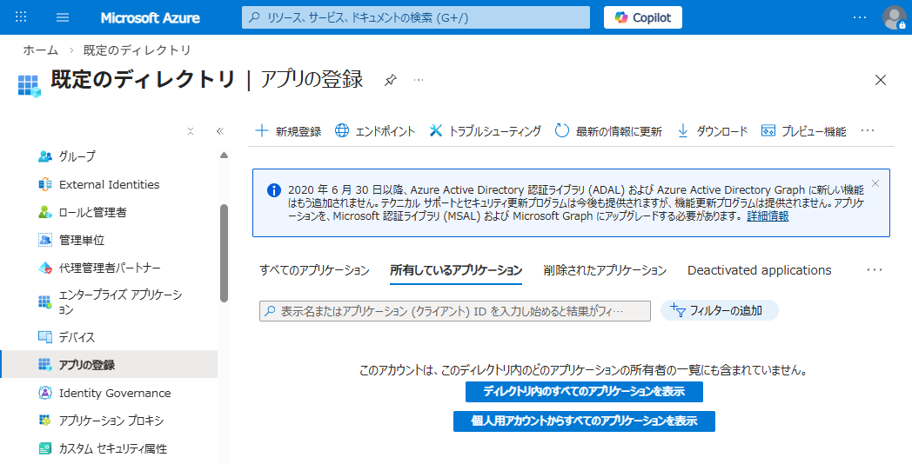

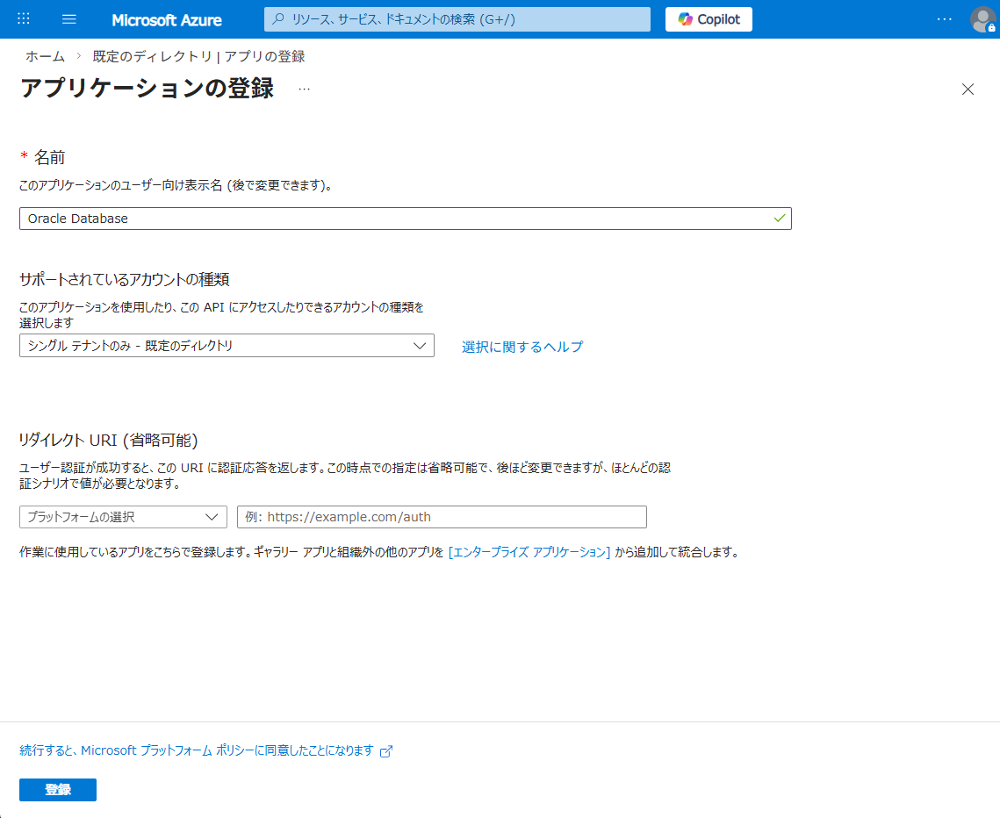

### ・APIの公開
左側のメニューから「API の公開」を選択し、「スコープの追加」をクリックします。  
アプリケーション ID URI が未設定の場合は、最初に設定画面が表示されるため、そのまま保存して続行します。

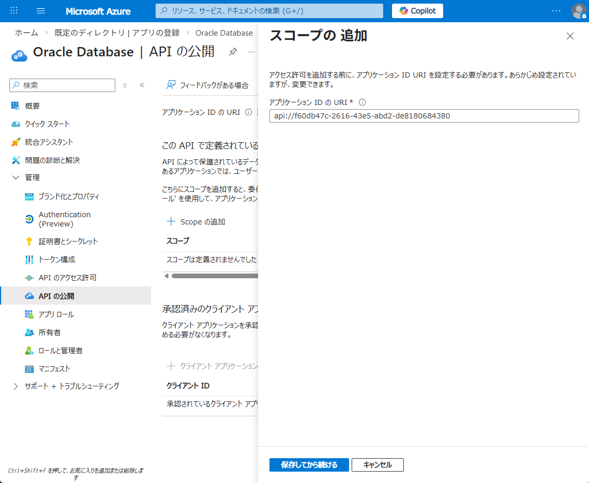

続いてスコープを設定します。値は任意ですが、ここでは `oracle:database:session` を設定します。  
表示名など必要な項目を入力し、「スコープの追加」をクリックします。

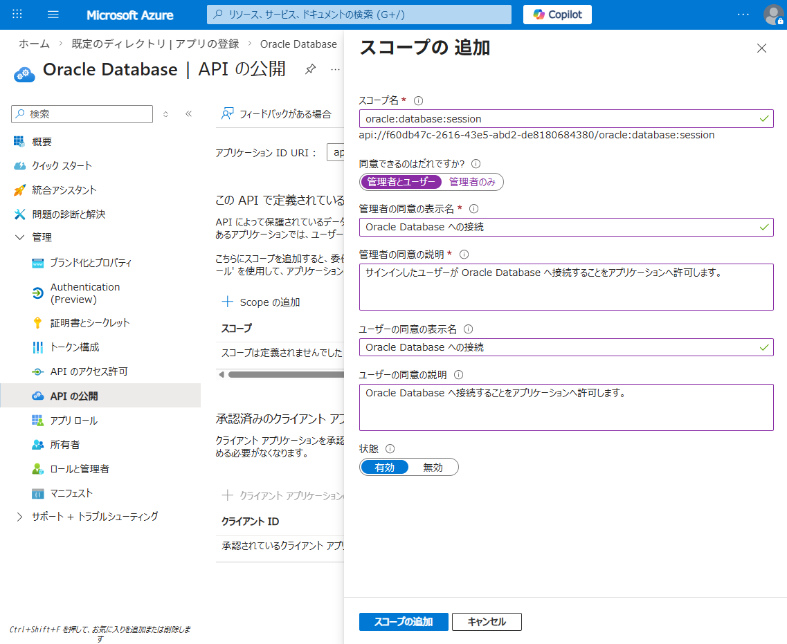

### (補足) アプリロールの作成
Oracle Database のロールと Entra ID のロールを紐付けるには、アプリロールを作成します。  
「アプリロール」から「アプリロールの作成」をクリックし、必要な情報を入力して「適用」します。

ただし、Entra ID ではロール割り当ては有償版でのみサポートされるため、本手順では設定しません。

### ・トークンバージョンの設定
アプリケーション ID URI が `http` ではなく、ここで示すように `api://` から始まる場合、Entra ID で発行するアクセストークンは **v2** である必要があります。

トークンのバージョンを変更するには、「マニフェスト」で `requestedAccessTokenVersion` の値を確認します。  
`null` の場合は v1 トークンが発行されるため、これを `2` に変更して保存します。

https://learn.microsoft.com/ja-jp/entra/identity-platform/access-tokens

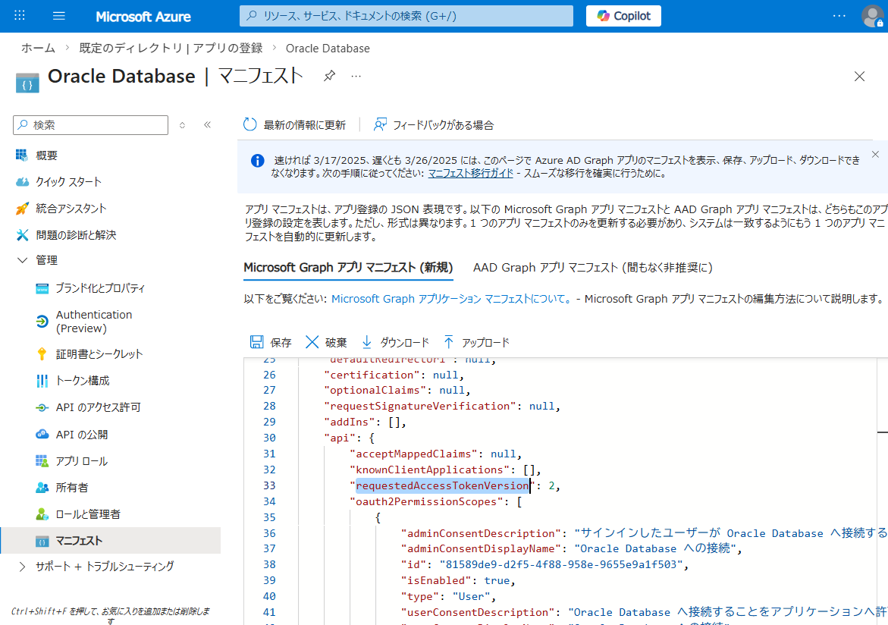

また、v2 トークンを認可コードフローで利用する場合は、`upn` クレームを参照するため、トークンに `upn` クレームが含まれるよう構成する必要があります。  
なお、この設定はクライアントクレデンシャル フローでは不要です。

「トークン構成」で `upn` にチェックを付けます。

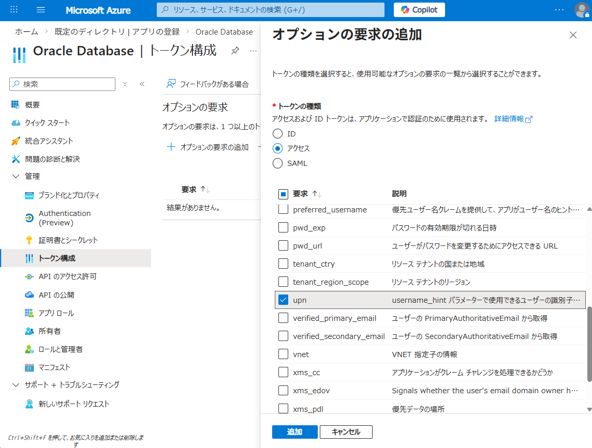

### ・Databaseで設定する情報を控える

後続の手順では、Database 側に設定を登録します。その際に必要となるため、アプリケーションの概要画面から以下の情報を控えておきます。
- アプリケーション ID
- ディレクトリ（テナント）ID
- アプリケーション ID URI
をそれぞれ控えます。

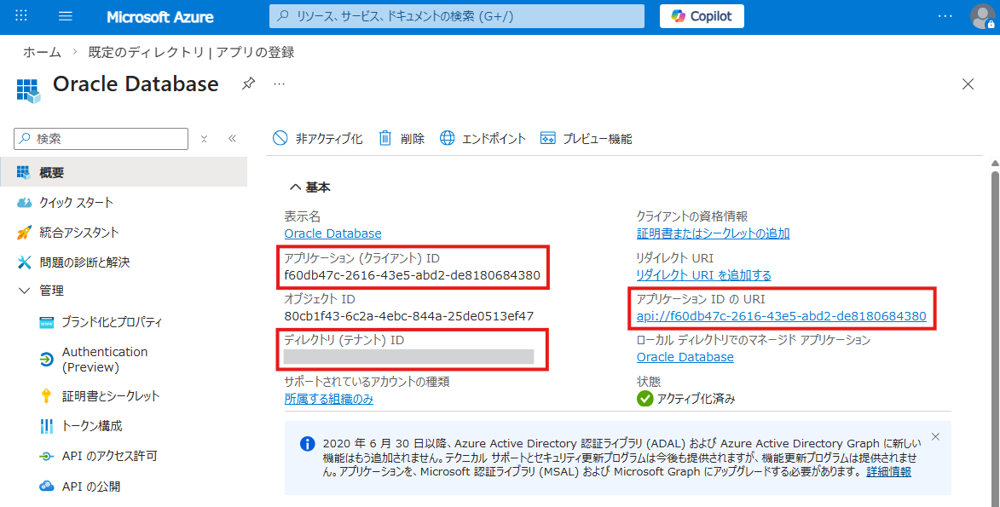


## 1-2. EntraID OAuthクライアントの設定

### ・クライアントの作成
再度、Azure ポータルで Entra ID の画面に移動し、左側のメニューから「アプリの登録」を選択して、「新規登録」をクリックします。

トークンを取得するクライアント アプリケーションを登録します。名前は任意ですが、ここでは Postman からトークンを取得するため「Postman」としています。  
「Oracle Database Client」などの名前でも問題ありません。  
リダイレクト URI は、現時点で利用予定のものがあれば登録しておきます。

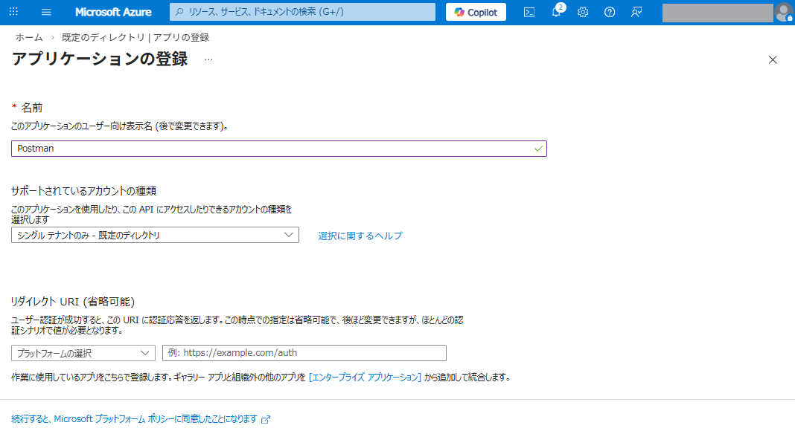

アプリケーションを作成したら、アプリケーション ID を控えておきます。

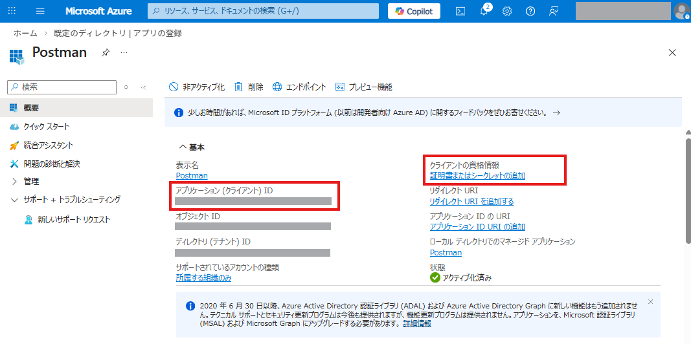

次に、クライアント シークレットを発行します。  
左側のメニューから「管理」→「証明書とシークレット」を選択し、「新しいクライアント シークレット」をクリックします。必要事項を入力し、追加します。

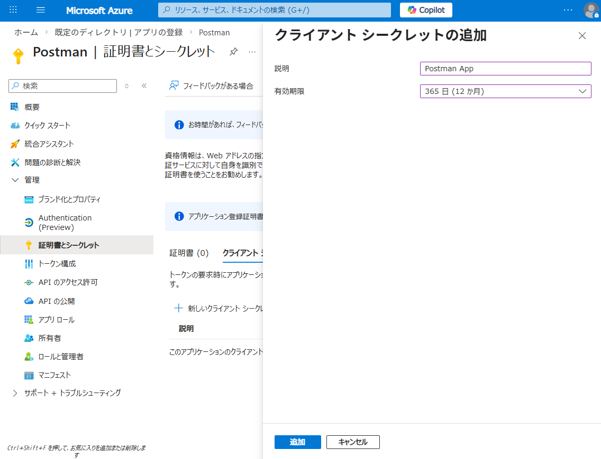

作成されたクライアント シークレットの値を控えておきます。  
この値は後からマスキングされて表示されるため、作成時点で必ず記録してください。

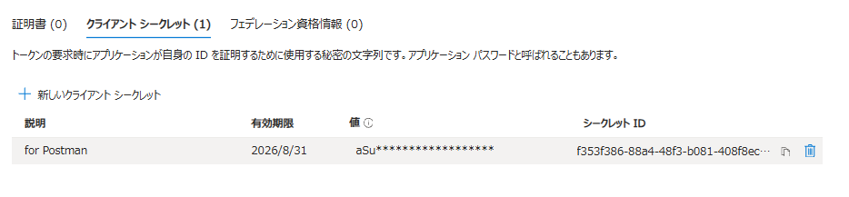

### ・クライアントの設定
作成したクライアントアプリケーションを利用するために、必要な設定を行います。

まず、リダイレクト URI を登録します。これは、認可リクエストの応答として認可コードを受け取るための URI です。  
つまり、トークンを受け取るアプリケーション自身がホストする URI を指定します。

テストや検証のためにローカル環境で実行する場合は、`localhost` を指定して問題ありません。  
また、Azure CLI でトークンを取得する場合、この設定は不要です。

Postman を使用する場合は、以下のいずれかの URI を登録します。
```
https://oauth.pstmn.io/v1/callback
```
または
```
https://oauth.pstmn.io/v1/browser-callback
```

設定するには、作成したアプリケーションの左側メニューから「Authentication (Preview)」を選択し、「リダイレクト URI の構成」をクリックします。
その後、「Web」を選択します。

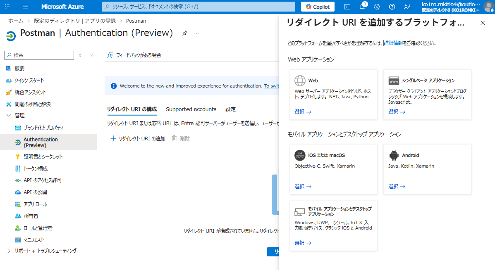

利用する環境に応じた URI を登録します。

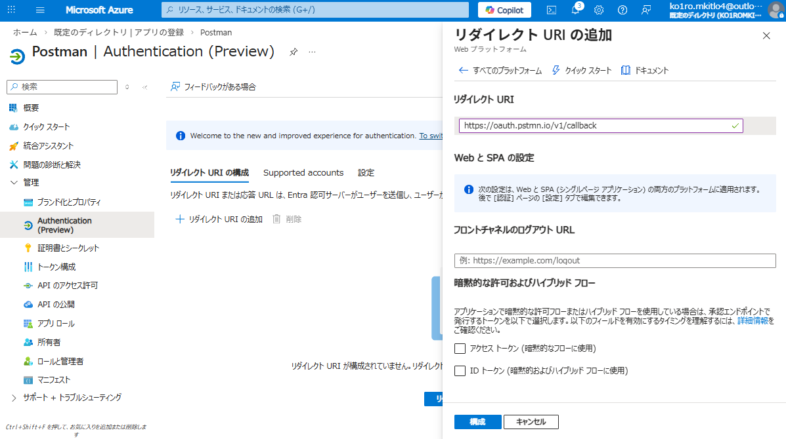


### ・API アクセス許可の設定
`1-1.`で設定した Oracle Database の API を、このクライアント アプリケーションから利用できるようにします。

左側のメニューから「API のアクセス許可」を選択し、「アクセス許可の追加」をクリックします。
続いて、「所属する組織で使用している API」から、作成した Oracle Database アプリケーションを選択します。

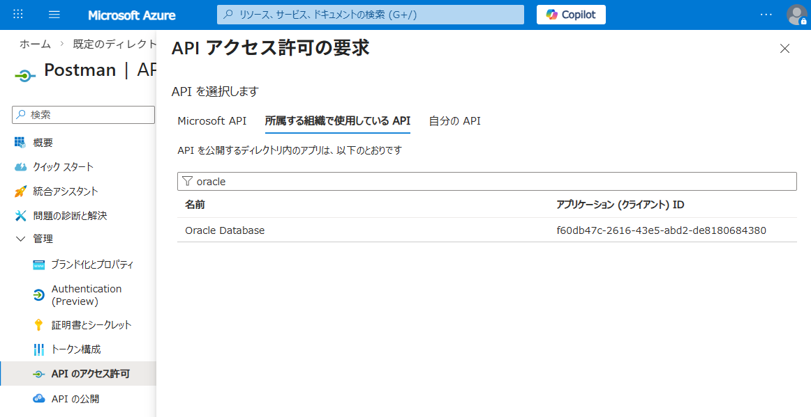

委任されたアクセス許可は、サインインしたユーザーの権限で API を呼び出す方式です。
取得したトークンには scope が含まれ、アプリケーションは「そのユーザーに許可されている範囲」でのみ API にアクセスできます。
初回アクセス時には、設定内容や既存の同意状況に応じて、ユーザーまたは管理者の同意画面が表示される場合があります。

一方、アプリケーションの許可は、ユーザーを介さず、アプリケーション自身の権限で API を呼び出す方式です。
バックグラウンド処理、バッチ、デーモン、サーバー間通信などに適しています。こちらは scope ではなく app roles を使用し、管理者同意が必須です。

Oracle Database 側の API アプリケーションが application permissions を公開していない場合、アプリケーションの許可が選択できないようになっています。
Entra ID では、API 側で App roles を作成し、その Allowed member types を Applications に設定したものだけが、クライアント側の「アプリケーションの許可」に表示されます。
つまり、API 側で scope のみを定義している場合、クライアント側では「委任されたアクセス許可」しか選択できません。

本構成では「委任されたアクセス許可」を使用します。

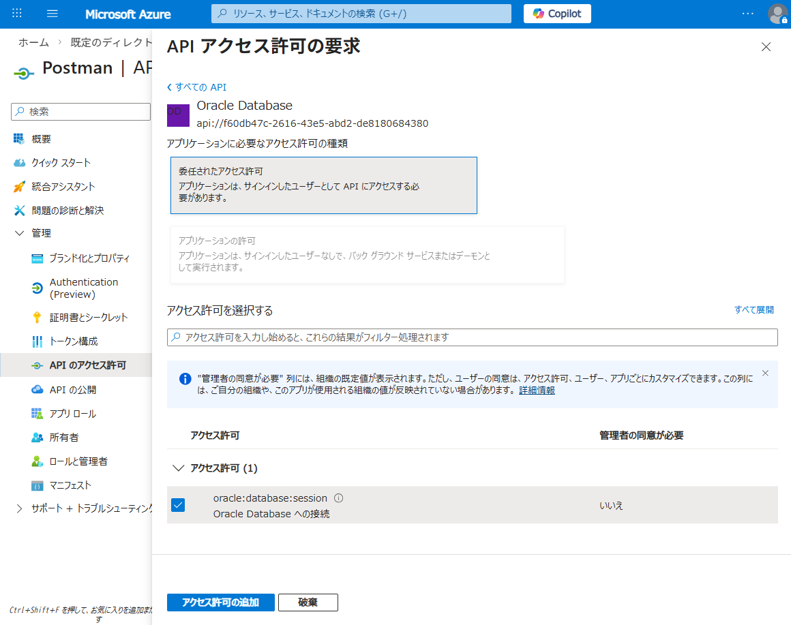


### ・対象ユーザー/ロールの割り当て

必要に応じて、対象ユーザーまたはロールを「エンタープライズ アプリケーション」より割り当てておきます。

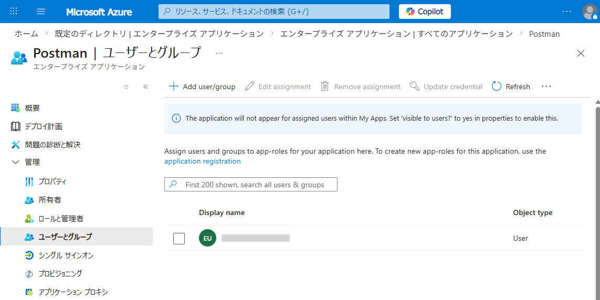
