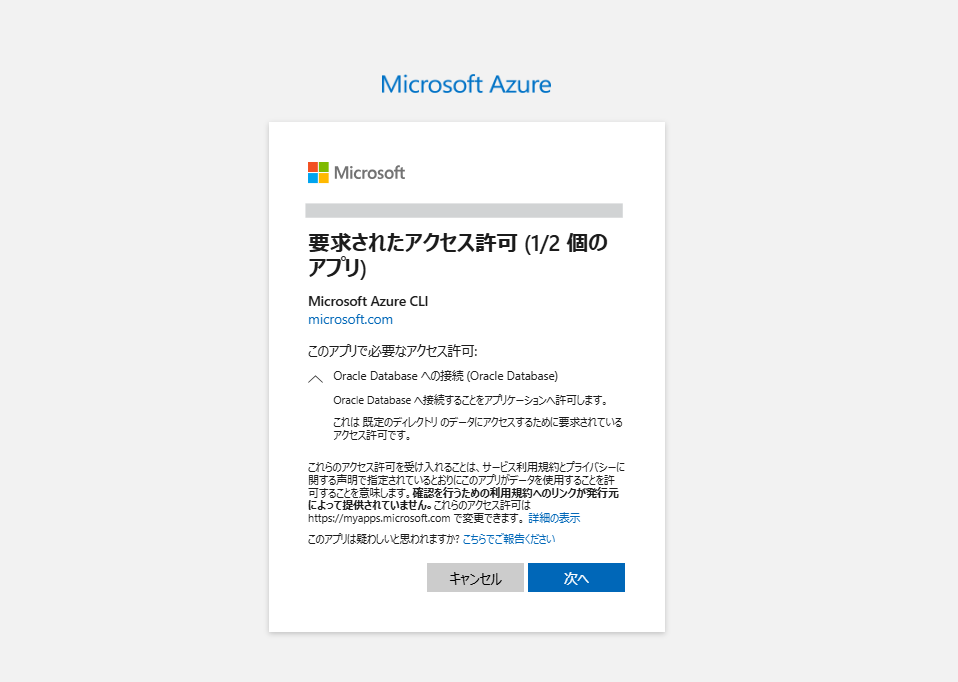
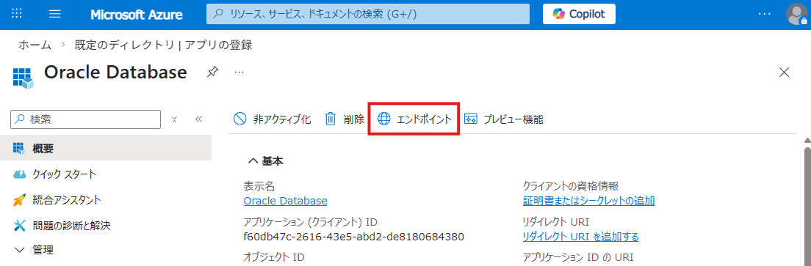
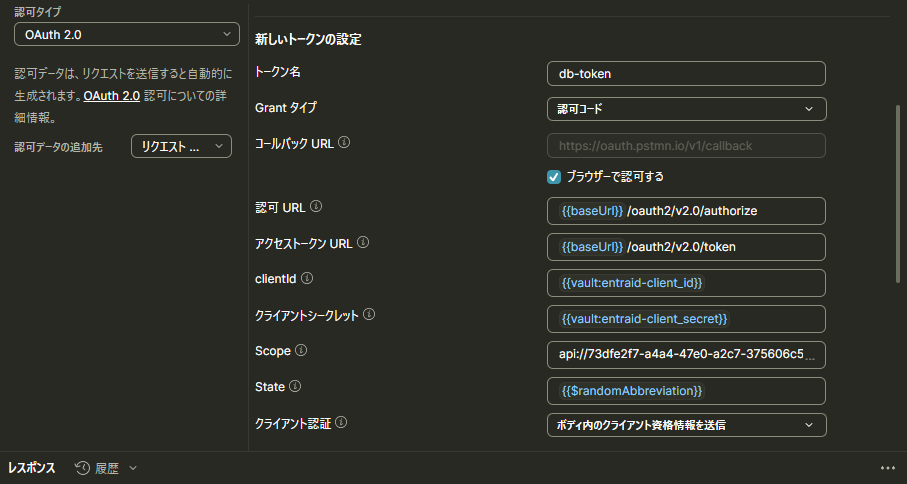
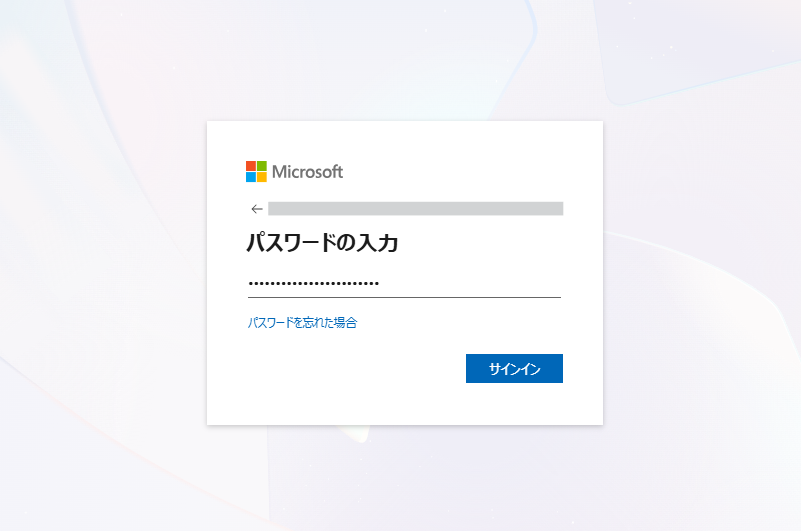
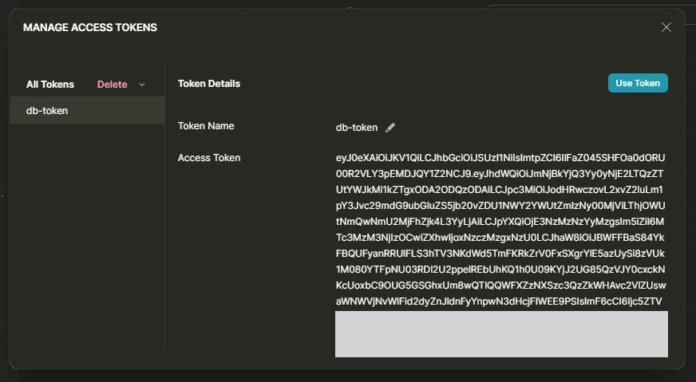

このセクションでは、Entra ID からアクセストークンを取得し、そのトークンを使用して Oracle Database に接続できることを確認します。

> **実施内容**
> - Azure CLI または Postman を使用したアクセストークンの取得
> - 取得したトークンの保存
> - SQLcl を使用した Database への接続確認

## 3-1. トークンの取得
SQLcl で接続をテストするため、まずは Entra ID からアクセストークンを取得します。  
トークンの取得は Web API 経由で行われるため、特別な環境は不要です。ここでは、Azure CLI と Postman の 2 つの方法を紹介します。

### ・Azure CLI を使用する場合
まずは Entra ID にログインします。

```
az login --allow-no-subscriptions
```
ブラウザが開けない環境では、`--use-device-code`オプションを追加で使用します。

Azure CLI の利用時には、Oracle Database への接続権限の委任について同意を求められる場合がありますので、表示された画面で承諾します。




ログイン後、Oracle Database 用 API の scope を指定してアクセストークンを取得します。
Azure CLI の `--scope` は v2 スコープ形式で指定すると、次の例のようになります。

```
az account get-access-token \
  --tenant <テナントID> \
  --scope api://<APIのApp ID>/<設定したscope>
```
```shell
➜  ~ az account get-access-token \
  --tenant xxxxxxxxxxxxxxx \
  --scope api://f60db47c-2616-43e5-abd2-de8180684380/oracle:database:session
{
  "accessToken": "eyJ0eXAiOiJKV1QiLCJhbGciOiJSUzI1NiIsImtpZCI6IlFaZ045SHFOa0dORU00R2VLY3pEMDJQY1Z2NCJ9.eyJhdWQiOiJmNjBkYjQ3Yy0yNjE2LTQzZTUtYWJkMi1kZTgxODA2ODQzODAiLCJpc3MiOiJodHRwczovL2xvZ2luLm1pY3Jvc29mdG9ubGluZS5jb20v
  ...
  kTTCIQSYRK_FpWkMAw7LLsObg9ugaRfCzKvlPs8RHLc5KKAY9cxYvCXaK4cmJGqLT65P_7h00YJ9zZaR3sTnSl3RJsKzzbGMFL2nfgVshb23th4mgQboxoI7UhXBc3tHjrndQVzoCCoXZR_sCdtdfqijVEyvlUgZ_2VoKu999kH8Zo5-v1dO-M5P89sxIjfut1cyOqEYLaiwkyRTLshQNo72ugE1viXie5v75ZyXEYXKvi0_yE6kv7ctF74xoa9McueqWCfSYIuRLPr9JUOv3GEt_g5LQ",
  "expiresOn": "2026-03-13 16:25:09.000000",
  "expires_on": 1773386709,
  "tenant": "xxxxxxxxxxxxxxx",
  "tokenType": "Bearer"
}
```

このように、アクセストークンを取得できます。

アクセストークンの文字列のみを出力したい場合は、以下のコマンドを実行します。

```
az account get-access-token \
  --tenant xxxxxxxxxxxxxxx \
  --scope api://f60db47c-2616-43e5-abd2-de8180684380/oracle:database:session \
  --query accessToken \
  --output tsv
```

### ・Postmanの場合
Postman では、「認可」タブで以下の項目を設定します。  
認可 URL およびアクセストークン URL は、API アプリケーションの概要画面にある「エンドポイント」から確認できます。



| 項目 | 入力値 | 
|---|---|
| コールバックURL | `<リダイレクトURIとして設定したURL>` |
| 認可URL | `<OAuth 2.0 承認エンドポイント>` |
| アクセストークンURL | `<OAuth 2.0 トークン エンドポイント>` |
| クライアントID | `<クライアントID>` |
| クライアントシークレット | `<発行したクライアント・シークレット>` |
| Scope | `api://<APIのApp ID>/<設定したscope>` |
| State | 任意 |
| クライアント認証 | (任意) `ボディ内のクライアント資格情報を送信` |



「新しいアクセストークンを取得」をクリックします。

EntraIDのユーザーでログインします。



トークンを取得できたら、その文字列をコピーして `db-token` というファイル名で保存します。



取得したトークンの形式は JWT です。[jwt.io](https://www.jwt.io/ja) などのサイトを利用すると簡単にデコードできます。
接続できない場合のトラブルシューティングとしては、次の点をまず確認してください。

- トークンのバージョン `ver` が `2.0` になっていること
- `upn` クレームが含まれていること


## 3-2. データベースへの接続
取得したトークンを、接続時に参照できる任意のディレクトリに保存します。

## 3-3. 接続を試す
以下をハイライトされた行を含むよう `tnsnames.ora` を構成します。なお、データベースにはTLSで接続する必要があることに注意が必要です。

```diff
azurepdb_token = (
  DESCRIPTION=
    (ADDRESS=(PROTOCOL=TCPS)(HOST=xx.xx.xx.xx)(PORT=2484))
    (SECURITY=
+			(TOKEN_AUTH=OAUTH)
+			(TOKEN_LOCATION=/path/to/db-token)
      (WALLET_LOCATION=/path/to/client/wallet)
			(SSL_SERVER_CERT_DN="CN=xx.xx.xx.xx")
			(SSL_SERVER_DN_MATCH=YES))
    (CONNECT_DATA=(SERVICE_NAME=<service.name>)))
```

設定した接続記述子を指定して接続します。

```
sql /@azurepdb_token
```

接続例は以下のとおりです。

```shell
➜  ~ sql /@azurepdb_token

SQLcl: Release 25.3 Production on Fri Mar 13 14:36:00 2026

Copyright (c) 1982, 2026, Oracle.  All rights reserved.

Connected to:
Oracle AI Database 26ai EE High Perf Release 23.26.0.0.0 - for Oracle Cloud and Engineered Systems
Version 23.26.0.0.0

SQL> sho user
USER is "ENTRAID_USER"
```

続いて、接続コンテキストを確認します。

```
SELECT
  SYS_CONTEXT('USERENV','CURRENT_SCHEMA')         AS current_schema,
  SYS_CONTEXT('USERENV','CURRENT_USER')           AS current_user,
  SYS_CONTEXT('USERENV','SESSION_USER')           AS session_user,
  SYS_CONTEXT('USERENV','AUTHENTICATION_METHOD')  AS auth_method,
  SYS_CONTEXT('USERENV','AUTHENTICATED_IDENTITY') AS authenticated_identity,
  SYS_CONTEXT('USERENV','ENTERPRISE_IDENTITY')    AS enterprise_identity,
  SYS_CONTEXT('USERENV','IDENTIFICATION_TYPE')    AS identification_type
FROM dual;
```

```shell
SQL> SELECT
  2    SYS_CONTEXT('USERENV','CURRENT_SCHEMA')         AS current_schema,
  3    SYS_CONTEXT('USERENV','CURRENT_USER')           AS current_user,
  4    SYS_CONTEXT('USERENV','SESSION_USER')           AS session_user,
  5    SYS_CONTEXT('USERENV','AUTHENTICATION_METHOD')  AS auth_method,
  6    SYS_CONTEXT('USERENV','AUTHENTICATED_IDENTITY') AS authenticated_identity,
  7    SYS_CONTEXT('USERENV','ENTERPRISE_IDENTITY')    AS enterprise_identity,
  8    SYS_CONTEXT('USERENV','IDENTIFICATION_TYPE')    AS identification_type
  9* FROM dual;

CURRENT_SCHEMA CURRENT_USER SESSION_USER AUTH_METHOD  AUTHENTICATED_IDENTITY                             ENTERPRISE_IDENTITY                  IDENTIFICATION_TYPE 
______________ ____________ ____________ ____________ __________________________________________________ ____________________________________ ___________________ 
ENTRAID_USER   ENTRAID_USER ENTRAID_USER TOKEN_GLOBAL entraid-user01@xxxxxxxxxxxxxxxxxxx.onmicrosoft.com 1b356ei9fe-ef85-8225-feee092c434fd01 GLOBAL EXCLUSIVE  
```