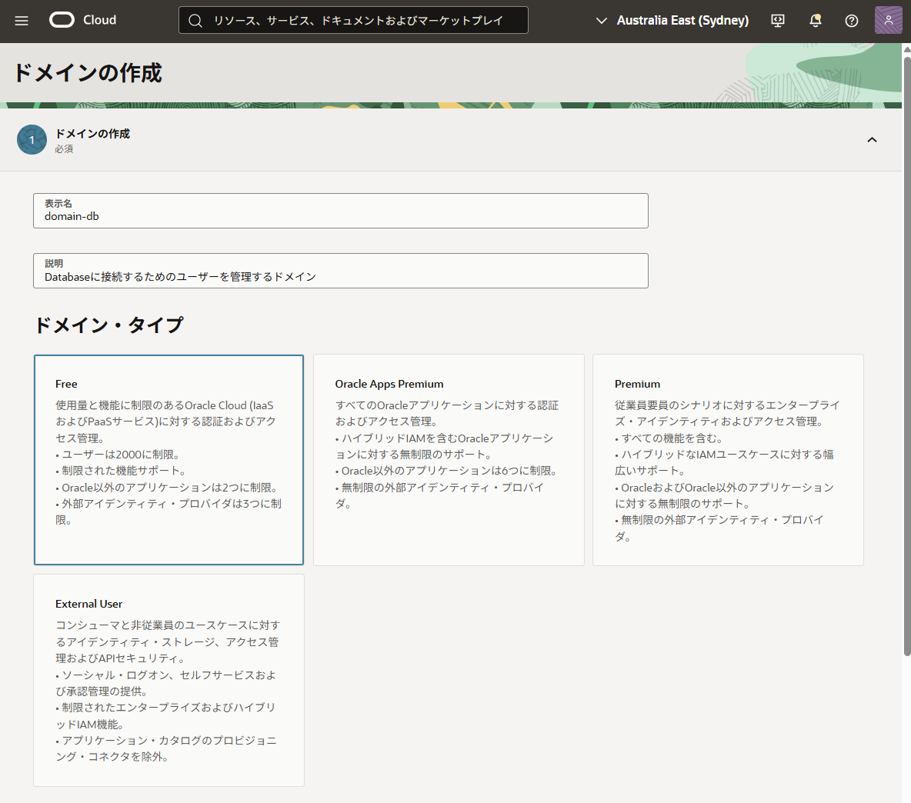
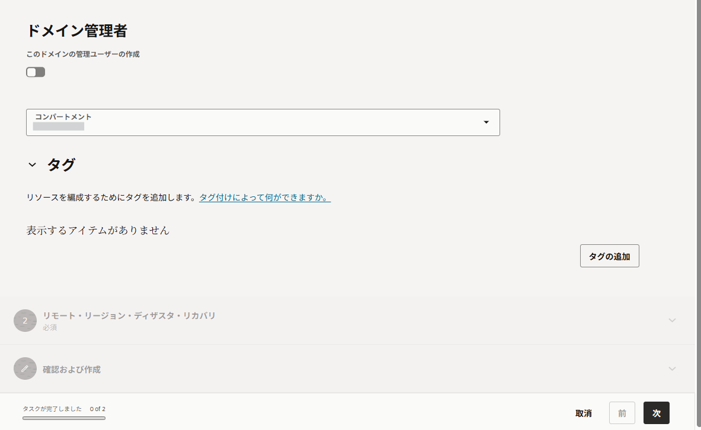
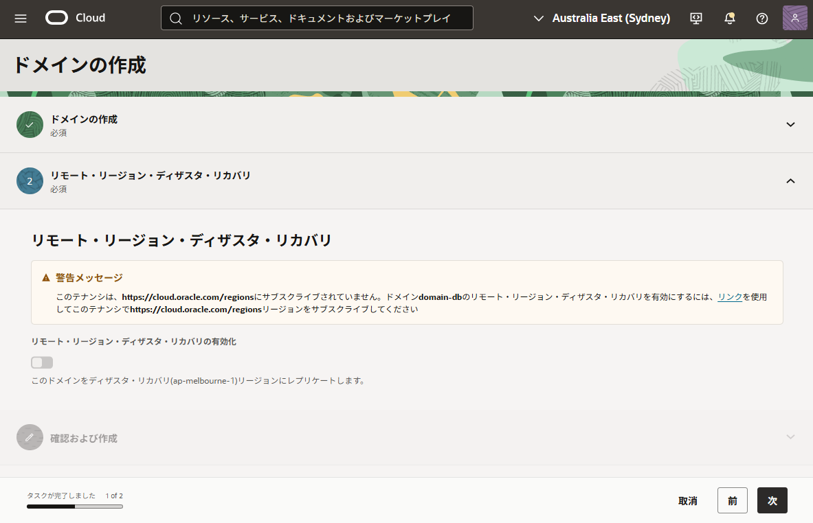
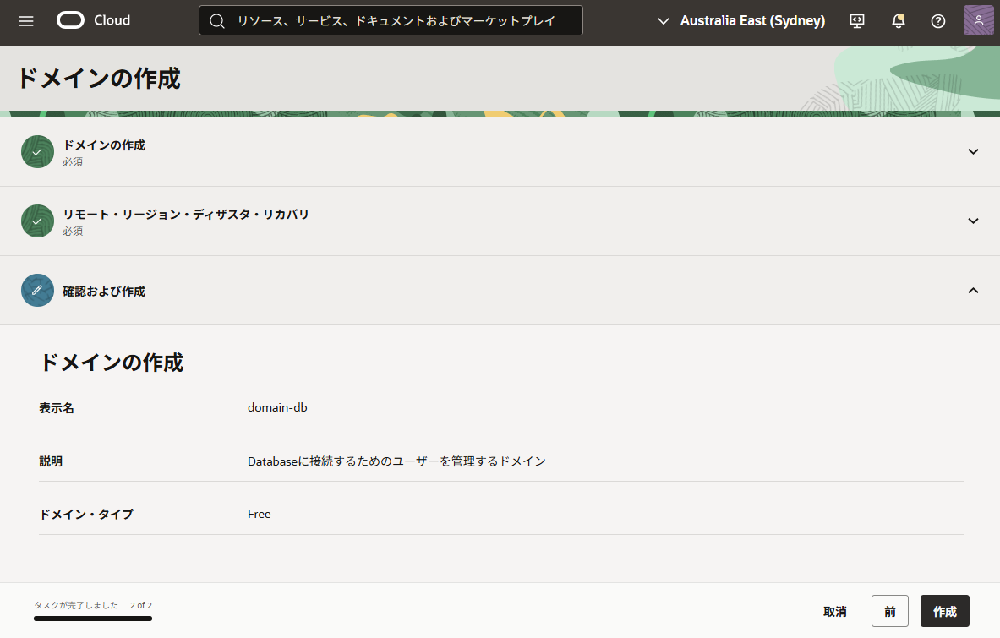
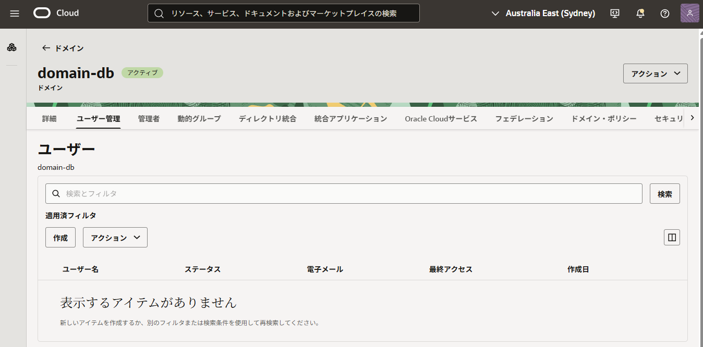
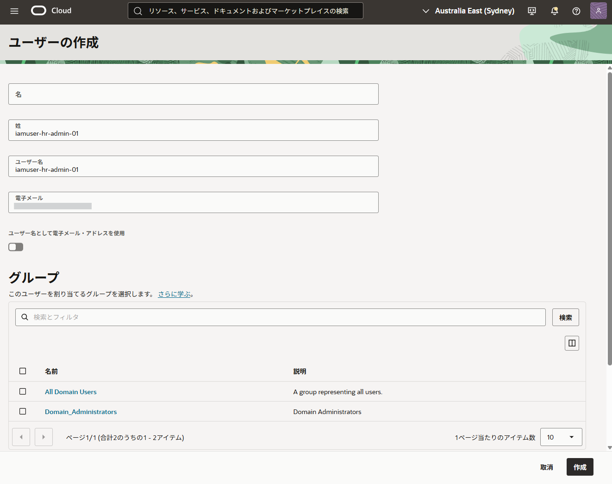
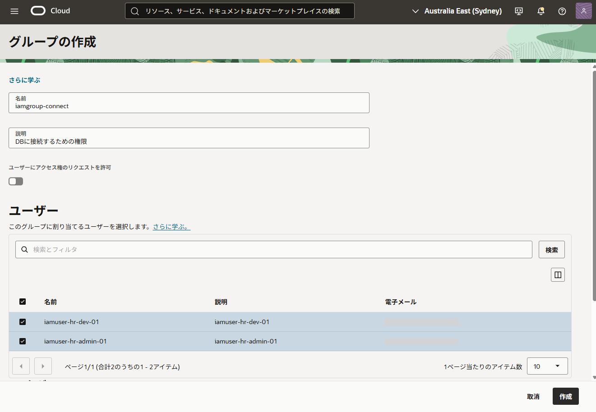
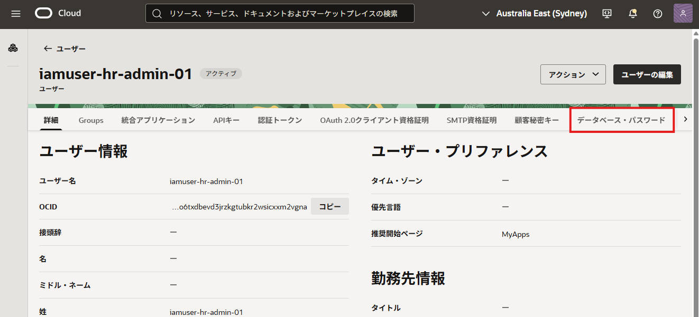
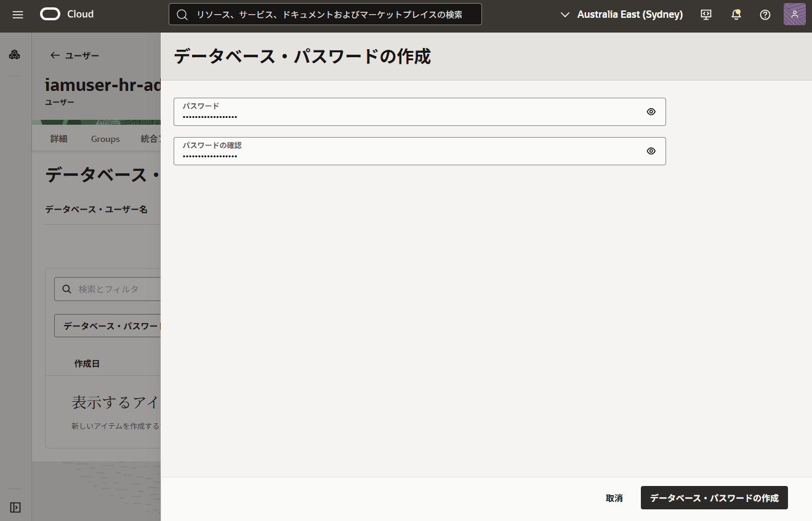

import { Steps } from '@astrojs/starlight/components';

> **実施内容**
> - Identity Domain の作成
> - IAMユーザー作成
> - IAMグループ作成（ユーザーの割当て）
> - IAMデータベース・パスワード（DBパスワード）の作成

## 1-1. Identity Domain の作成

デフォルトのIdentity Domainを使用することも可能ですが、Database認証用のIAM設定を独立して管理するため、専用のドメインを作成することを推奨します。本手順では「domain-db」という名前のドメインを作成します。

OCIコンソールの左上のメニューボタンより、「アイデンティティとセキュリティ」→「ドメイン」と移動します。
「ドメインの作成」をクリック。

各入力項目を入力していきます。

<Steps>
1. ドメインの作成

    ドメインタイプは「FREE」で問題ありません。

    
    

    「次」を選択

2. リモート・リージョン・ディザスタ・リカバリ

    今回は設定を行わずに、「次」を選択

    

3. 確認および作成

    表示名と説明を確認して、「作成」を選択します。

    

</Steps>

## 1-2. IAMユーザーの作成

Database での役割（権限）を分けるため、ここでは次の 2 ユーザーを作成します。

- `iamuser-hr-admin-01`
- `iamuser-hr-dev-01`

ユーザーを作成します。ドメイン詳細画面の「ユーザー管理」タブを選択し、[ユーザー] セクションの「作成」をクリック。

「姓」と「電子メール」が必要のため、どちらもユーザー名を入力しておきます。

入力できたら「作成」を選択し、ユーザーを作成します。

同じ手順を繰り返し、2人のユーザーを用意します。

## 1-3. IAMグループの作成

作成したユーザーを格納し、権限を管理するためのグループを作成します。

- ``iamgroup-hr-admin`` （admin用の権限を与える）
- ``iamgroup-hr-dev`` （dev用の権限を与える）

ユーザーの作成時と同じく「ユーザー管理」タブを選択し、[グループ] セクションの「グループの作成」をクリック

作成の際に、先程作成したユーザーを割り当てておきます

- ``iamgroup-hr-admin`` グループ
    - iamuser-hr-admin-01 ユーザー
- ``iamgroup-hr-dev`` グループ
    - iamuser-hr-dev-01 ユーザー

## 1-4. DBパスワードの作成

作成した各IAMユーザーに対し、Database接続用の専用パスワード（DBパスワード）を設定します。

ユーザー詳細画面の「データベース・パスワード」タブをクリックし、「データベース・パスワードの作成」を選択し、パスワードを作成します。

この手順を繰り返し、作成した2人のユーザーそれぞれにてDBパスワードを設定しておきます。

また、コンソール画面からわかるように「データベース・ユーザー名」を変更することも可能ですが、本手順ではデフォルトのIAMユーザー名を使用します。

次のステップは、Database側のセットアップになります。