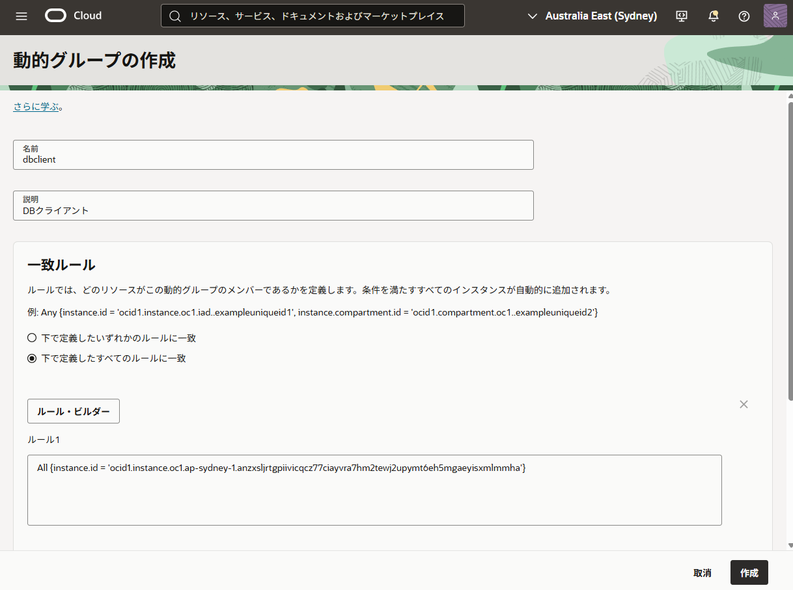

チュートリアルではAPIキーを使用してDBトークンを取得しましたが、このページでは、クライアント環境にAPIキーやパスワードを配置せず、インスタンスプリンシパルを使ってDBトークンを取得し、Autonomous Databaseに接続します。

> **実施内容**
> - OCIコンピュートインスタンスの準備とIAMポリシーの作成
> - コンピュートインスタンスにOCI CLIをインストールする
> - DBユーザーを作成する
> - トークンを使用してアクセスする


## 1. OCIコンピュートインスタンスの準備とIAMポリシーの作成


インスタンスプリンシパルを使用するには、Databaseにアクセスするコンピュートインスタンスと、そのインスタンスを認可するIAM設定が必要です。
ここでは詳細な作成手順は省略し、次の状態になっている前提で進めます。

- DBアクセスに使用するOCIコンピュートインスタンスが作成済み
- そのインスタンスが所属する動的グループ（dynamic group）が作成済み

動的グループのルールで、対象インスタンスのOCIDを指定します。これにより、特定のインスタンスがIAMのプリンシパルとして扱えるようになります。



作成した動的グループに対して、Autonomous Databaseへの接続権限を付与するIAMポリシーを設定します。動的グループは今回使用しているIdentity Domain内に作成した場合、動的グループ名は ``<domain名>/<動的グループ名>`` で指定します。

```
Allow dynamic-group 'domain-db'/'dbclient' to use autonomous-database-family in tenancy
```

## 2. コンピュートインスタンスにOCI CLIをインストールする

準備したコンピュートインスタンスにOCI CLIをインストールし、インスタンスプリンシパル認証でOCI CLIが実行できることを確認します。

インスタンスプリンシパル認証を使用する場合、`--auth instance_principal` を指定します。

```shell
$ oci iam region list --auth instance_principal
{
  "data": [
    {
    "key": "AMS",
    "name": "eu-amsterdam-1"
    },
    {
    "key": "ARN",
    "name": "eu-stockholm-1"
    },
  ...
```

リージョン一覧が取得できれば、OCI CLIの実行と認証が成功しています。


## 3. DBユーザーを作成する

インスタンス・プリンシパルをDatabase側で認証するための専用のDBユーザーを作成します。  
このDBユーザーは、インスタンスのOCIDにマッピングされます。

管理者権限を持つユーザー（ADBでは ADMIN など）で接続し、インスタンスOCIDに紐づくグローバルユーザーを作成します。

```
create user DBUSER_COMPUTE identified globally as 'IAM_PRINCIPAL_OCID=ocid1.instance.oc1.ap-sydney-1.yyyyyyyyyyyyyyyyy';
```

また、接続できるように `create session`権限を付与します。
```
grant create session to USER_COMPUTE;
```

## 4. トークンを使用してアクセスする

インスタンスプリンシパルを使って db-token を取得し、接続します。

### DBトークンの取得

`--auth instance_principal` オプションを指定して `db-token get` コマンドを実行します。

```shell
$ oci iam db-token get --auth instance_principal
Private key written at /home/ubuntu/.oci/db-token/oci_db_key.pem
db-token written at: /home/ubuntu/.oci/db-token/token
db-token is valid until 2025-11-08 22:16:17
```

<details>
<summary>トークンをデコードした例</summary>

```json title="ヘッダー"
{
  "kid": "scoped_sk_db_token_syd_1713219551687",
  "alg": "RS256"
}
```
```json title="ペイロード"
{
  "sub": "ocid1.instance.oc1.ap-sydney-1.yyyyyyyyyyyyyyyyyyyyyyyyyyyyyyyyyyyyyyy",
  "opc-certtype": "instance",
  "iss": "authService.oracle.com",
  "fprint": "A2:82:C9:B0:F3:5B:B8:DF:22:57:0F:10:3D:3F:27:B0:0E:78:3C:B6",
  "ptype": "instance",
  "sess_exp": "Sat, 08 Nov 2025 18:56:17 UTC",
  "aud": "urn:oracle:db:ocid1.tenancy.oc1..xxxxxxxxxxxxxxxxxxxxxxxxxxxx",
  "opc-tag": "V3,ocid1.tenancy.oc1..xxxxxxxxxxxxxxxxxxxxxxxxxxxx,AAAAAgAAAAAAAMmB,AAAAAgAAAAAbhip6AACBaA==,AAAAAQAAAAAAlERs",
  "ttype": "scoped_access",
  "scope": "urn:oracle:db::id::*",
  "opc-instance": "ocid1.instance.oc1.ap-sydney-1.yyyyyyyyyyyyyyyyyyyyyyyyyyyyyyyyyyyyyyy",
  "exp": 1762607777,
  "opc-compartment": "ocid1.compartment.oc1..zzzzzzzzzzzzzzzzzzzzzzzzzzzzzz",
  "iat": 1762606577,
  "jti": "68aa4a1d-65c2-4e6c-9c12-2650d83abe60",
  "tenant": "ocid1.tenancy.oc1..xxxxxxxxxxxxxxxxxxxxxxxxxxxx",
  "jwk": "{\"kid\":\"ocid1.tenancy.oc1..xxxxxxxxxxxxxxxxxxxxxxxxxxxx\",\"n\":\"rAU48ZSgchpnl-eXFyKQUF8bq5kGHtqx7LPWgHn_kWUh6rRWHkHvIf0--KD45hM_Yvi8L4edU7W_X7-qaYno2mWo4RBCx51wfo2EChOfktcZjJdK385g6xG6dclCQVT4IjUg1C6LmjHCCsKMhD2G9Q1sagJTipYZfbMSgT5IjtaM4kCwEdMLq6azzJ22ku8UqSVOZdrEVjYGVB-XIxr4xqjPMzvFo-DJLQrqnmKAGuf2HMbyxkCajiYBgAb1uYREXbtHuuS4CetirevBR5vIFWKYIYU3sUmZnA59-opYJuBfnpa-3eTmMdUD_fmCpMSAusYz-zR-vWKNSxM1qZjxww\",\"e\":\"AQAB\",\"kty\":\"RSA\",\"alg\":\"RS256\",\"use\":\"sig\"}",
  "opc-tenant": "ocid1.tenancy.oc1..xxxxxxxxxxxxxxxxxxxxxxxxxxxx"
}
```
</details>

`tnsnames.ora` の接続記述子を設定し、取得したトークンで接続します。接続記述子には `TOKEN_AUTH=OCI_TOKEN` が設定済みである前提となります。

```shell
$ sql /nolog

SQL> connect /@db-token
Connected.

SQL> show user
USER is "DBUSER_COMPUTE"
```

これにより、コンピュートインスタンス側にAPIキーやパスワードなどの静的な資格証明を持たせず、インスタンスプリンシパルで取得したDBトークンを使って、専用DBユーザー（`DBUSER_COMPUTE`）として接続できることを確認できます。
