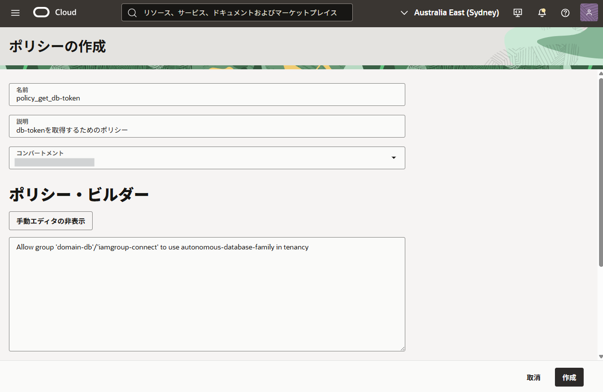
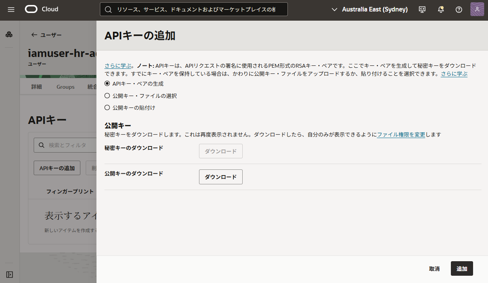
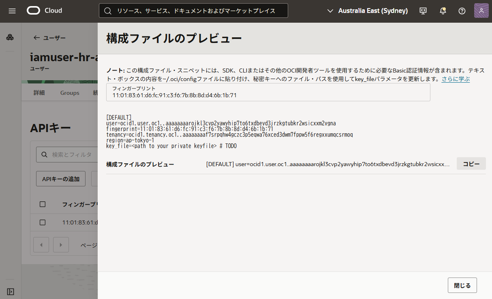

このセクションでは、OCI IAMトークンを取得し、Databaseへ接続するために必要な OCI（クラウド側）と Database 側の環境設定を行います。

DBトークンを取得するには、通常 OCI CLI または OCI SDK（あるいはネイティブAPI）を使用します。本チュートリアルでは、OCI CLIを使用してトークンを取得します。

このセクションで実施する内容は以下の通りです。

> **実施内容**
> - Identity Domain および IAM ユーザー/グループの準備
> - DBユーザーの作成
> - IAMポリシーの作成
> - OCI CLIの準備


## 1-1. Identity Domain および IAM ユーザー/グループの準備

Identity Domain を準備し、そのドメイン内にトークンを発行する主体（ユーザーとグループ）を準備します。  
Default ドメインの使用も可能ですが、データベースアクセスに関する管理を分離したい場合は、専用の Identity Domain を作成することを推奨します。

本手順では、DBトークンを発行する専用の IAMユーザーを用意し、使用するトークンによってDatabaseでの権限が変化することを確認します。

手順としては、  
[`1. Identity Domain のセットアップ`](../oci-iam-dbcredential/1-setup-ocidomain) を参考に、以下に該当する内容を行います。

- Identity Domain の作成
- IAMユーザーの作成
- IAMグループの作成


## 1-2. DBユーザーの作成

Database側でも、OCI IAMユーザーと連携するための設定およびユーザーを作成します。

こちらも、 [`2. Databaseのセットアップ`](../oci-iam-dbcredential/2-setup-database) を参照し、以下の内容すべてを実施してください。

- サンプルスキーマの作成
- 外部認証の有効化
- グローバルユーザーの作成
- グローバルロールの作成


## 1-3. IAMポリシーの作成

DBトークンを発行したユーザーが、対象の Autonomous Database に接続できるよう、OCIのIAMポリシーを設定します。  
このポリシーにより、特定の IAM グループに属するユーザーが、テナンシ内の Autonomous Database リソースファミリーを利用できるようになります。

OCIコンソールの左上メニューより、[アイデンティティとセキュリティ] → [ポリシー] と遷移し、次の IAM ポリシーを追加します。

```
Allow group '<IdentityDomain名>'/'<グループ名>' to use autonomous-database-family in tenancy
```

下の画面ショットの例では `iamgroup-connect` グループを作成し、APIキーを登録したユーザーをこのグループに所属させています。




## 1-3. OCI CLIの準備

DBトークンを取得するために使用する OCI CLI をセットアップします。

### OCI CLI のインストール

以下リンクを参考にOCI CLIをインストールします。

- [OCIチュートリアル「コマンドライン(CLI)でOCIを操作する」](https://oracle-japan.github.io/ocitutorials/intermediates/using-cli/)
- [OCI CLI クイックスタート - OCIドキュメント](https://docs.oracle.com/ja-jp/iaas/Content/API/SDKDocs/cliinstall.htm)

### APIキーの準備と設定

OCI CLIをダウンロードしたら、OCIに接続するためのクレデンシャルが必要です。  
この手順では CLI の認証に **APIキー** を使用するため、APIキーの準備を行います。

OCIコンソールのユーザー詳細画面、[APIキー] タブより「APIキーの追加」を選択します。



「追加」を選択すると、OCI CLIの設定ファイル（`$HOME/.oci/config`）に記述するための設定文字列が表示されます。これをコピーします。



```text title="例：設定文字列"
[DEFAULT]
user=ocid1.user.oc1..aaaaaaaaxxxxxxxxxxxxxxxxxxxxxxx
fingerprint=11:01:83:61:d6:fc:09:c3:f6:7b:8b:8d:d4:6b:1b:71
tenancy=ocid1.tenancy.oc1..aaaaaaaayyyyyyyyyyyyyyyyyyyyyyyyyyyy
region=ap-tokyo-1
key_file=<path to your private keyfile> # TODO
```

コピーした設定文字列を `$HOME/.oci/config` に追記します。  
この際 `key_file` のパスを秘密鍵の実際のパスへ書き換えてください。

このAPIキーの登録をIAMユーザー `iamuser-hr-admin-01` と `iamuser-hr-dev-01` のそれぞれで行います。この際、使用するユーザーのプロファイルを使い分けられるよう、 [DEFAULT] ではなく、 [iamuser-hr-admin-01] と [iamuser-hr-dev-01] で作成しておく便利です。


```text title="例：設定文字列"
[iamuser-hr-admin-01]
user=ocid1.user.oc1..aaaaaaaaxxxxxxxxxxxxxxxxxxxxxxx
fingerprint=xx:xx...

...
[iamuser-hr-dev-01]
user=ocid1.user.oc1..aaaaaaaaxxxxxxxxxxxxxxxxxxxxxxx
fingerprint=yy:yy...
```


### 接続確認

CLIが問題なく実行できることを確認します。  
OCI CLIの設定ファイルでプロファイルを別に作成している場合は `--profile` オプションを使用します。

```
oci iam region list

# または以下のコマンドを実行
oci iam region list --profile iamuser-hr-admin-01
oci iam region list --profile iamuser-hr-dev-01
```

```bash
$ oci iam region list --profile iamuser-hr-admin-01
{
    "data": [
        {
            "key": "AMS",
            "name": "eu-amsterdam-1"
        },
        {
            "key": "ARN",
            "name": "eu-stockholm-1"
...
```

次のステップでは、DBトークンを取得しDBに接続する手順に進みます。
