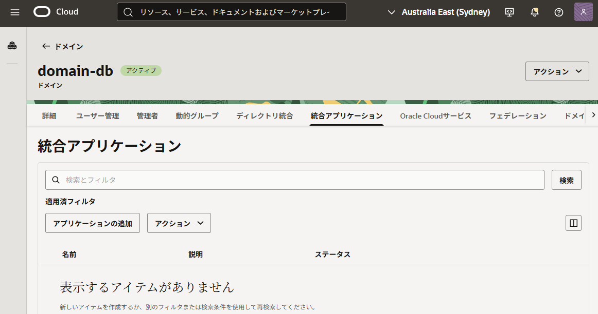
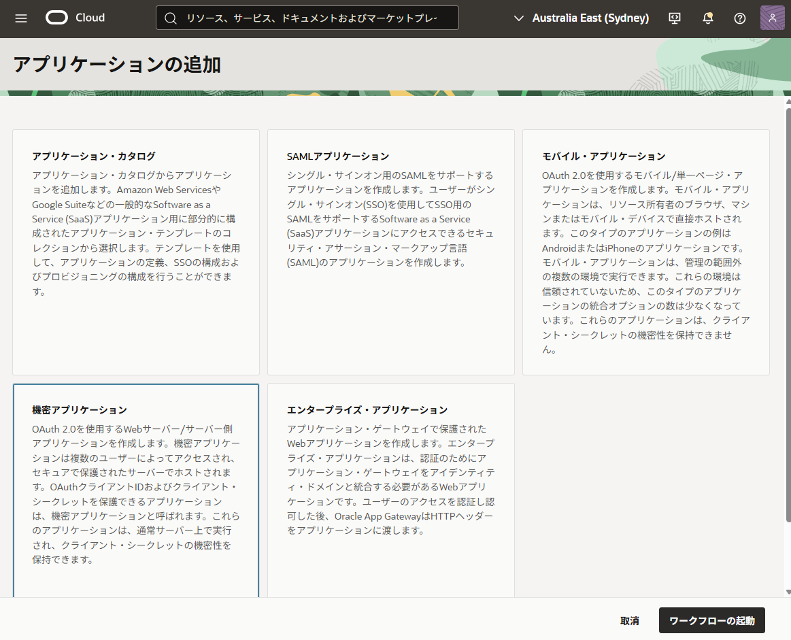
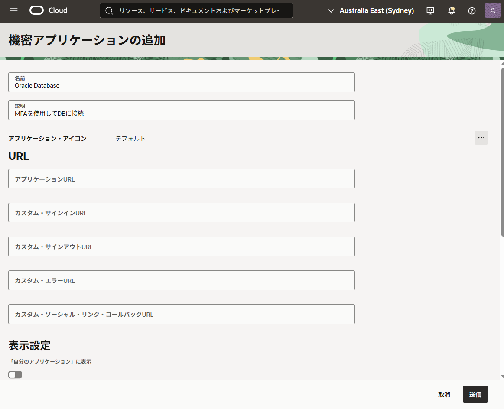
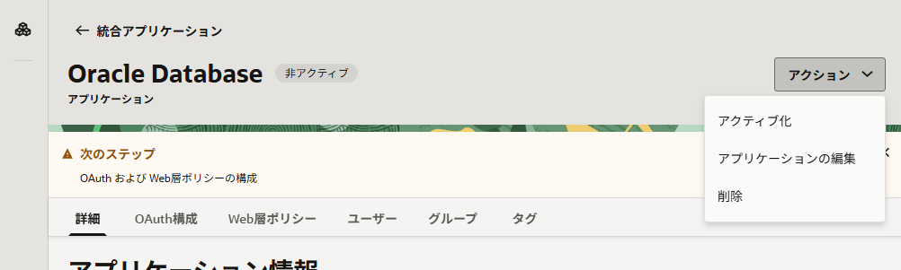
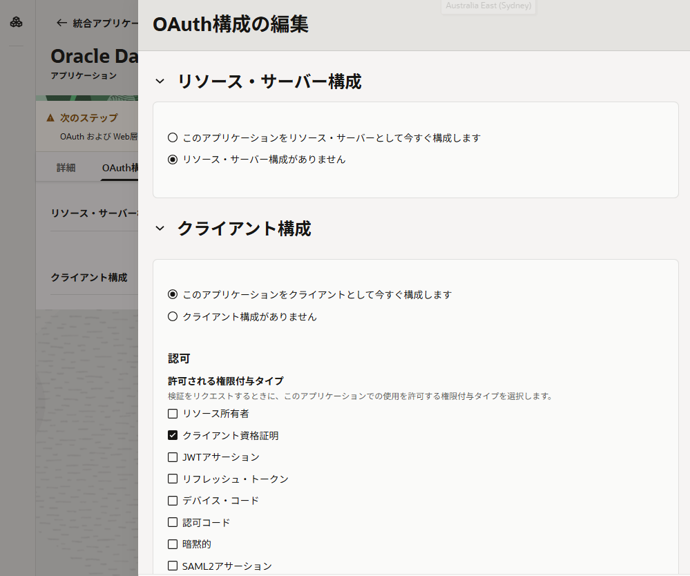
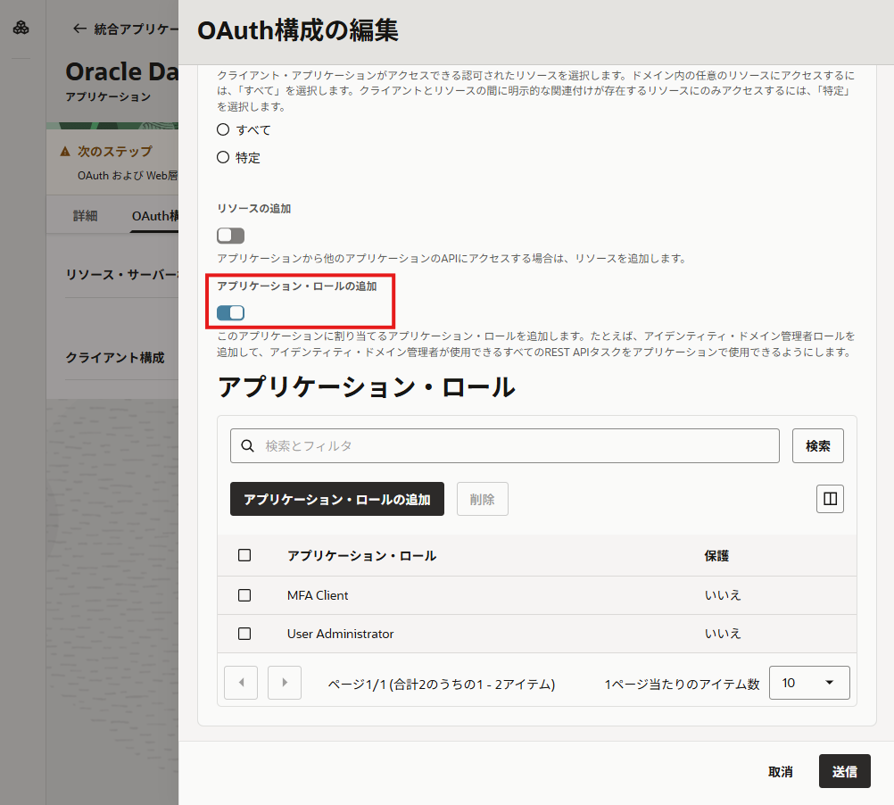
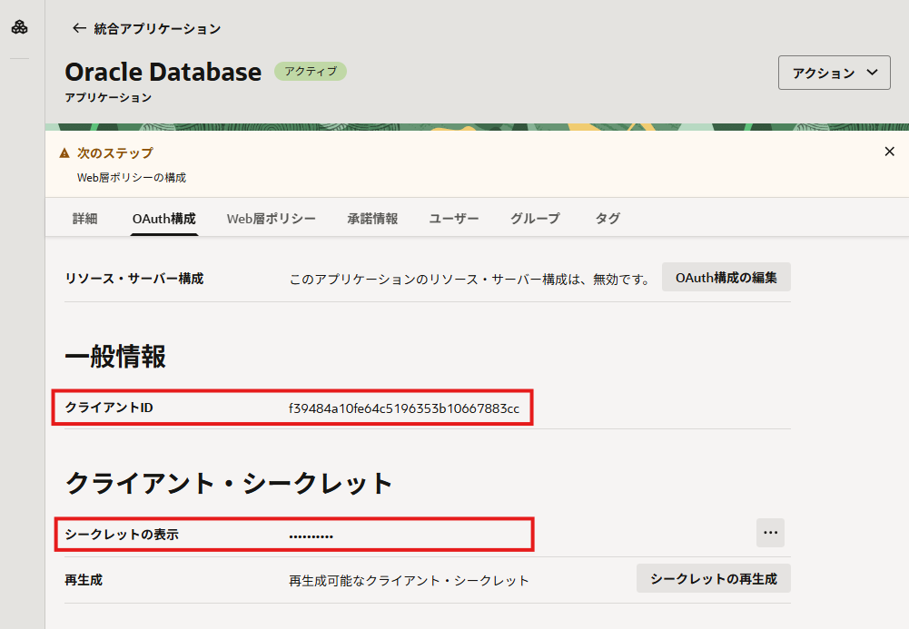
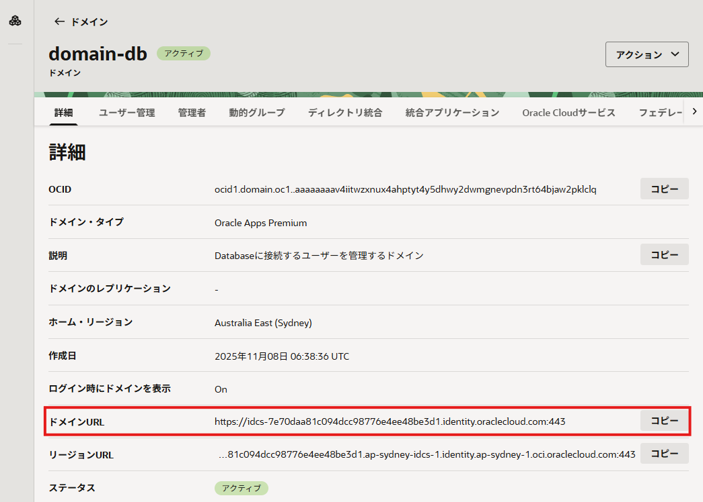

import { Steps, Aside } from '@astrojs/starlight/components';

このチュートリアルでは、OCI IAMと連携し、Oracle Mobile Authenticator (OMA) を使用した多要素認証（MFA）を有効化するための設定を、Base Database ServiceのPDB（プラガブル・データベース）に対して行います。


> **実施内容**
> - Identity Domain クライアントの作成
> - 初期化パラメータの設定
> - 構成時シークレットの設定
> - 事前確認（任意）


## 1-1. Identity Domain クライアントの作成

Oracle Database が OCI IAM に対してMFAの認証要求を行うために、IAM側で OAuth クライアント（機密アプリケーション）を作成し、必要なアプリケーション・ロールを付与します。

<Steps>

1. Identity Domain 詳細画面で [統合アプリケーション] を開き、[アプリケーションの追加] をクリックします。  
   

2. [機密アプリケーション] を選択し、[ワークフローの起動] をクリックします。  
   

3. 名前と説明を入力し、[送信] します。  
   

4. 作成後、アプリケーションをアクティブ化します。  
   

5. [OAuth構成] タブで [OAuth構成の編集] をクリックし、[このアプリケーションをクライアントとして今すぐ構成します] を選択します。  
   

6. 下にスクロールして、[アプリケーション・ロールの追加] を有効化し、次を追加して [送信] します。  
   - MFA client  
   - User administrator  

   

7. アプリケーション詳細に表示される次の値を控えます（後続で使用します）。  
   - クライアントID  
   - クライアントシークレット  

   

8. MFAパラメータ設定に使用するため、Identity Domain のURLも控えます。  
   

</Steps>

## 1-2. 初期化パラメータの設定

PDBに接続し、MFAに必要な初期化パラメータを設定します。
システム管理者権限（sysdba）で接続し、対象のPDBにコンテナを切り替えてから実行してください。

### MFA_OMA_IAM_DOMAIN_URL

OMAプッシュ通知で使用する Identity Domain のURLを設定します（PDBで設定可能な動的パラメータです）。

```
ALTER SYSTEM SET MFA_OMA_IAM_DOMAIN_URL = "<控えておいたIdentity DomainのURL>";
```

```sql title="[PDB] SYS（sysdba）"
SQL> alter system set MFA_OMA_IAM_DOMAIN_URL = "https://idcs-7e70daa81c094dcc98776e4ee48be3d1.identity.oraclecloud.com";

System altered.

SQL> sho parameter mfa
NAME                         TYPE    VALUE                                                                  
---------------------------- ------- ---------------------------------------------------------------------- 
mfa_duo_api_host string                                                                        
mfa_oma_iam_domain_url string https://idcs-7e70daa81c094dcc98776e4ee48be3d1.identity.oraclecloud.com 
mfa_sender_email_displayname string                                                                        
mfa_sender_email_id string                                                                        
mfa_smtp_host     string                                                                        
mfa_smtp_port      integer 587      
```

<Aside type="note">

SMTPサーバーを使用しない場合、次のパラメータは設定不要です。

- MFA_SMTP_HOST
- MFA_SMTP_PORT
- MFA_SENDER_EMAIL_ID
- MFA_SENDER_EMAIL_DISPLAYNAME

```text title="SMTPを使う場合の例"
-- SMTPホスト、ポートの設定
ALTER SYSTEM SET MFA_SMTP_HOST = "smtp.email.<Region Code>.oci.oraclecloud.com";
ALTER SYSTEM SET MFA_SMTP_PORT = 587;

-- 送信元メールアドレスの設定例
ALTER SYSTEM SET MFA_SENDER_EMAIL_ID = "db-admin@example.com";
ALTER SYSTEM SET MFA_SENDER_EMAIL_DISPLAYNAME = "DB Admin";
```
</Aside>

## 1-3. 構成時シークレットの設定

OAuthクライアント情報（クライアントID / クライアントシークレット）を、Databaseサーバー上のウォレットに保存します。

まずはウォレットの場所とPDBのGUIDを確認します。

```sql
SQL> sho parameter wallet_root
NAME        TYPE   VALUE                                              
----------- ------ --------------------------------------------------                                               
wallet_root string /opt/oracle/dcs/commonstore/wallets/DB1110_zsx_syd   

SQL> select NAME, GUID from v$containers;

NAME        GUID                             
___________ ________________________________ 
DB1110_PDB1 40BA6EE05F8027C2E063B501F40ABC91 
```

ウォレットの場所は次のようになります。

- CDBルートの場合、ウォレットの場所は `<WALLET_ROOT>/mfa`
- PDBの場合、 `<WALLET_ROOT>/<PDBのguid>/mfa`

OSユーザー `oracle` に切り替え、対象パスにMFAウォレットを作成します。mfa ディレクトリは自動で作成されます。

```
orapki wallet create -wallet <wallet_path> -pwd <wallet_password> -auto_login -compat_v12
```

```shell title="[対CDB]"
$ orapki wallet create -wallet /opt/oracle/dcs/commonstore/wallets/DB1110_zsx_syd/mfa -pwd <Wallet Password> -auto_login -compat_v12
Oracle PKI Tool Release 23.0.0.0.0 - Production
Version 23.0.0.0.0
Copyright (c) 2004, 2025, Oracle and/or its affiliates. All rights reserved.

Operation is successfully completed.

$ ls /opt/oracle/dcs/commonstore/wallets/DB1110_zsx_syd/mfa
cwallet.sso  cwallet.sso.lck  ewallet.p12  ewallet.p12.lck
```

```shell title="[対PDB]"
$ orapki wallet create -wallet /opt/oracle/dcs/commonstore/wallets/DB1110_zsx_syd/40BA6EE05F8027C2E063B501F40ABC91/mfa -pwd <Wallet Password> -auto_login -compat_v12
Oracle PKI Tool Release 23.0.0.0.0 - Production
Version 23.0.0.0.0
Copyright (c) 2004, 2025, Oracle and/or its affiliates. All rights reserved.

Operation is successfully completed.

$ ls -l /opt/oracle/dcs/commonstore/wallets/DB1110_zsx_syd/40BA6EE05F8027C2E063B501F40ABC91/mfa
total 8
-rw------- 1 oracle oinstall 270 Nov 10 04:22 cwallet.sso
-rw------- 1 oracle oinstall   0 Nov 10 04:22 cwallet.sso.lck
-rw------- 1 oracle oinstall 346 Nov 10 04:22 ewallet.p12
-rw------- 1 oracle oinstall   0 Nov 10 04:22 ewallet.p12.lck
```

`orapki secretstore create_entry` コマンドを使用して、クライアントIDとクライアントシークレットを上記で作成したウォレットに格納します。

```
orapki secretstore create_entry -wallet <wallet_path> -pwd <wallet_password> -alias oracle.security.mfa.oma.clientid -secret <client id>

orapki secretstore create_entry -wallet <wallet_path> -pwd <wallet_password> -alias oracle.security.mfa.oma.clientsecret -secret <client secret>
```

```shell title="[対PDB]"
$ orapki secretstore create_entry -wallet /opt/oracle/dcs/commonstore/wallets/DB1110_zsx_syd/40BA6EE05F8027C2E063B501F40ABC91/mfa -pwd <Wallet Password> -alias oracle.security.mfa.oma.clientid -secret f39484a10fe64c5196353b10667883cc
Oracle PKI Tool Release 23.0.0.0.0 - Production
Version 23.0.0.0.0
Copyright (c) 2004, 2025, Oracle and/or its affiliates. All rights reserved.

Operation is successfully completed.

$ orapki secretstore create_entry -wallet /opt/oracle/dcs/commonstore/wallets/DB1110_zsx_syd/40BA6EE05F8027C2E063B501F40ABC91/mfa -pwd <Wallet Password> -alias oracle.security.mfa.oma.clientsecret -secret idcscs-xxxxxxxxxxxxxxxxxxxxxxxxxxxxxx
Oracle PKI Tool Release 23.0.0.0.0 - Production
Version 23.0.0.0.0
Copyright (c) 2004, 2025, Oracle and/or its affiliates. All rights reserved.

Operation is successfully completed.

$ ls -l /opt/oracle/dcs/commonstore/wallets/DB1110_zsx_syd/40BA6EE05F8027C2E063B501F40ABC91/mfa
total 8
-rw------- 1 oracle oinstall 699 Nov 10 04:24 cwallet.sso
-rw------- 1 oracle oinstall   0 Nov 10 04:22 cwallet.sso.lck
-rw------- 1 oracle oinstall 654 Nov 10 04:24 ewallet.p12
-rw------- 1 oracle oinstall   0 Nov 10 04:22 ewallet.p12.lck
```

<Aside type="note">
SMTPサーバーを使用する場合は、SMTPのユーザーIDとパスワードもsecretstoreに格納します。
- `oracle.security.mfa.smtp.user`
- `oracle.security.mfa.smtp.password`

```
orapki secretstore create_entry -wallet <wallet_path> -pwd <wallet_password> -alias oracle.security.mfa.smtp.user -secret <smtp user id>

orapki secretstore create_entry -wallet <wallet_path> -pwd <wallet_password> -alias oracle.security.mfa.smtp.password -secret <smtp password>
```
</Aside>

## 1-4. 事前確認（任意）

OMAプッシュ認証は通知待ちが発生します。環境によっては `sqlnet.ora` の `SQLNET.INBOUND_CONNECT_TIMEOUT` が短いと、認証が切れる前に接続が切断され、失敗時の監査ログが残りにくくなることがあります。
必要に応じて、`SQLNET.INBOUND_CONNECT_TIMEOUT` を 60 秒より長く設定しておきます。

また、ウォレットの状態をDatabase側から確認します。

```sql
SQL> alter session set container=DB1110_PDB1;
SQL> SELECT WRL_TYPE,
2         WRL_PARAMETER,
3         STATUS,
4         WALLET_TYPE
5* FROM   V$ENCRYPTION_WALLET;

WRL_TYPE WRL_PARAMETER STATUS WALLET_TYPE 
________ _____________ ______ ___________ 
FILE                   OPEN   AUTOLOGIN   
```

ここまでで、OMAプッシュMFAのためのIAM側（OAuthクライアント）とDB側（パラメータ、ウォレット/secretstore）の準備が完了です。
次のファイルで、DBユーザーにOMAプッシュ要素を追加し、実際に接続して確認します。
