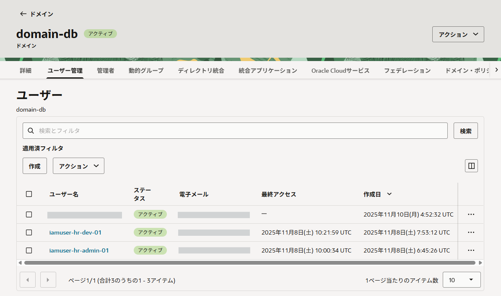
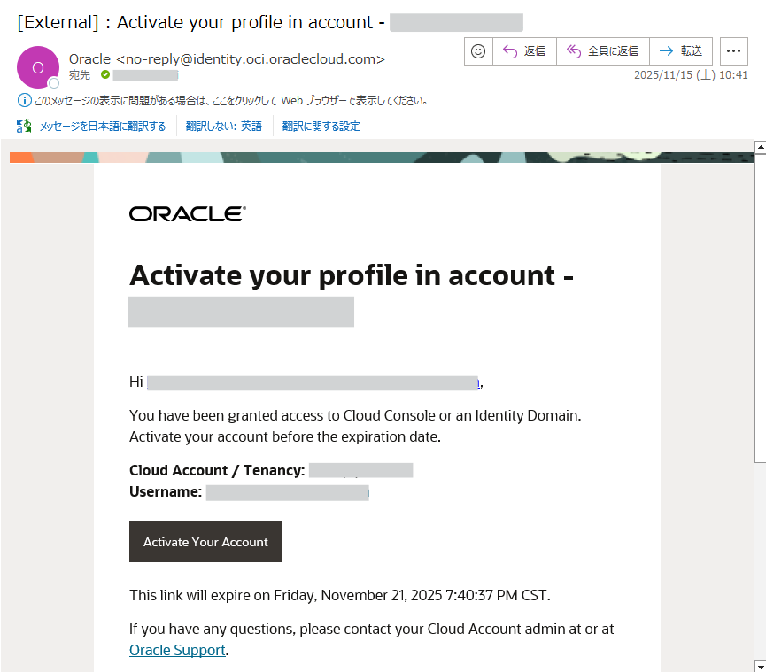
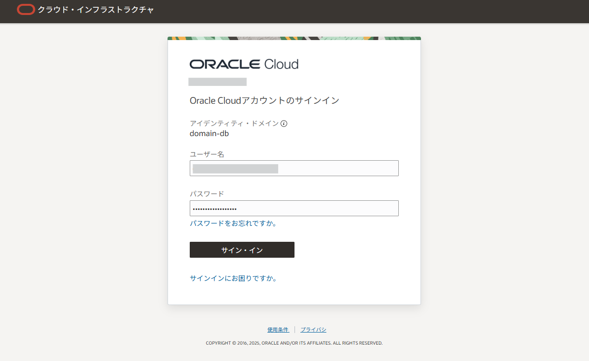
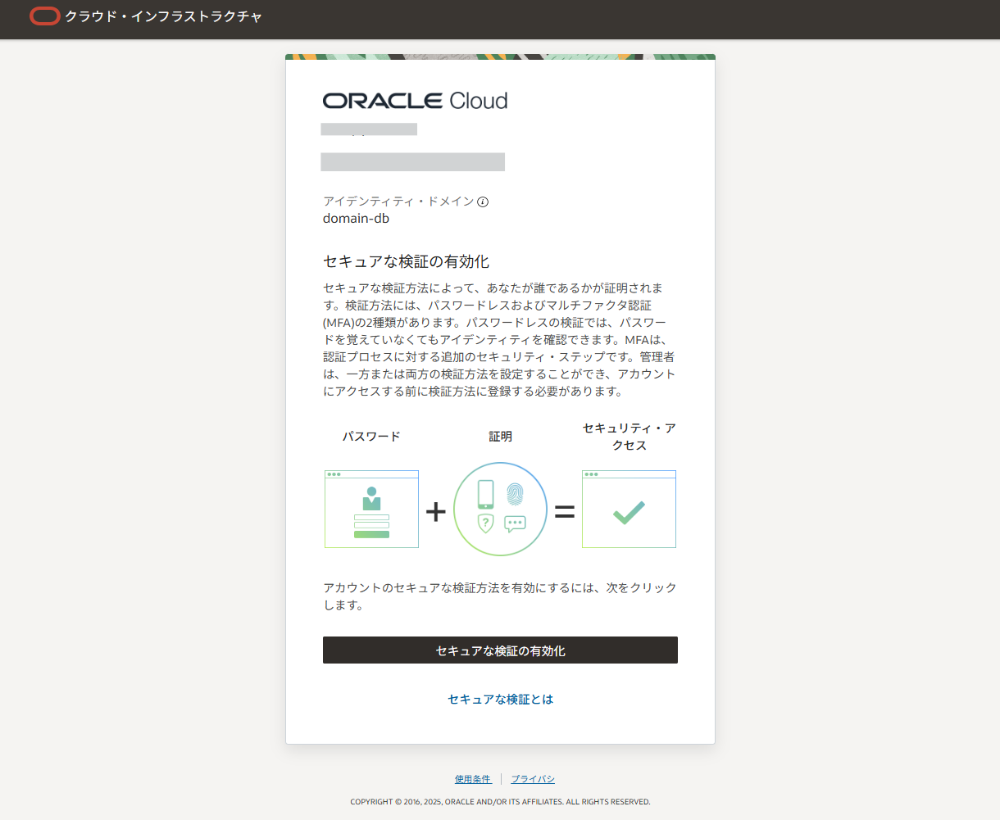
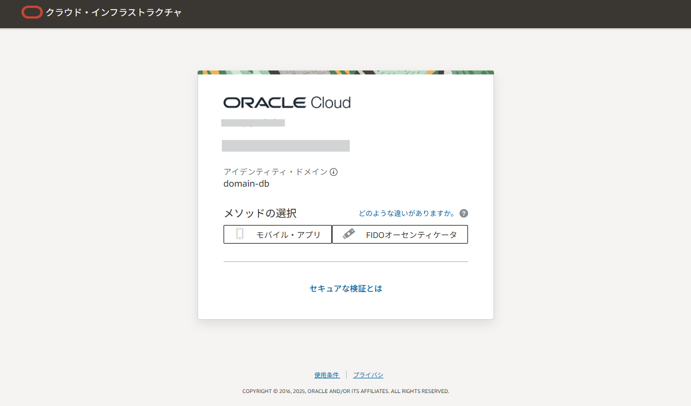
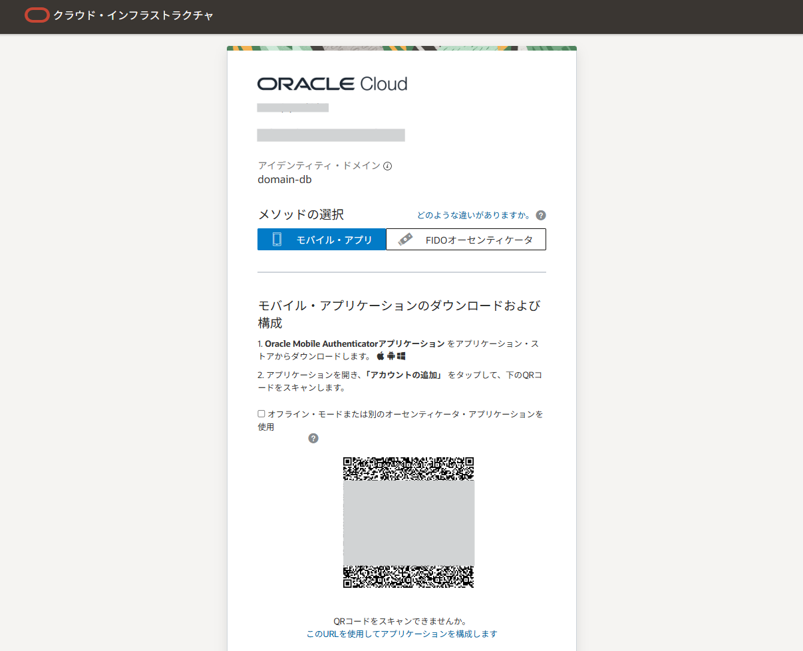
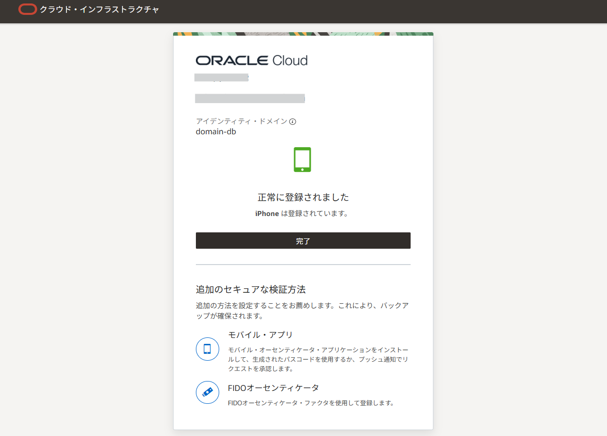

import { Aside } from '@astrojs/starlight/components';
import iamLoginPush from '../../images/iam-login-push-mobile.png';

このセクションでは、DBユーザーを用意し、OMAプッシュ通知を使った多要素認証（MFA）で接続できることを確認します。

> **実施内容**
> - DBユーザーを作成し、OMAプッシュ要素を設定する
> - 必要に応じてIAM側のユーザー有効化とOMA登録を行う
> - 接続してOMAプッシュが要求されることを確認する

## 2-1. DBユーザーの作成とOMAプッシュ要素の設定

PDBに接続して作業します。sysdbaで接続し、対象PDBへ切り替えます。

```sql title="[CDB] SYS（sysdba）"
$ sql / as sysdba

SQL> show pdbs
CON_ID CON_NAME    OPEN MODE  RESTRICTED 
______ ___________ __________ __________ 
    2 PDB$SEED    READ ONLY  NO         
    3 DB1110_PDB1 READ WRITE NO         

SQL> alter session set container=DB1110_PDB1;
Session altered.

SQL> show con_name
CON_NAME 
------------------------------
DB1110_PDB1
```

ユーザー作成時に、OMAプッシュ要素としてメールアドレスを指定します。

```
create user dbuser_mfa_oma identified by <password> and factor 'OMA_PUSH' as 'mail@example.com';

grant create session to dbuser_mfa_oma;
```

```sql title="[PDB] SYS（sysdba）"
SQL> create user if not exists DBUSER_MFA_OMA identified by <password> and FACTOR 'OMA_PUSH' as 'mail@example.com';

Error starting at line : 1 in command -
create user if not exists DBUSER_MFA_OMA identified by <password> and FACTOR 'OMA_PUSH' as 'mail@example.com'
Error report -
ORA-28470: Failure to enroll the user for Oracle Mobile Authenticator (OMA) Push Notification
Help: https://docs.oracle.com/error-help/db/ora-28470/
```

<Aside type="note">
既存ユーザーへMFA要素を追加する場合は ALTER USER を使用し、以下のコマンドを実行します。
```
ALTER USER <user> ADD FACTOR 'OMA_PUSH' AS '<user.name@email.com>';
```
</Aside>

初回登録時、Identity Domain 側のユーザーが未作成/未有効化などの状態だと、作成が失敗して次のエラーになることがあります。
```
ORA-28470: Failure to enroll the user for Oracle Mobile Authenticator (OMA) Push Notification
```
その場合、メールアドレス宛に送られる案内に従って、Identity Domain 側のユーザーのアクティベーションと OMAの登録を完了させます。



届いたメールに記載のあるリンクをクリックし、パスワードを設定した後、Authenticatorを設定します。














Identity Domainのユーザーを無事有効化できたら、まだDBユーザーは作成されていませんので再度DBユーザーを作成のコマンドを実行します。この際、接続権限も与えておきます。

```
create user if not exists DBUSER_MFA_OMA identified by <password> and FACTOR 'OMA_PUSH' as '<user.name@email.com>';

grant create session to DBUSER_MFA_OMA;
```


## 2-2. 接続を試す

準備ができたら、MFAが有効なユーザーで接続します。接続時に OMA アプリへプッシュ通知が届くので、端末側で許可すると接続できます。
<p style="display: flex; justify-content: center;">
  
</p>

```sql
SQL> conn DBUSER_MFA_OMA/<password>@basedb26ai.dbprisbnt.koivcnsydpoc.oraclevcn.com:1521/DB1110_pdb1.dbprisbnt.koivcnsydpoc.oraclevcn.com
Connected.

SQL> show user
USER is "DBUSER_MFA_OMA"
```

パスワードに加えてOMAプッシュ通知による第二の要素が要求され、接続できることを確認できれば完了です。

以上でMFAによる接続のチュートリアルは終了です。