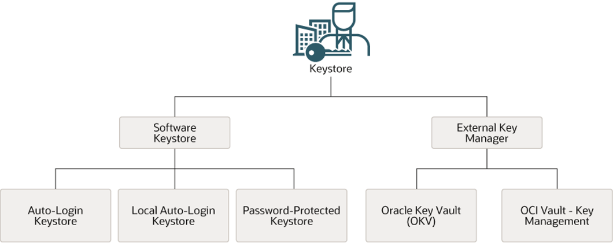

import { LinkCard } from '@astrojs/starlight/components';

> **実施内容**
> - TDEに関連する初期化パラメータを設定する
> - Keystore（ウォレット）およびTDEマスター暗号鍵を作成する

## 1-1. 初期化パラメータの設定

TDEに関連するパラメータの設定を行っていきます。なお、各パラメータの詳細については、以下ページも参照ください。

<LinkCard title="TDEに関連する初期化パラメータ" href="../../initialization-parameters"/>


### wallet_root

TDEで使用されるマスター暗号鍵は、OS上のファイル（12c以降は Keystore と呼ばれる）として保存されます。
`wallet_root`は、このKeystore（ウォレット）を格納するルートディレクトリを指定します。

`wallet_root` に指定するディレクトリは任意の場所に指定できますが、事前に存在するディレクトリを用意し、oracleユーザーが読み書きできる権限にしておくのが確実です。（用意がなくとも初期化パラメータの設定時に作成されますので、操作は必須ではありません）
ディレクトリはここでは `/opt/oracle/admin/FREE/wallet` を指定します。

`wallet_root` は静的パラメータのため、SPFILEに設定後に再起動します。

CDBに接続し、以下のコマンドでパラメータを設定します。PDBから実行はできませんので、CDBから実行を行ってください。

```sql title="[CDB] SYSユーザー"
-- パラメータを設定
SQL> alter system set wallet_root='/opt/oracle/admin/FREE/wallet' scope=spfile;

-- 静的パラメータのため、再起動するまでは反映されない
SQL> select inst_id, name, value, issys_modifiable from gv$parameter where name = 'wallet_root';

   INST_ID NAME           VALUE    ISSYS_MODIFIABLE
__________ ______________ ________ ___________________
         1 wallet_root             FALSE

-- 再起動
SQL> shutdown immediate
SQL> startup

-- 再起動後、設定が反映されている
SQL> select inst_id, name, value, issys_modifiable from gv$parameter where name = 'wallet_root';

   INST_ID NAME           VALUE                            ISSYS_MODIFIABLE
__________ ______________ ________________________________ ___________________
         1 wallet_root    /opt/oracle/admin/FREE/wallet    FALSE
```


### `tde_configuration`

`tde_configuration` はTDEで使用される Keystore の種類を設定します。

`tde_configuration` は、TDEで使用するKeystoreの種類（FILE/Oracle Key Vaultなど）や、統一モードまたは分離モードの前提となる設定に関わります。19cからは分離モードがサポートされ、PDBごとに固有の Keystore を使用できるようになりました。

このパラメータはルートコンテナ（CDB$ROOT）に対して設定し、統一モードのPDBはその値を継承します（分離PDBは個別設定が可能）。

サポートされる Keystore は以下の通りです。



有効化すると設定した値によって `wallet_root` 配下に以下のディレクトリが作成されます。そのため、このパラメータ設定のためには `wallet_root` を先に有効にしておく必要があります。

| 方式 | 作成されるディレクトリ |
|---|---|
| FILE | `<wallet_root>/tde` |
| Oracle Key Vault | `<wallet_root>/okv` |

> 参考リンク：[26ai - TDE_CONFIGURATION](https://docs.oracle.com/cd/G47991_01/refrn/TDE_CONFIGURATION.html)

今回はデモのため、DBサーバー上の FILE Keystore を使用します。

```sql title="[CDB] SYSユーザー"
-- パラメータを設定
SQL> alter system set tde_configuration='keystore_configuration=file' scope=both;

-- すぐに反映されている
SQL> select inst_id, name , value , issys_modifiable from gv$parameter where name = 'tde_configuration';

   INST_ID NAME                 VALUE                          ISSYS_MODIFIABLE
__________ ____________________ ______________________________ ___________________
         1 tde_configuration    keystore_configuration=file    IMMEDIATE

-- 現在では Keystore は認識されていない
SQL> select * from v$encryption_wallet;

WRL_TYPE    WRL_PARAMETER                         STATUS           WALLET_TYPE    WALLET_ORDER    KEYSTORE_MODE    FULLY_BACKED_UP       CON_ID
___________ _____________________________________ ________________ ______________ _______________ ________________ __________________ _________
FILE        /opt/oracle/admin/FREE/wallet/tde/    NOT_AVAILABLE    UNKNOWN        SINGLE          NONE             UNDEFINED                  1
FILE                                              NOT_AVAILABLE    UNKNOWN        SINGLE          UNITED           UNDEFINED                  2
FILE                                              NOT_AVAILABLE    UNKNOWN        SINGLE          UNITED           UNDEFINED                  3
```

CDB$ROOTで `tde_configuration` を設定すると、統一（united）PDBは基本的に値を継承します。


##  1-2. Keystore の作成

暗号化鍵を格納するための Keystore を作成します。 Keystoreおよびキー管理には SYSKM（または `ADMINISTER KEY MANAGEMENT` 権限）が必要です。
以下の操作は SYS ユーザーでも可能ですが、Keystore 操作の専用ユーザーとして SYSKM ユーザーも用意されているため、ここでは SYSKM ユーザーを使用します。

以下のコマンドで Keystore を作成します。デフォルトではPKCS#12ベースのキーストレージファイルに保存されます。  

> 参考リンク：[26ai - ADMINISTER KEY MANAGEMENT](https://docs.oracle.com/en/database/oracle/oracle-database/26/sqlrf/ADMINISTER-KEY-MANAGEMENT.html)

```sql title="[CDB] SYSKMユーザー or SYSユーザー"
-- SYSKMユーザーで接続
SQL> conn / as syskm
Connected.
SQL> show con_name user
CON_NAME
------------------------------
CDB$ROOT
USER is "SYSKM"

-- Keystore を作成
SQL> administer key management create keystore identified by <password>;
```

この操作により、`wallet_root` 配下に `tde` ディレクトリが作成され、その中にパスワードウォレット `ewallet.p12` が作成されます。

```shell
$ tree /opt/oracle/admin/FREE/wallet
/opt/oracle/admin/FREE/wallet
└── tde
    └── ewallet.p12

1 directory, 1 file
```

作成された Keystore は `orapki` コマンドから中身を確認することもできます。

```sql
-- orapki コマンドで確認
SQL> !orapki wallet display -wallet /opt/oracle/admin/FREE/wallet/tde -pwd "<password>" -details
Oracle PKI Tool Release 23.0.0.0.0 - Production
Version 23.0.0.0.0
Copyright (c) 2004, 2026, Oracle and/or its affiliates. All rights reserved.

=======================
Requested Certificates:
=======================
-------------------------
Requested Certificate [1]
-------------------------
Subject:        CN=oracle
=============================
Oracle Secret Store entries:
=============================
ORACLE.SECURITY.ID.ENCRYPTION.
ORACLE.SECURITY.KB.ENCRYPTION.
```

また、データベースから Keystore が正しく認識されていることが `V$ENCRYPTION_WALLET`ビューからも確認することができます。

```sql title="[CDB] SYSユーザー"
SQL> select * from v$encryption_wallet;

WRL_TYPE    WRL_PARAMETER                         STATUS    WALLET_TYPE    WALLET_ORDER    KEYSTORE_MODE    FULLY_BACKED_UP       CON_ID
___________ _____________________________________ _________ ______________ _______________ ________________ __________________ _________
FILE        /opt/oracle/admin/FREE/wallet/tde/    CLOSED    UNKNOWN        SINGLE          NONE             UNDEFINED                  1
FILE                                              CLOSED    UNKNOWN        SINGLE          UNITED           UNDEFINED                  2
FILE                                              CLOSED    UNKNOWN        SINGLE          UNITED           UNDEFINED                  3
```

上記の結果からわかる通り、 作成直後は Keystore の `STATUS=CLOSED` となっています。この状態では Keystore は使用できませんので、次のコマンドにて Keystore を `OPEN` にします。

```sql title="[CDB] SYSユーザー" "OPEN_NO_MASTER_KEY"
SQL> administer key management set keystore open identified by <password> container=current;

Key MANAGEMENT succeeded.

SQL> select * from v$encryption_wallet;

WRL_TYPE    WRL_PARAMETER                         STATUS                WALLET_TYPE    WALLET_ORDER    KEYSTORE_MODE    FULLY_BACKED_UP       CON_ID
___________ _____________________________________ _____________________ ______________ _______________ ________________ __________________ _________
FILE        /opt/oracle/admin/FREE/wallet/tde/    OPEN_NO_MASTER_KEY    PASSWORD       SINGLE          NONE             UNDEFINED                  1
FILE                                              CLOSED                UNKNOWN        SINGLE          UNITED           UNDEFINED                  2
FILE                                              CLOSED                UNKNOWN        SINGLE          UNITED           UNDEFINED                  3
```

`STATUS` が `OPEN_NO_MASTER_KEY` になっていれば「Keystoreは開いたが、マスター暗号鍵がまだ無い」状態です。


## 1-3. CDBのマスター暗号鍵の作成

KeystoreをOPENしただけでマスター暗号鍵は存在しない状態です。

```sql title="[CDB] SYSKMユーザー or SYSユーザー"
SQL> select * from v$encryption_keys;

no rows selected
```

そのため、続く手順にてマスター暗号鍵を作成します。今回はCDB、PDBを一括で暗号化するために"統一モード"で鍵を作成します。
統一モードでは、CDBおよび（統一モードの）PDBのキーは共通のKeystoreに格納されることになります。

まずはCDBのKeystoreをオープンします。

> 参考リンク：[26ai - 統一モードでのキーストアおよびTDEマスター暗号化キーの管理](https://docs.oracle.com/cd/E96517_01/asoag/managing-keystores-encryption-keys-in-united-mode.html)

```sql title="[CDB] SYSKMユーザー or SYSユーザー"
SQL> administer key management set key using tag 'v1.0_MEK' identified by <password> with backup container=current;
```
- `USING TAG` は省略可能ですが、ローテーション管理のため付与が推奨されます。
- `WITH BACKUP` により、`ewallet_YYYYMMDD...p12` のようなバックアップが作成されます。
- また、今回は使用していませんが、`force keystore`句でオープンしていないkeystoreに対して作成することができます。

バックアップが作成され、新しいkeystoreが作成されていることを確認します。
```shell
# 作成されたファイルを確認
[oracle@db-tut tde]$ ls -l
total 8
-rw-------. 1 oracle oinstall 2563 Feb  9 04:12 ewallet_2026020904125329.p12
-rw-------. 1 oracle oinstall 4003 Feb  9 04:12 ewallet.p12
-rw-------. 1 oracle oinstall    0 Feb  9 04:08 ewallet.p12.lck

# orapkiコマンドで確認
[oracle@db-tut tde]$ orapki wallet display -wallet /opt/oracle/admin/FREE/wallet/tde -pwd "<password>" -details
Oracle PKI Tool Release 23.0.0.0.0 - Production
Version 23.0.0.0.0
Copyright (c) 2004, 2026, Oracle and/or its affiliates. All rights reserved.

=======================
Requested Certificates:
=======================
-------------------------
Requested Certificate [1]
-------------------------
Subject:        CN=oracle
=============================
Oracle Secret Store entries:
=============================
ORACLE.SECURITY.DB.ENCRYPTION.AYR7Rvt8DE8qhEm4JlOxDVwAAAAAAAAAAAAAAAAAAAAAAAAAAAAA
ORACLE.SECURITY.ID.ENCRYPTION.
ORACLE.SECURITY.KB.ENCRYPTION.
ORACLE.SECURITY.KM.ENCRYPTION.AYR7Rvt8DE8qhEm4JlOxDVwAAAAAAAAAAAAAAAAAAAAAAAAAAAAA
ORACLE.SECURITY.KT.ENCRYPTION.AYR7Rvt8DE8qhEm4JlOxDVwAAAAAAAAAAAAAAAAAAAAAAAAAAAAA
```

一方、データベースからも認識されていることを確認できます。

```sql title="[CDB] SYSユーザー"
SQL> select * from v$encryption_wallet;

WRL_TYPE    WRL_PARAMETER                         STATUS    WALLET_TYPE    WALLET_ORDER    KEYSTORE_MODE    FULLY_BACKED_UP       CON_ID
___________ _____________________________________ _________ ______________ _______________ ________________ __________________ _________
FILE        /opt/oracle/admin/FREE/wallet/tde/    OPEN      PASSWORD       SINGLE          NONE             NO                         1
FILE                                              CLOSED    UNKNOWN        SINGLE          UNITED           UNDEFINED                  2
FILE                                              CLOSED    UNKNOWN        SINGLE          UNITED           UNDEFINED                  3

SQL> select key_id, tag, creation_time, activation_time, key_use, keystore_type, origin, backed_up, algorithm, con_id from v$encryption_keys order by activation_time desc;

KEY_ID                                                  TAG         CREATION_TIME                          ACTIVATION_TIME                        KEY_USE       KEYSTORE_TYPE        ORIGIN    BACKED_UP    ALGORITHM       CON_ID
_______________________________________________________ ___________ ______________________________________ ______________________________________ _____________ ____________________ _________ ____________ ____________ _________
AYR7Rvt8DE8qhEm4JlOxDVwAAAAAAAAAAAAAAAAAAAAAAAAAAAAA    v1.0_MEK    09-FEB-26 04.12.53.307377000 AM GMT    09-FEB-26 04.12.53.307379000 AM GMT    TDE IN PDB    SOFTWARE KEYSTORE    LOCAL     NO           AES256               1
```


## 1-4. PDBのマスター暗号鍵作成

PDB側でも同様に、そのPDBのマスター暗号鍵を作成します。統一モードのため、キーは共通のKeystoreに格納されます。

```sql title="[PDB] SYSユーザー"
-- PDBに接続を切り替え
SQL> alter session set container=freepdb1;
SQL> show con_name
CON_NAME
------------------------------
FREEPDB1

-- PDBでウォレットの状態を確認
SQL> select * from v$encryption_wallet;

WRL_TYPE    WRL_PARAMETER    STATUS    WALLET_TYPE    WALLET_ORDER    KEYSTORE_MODE    FULLY_BACKED_UP       CON_ID
___________ ________________ _________ ______________ _______________ ________________ __________________ _________
FILE                         CLOSED    UNKNOWN        SINGLE          UNITED           UNDEFINED                  3

-- PDBでマスター暗号鍵を認識しているか確認
SQL> select * from v$encryption_keys;

no rows selected
```

PDB のマスター暗号鍵を作成します。（以下の実行ではSYSユーザーを使用しています）
今回のように、Keystore が閉じている場合でも、`FORCE KEYSTORE`句を付けることにより「閉じているKeystoreに対しても操作可能」になります。

```sql title="[PDB] SYSユーザー"
SQL> administer key management set key using tag 'v1.1_MEK' force keystore identified by <password> with backup container=current;

Key MANAGEMENT succeeded.
```

作成されたことを確認します。

```sql title="[PDB] SYSユーザー"
SQL> select * from v$encryption_wallet;

WRL_TYPE    WRL_PARAMETER    STATUS    WALLET_TYPE    WALLET_ORDER    KEYSTORE_MODE    FULLY_BACKED_UP       CON_ID
___________ ________________ _________ ______________ _______________ ________________ __________________ _________
FILE                         OPEN      PASSWORD       SINGLE          UNITED           NO                         3

SQL> select key_id, tag, creation_time, activation_time, key_use, keystore_type, origin, backed_up, algorithm, con_id from v$encryption_keys order by activation_time desc;

KEY_ID                                                  TAG         CREATION_TIME                          ACTIVATION_TIME                        KEY_USE       KEYSTORE_TYPE        ORIGIN    BACKED_UP    ALGORITHM       CON_ID
_______________________________________________________ ___________ ______________________________________ ______________________________________ _____________ ____________________ _________ ____________ ____________ _________
ASYVqAGBX0NTmukahQkZd2UAAAAAAAAAAAAAAAAAAAAAAAAAAAAA    v1.1_MEK    09-FEB-26 04.28.05.780650000 AM GMT    09-FEB-26 04.28.05.780652000 AM GMT    TDE IN PDB    SOFTWARE KEYSTORE    LOCAL     NO           AES256               3
```

これでPDBのマスター暗号鍵も作成されました。

`orapki`コマンドからもウォレットに鍵が作成されたことが確認できます。

```shell
[oracle@db-tut tde]$ orapki wallet display -wallet /opt/oracle/admin/FREE/wallet/tde -pwd "<password>" -details
Oracle PKI Tool Release 23.0.0.0.0 - Production
Version 23.0.0.0.0
Copyright (c) 2004, 2026, Oracle and/or its affiliates. All rights reserved.

=======================
Requested Certificates:
=======================
-------------------------
Requested Certificate [1]
-------------------------
Subject:        CN=oracle
=============================
Oracle Secret Store entries:
=============================
ORACLE.SECURITY.DB.ENCRYPTION.ASYVqAGBX0NTmukahQkZd2UAAAAAAAAAAAAAAAAAAAAAAAAAAAAA
ORACLE.SECURITY.DB.ENCRYPTION.AYR7Rvt8DE8qhEm4JlOxDVwAAAAAAAAAAAAAAAAAAAAAAAAAAAAA
ORACLE.SECURITY.ID.ENCRYPTION.
ORACLE.SECURITY.KB.ENCRYPTION.
ORACLE.SECURITY.KM.ENCRYPTION.ASYVqAGBX0NTmukahQkZd2UAAAAAAAAAAAAAAAAAAAAAAAAAAAAA
ORACLE.SECURITY.KM.ENCRYPTION.AYR7Rvt8DE8qhEm4JlOxDVwAAAAAAAAAAAAAAAAAAAAAAAAAAAAA
ORACLE.SECURITY.KT.ENCRYPTION.ASYVqAGBX0NTmukahQkZd2UAAAAAAAAAAAAAAAAAAAAAAAAAAAAA
ORACLE.SECURITY.KT.ENCRYPTION.AYR7Rvt8DE8qhEm4JlOxDVwAAAAAAAAAAAAAAAAAAAAAAAAAAAAA
```

これでTDEの事前準備（パラメータ設定、Keystore作成、CDB/PDBのマスター暗号鍵作成）が完了しました。
次の手順から、実際に表領域暗号化を行います。


## 参考リンク

- [26ai - V$ENCRYPTION_WALLET](https://docs.oracle.com/en/database/oracle/oracle-database/26/refrn/V-ENCRYPTION_WALLET.html) — ウォレットの状態とTDEウォレットの場所に関する情報を表示
- [26ai - V$ENCRYPTION_KEYS](https://docs.oracle.com/en/database/oracle/oracle-database/26/refrn/V-ENCRYPTION_KEYS.html) — マスターキーの説明属性を表示
