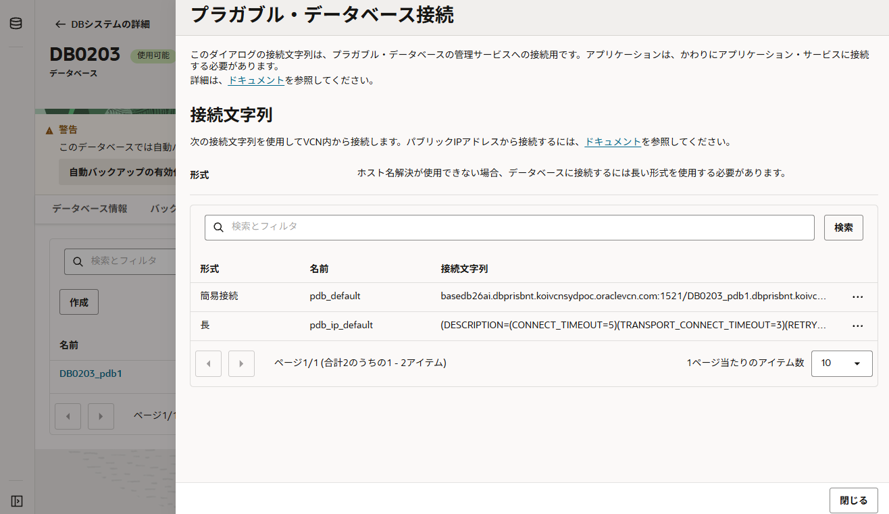

import { LinkButton } from '@astrojs/starlight/components';

Oracle Database 26ai FREE を準備したら、そのDatabaseに接続するためのクライアントを準備します。
26ai FREEをインストールし環境変数をセットした時点で、DBホストにはSQL\*Plusが用意されているため、以下のコマンドでも接続することができます。
```
sqlplus / as sysdba
```

ここでは、SQL*Plusではなく、SQLclのインストール及び、リモートで接続する際の準備を示します。

## SQLcl のインストール

簡易なDatabaseクライアントには、SQL\*Plus の他に「Oracle SQL Developer Command-Line (SQLcl)」というものがあります。
SQL\*Plusと比べ、tabによる保管や移動キーによるカーソルの移動、結果の整形などかゆいところに手が届く機能を持ちます。このサイトでは結果の例としてSQLclを主に使います。


このSQLclの動作のためにはjava 11以降のバージョンが必要ですが、Oracle Linuxの場合は標準リポジトリに含まれるOracle Developer Tools内に含まれていますので、以下コマンドだけで準備ができます。
別ホストからリモートで接続する際

```
dnf install -y java-21-openjdk-headless sqlcl
```

また、ZIPを使ってダウンロードすることもできます。その際は以下のリンクからダウンロードすることができます。

<LinkButton
  href="https://www.oracle.com/database/sqldeveloper/technologies/sqlcl/download/"
  variant="minimal"
  icon="external"
  iconPlacement="start"
>
  ダウンロードサイト：SQLcl Downloads
</LinkButton>

`dnf`を使ってインストールした場合、`sql`コマンドで起動することが可能です。接続先情報については後述します。

```shell
[opc@inst-db ~]$ sql /nolog

SQLcl: Release 25.4 Production on Wed Feb 04 06:28:29 2026

Copyright (c) 1982, 2026, Oracle.  All rights reserved.

SQL> exit
```

zipを使ってインストールした場合、解凍の後 `/sqlcl/bin/sql` に実行ファイルがあります。必要に応じてパスを通してください。
```
export PATH=`pwd`/sqlcl/bin:$PATH
```

## 接続先情報について

Oracle Database では接続先の指定方法に３つの方法があります。
- 簡易接続
- 


### 簡易接続 EZCONNECT

データベースのホスト名およびポート、サービス名を指定してデータベースに接続します。
構文は以下の通りです。

```
CONNECT username/password@host[:port][/service_name][:server_type][/instance_name]
```

さらに単純化すると以下のコマンドのみで接続することが可能です。
- CDBへの接続: `host[:port]`
- PDBへの接続: `host[:port]/service_name`

```shell: title="CDB接続例"
[opc@inst-db ~]$ sql system/<password>@localhost:1521

SQLcl: Release 25.4 Production on Wed Feb 04 06:47:51 2026
...
SQL> sho con_name
CON_NAME
------------------------------
CDB$ROOT
```

```shell: title="PDB接続例"
[opc@inst-db ~]$ sql system/<password>@localhost/freepdb1:1521

SQLcl: Release 25.4 Production on Wed Feb 04 06:48:52 2026

Copyright (c) 1982, 2026, Oracle.  All rights reserved.

Last Successful login time: Wed Feb 04 2026 06:48:53 +00:00

Connected to:
Oracle AI Database 26ai Free Release 23.26.1.0.0 - Develop, Learn, and Run for Free
Version 23.26.1.0.0

SQL> sho con_name
CON_NAME
------------------------------
FREEPDB1
```


### tnsnames
接続情報をエイリアスとして登録し、接続する際はそれを指定する方法です。接続の際に以下のように指定します。
```
CONNECT username@tns_alias
```

このエイリアスは `tnsnames.ora` というファイル名に保存します。DBホストの場合、`$ORACLE_HOME/network/admin/tnsnames.ora` 該当ファイルは配置されています。サンプルとして参考にするとよいと思います。

また、記法のサンプルは以下ドキュメントにも記載があります。

https://docs.oracle.com/cd/G47991_01/netag/examples-easy-connect-naming-method.html

Base Database Serviceの場合、この接続記述子はコンソールから簡単に取得することができます。


別ホストでは好きな場所に `tnsnames.ora` を作成し、環境変数`$TNS_NAME`で配置したディレクトリを指定することで使用することができます。

## 参考リンク
https://docs.oracle.com/cd/G47991_01/netag/connecting-database.html