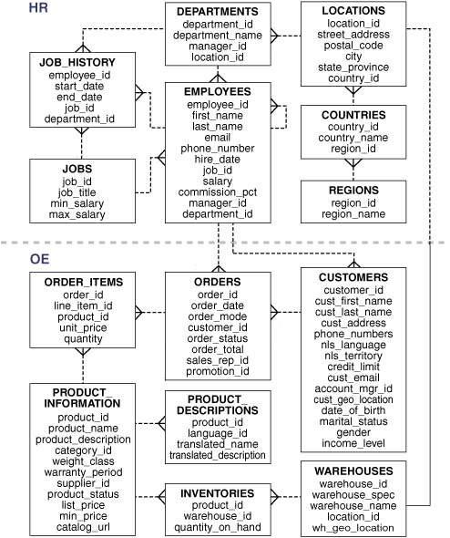

このページでは、サンプルスキーマ（HR）のダウンロード・インストール手順を解説します。

## 実施内容
- サンプルスキーマ（HR）を作成する

### サンプルスキーマのダウンロード

このデモではサンプルデータとしてHRスキーマ使用します。

サンプルスキーマは、GitHubで公開されている[こちらのリンク](https://github.com/oracle-samples/db-sample-schemas/archive/refs/tags/v23.3.zip)よりファイルをダウンロードします。
なお、ここではoralleユーザーで実行しています。

> GitHubレポジトリ：https://github.com/oracle-samples/db-sample-schemas

```bash
wget https://github.com/oracle-samples/db-sample-schemas/archive/refs/tags/v23.3.zip
unzip v23.3.zip
```

解凍後、`db-sample-schemas-23.3/human_resources/hr_install.sql` を実行しますので、お手元の環境に合わせてファイル名とパスを確認してください。

サンプルスキーマの詳細については[こちら](https://docs.oracle.com/cd/F82042_01/comsc/schema-diagrams.html)をご参照ください。

### サンプルスキーマを作成する

HRスキーマを作成するために、まずDBに接続します。

```sql
-- PDBにSYSユーザーで接続
[oracle@db-tut ~]$ sql sys/<password>@localhost:1521/freepdb1 as sysdba

-- 現在のコンテナとユーザー名を確認
SQL> show con_name user
CON_NAME
------------------------------
FREEPDB1
USER is "SYS"
```

続いて、先ほどダウンロードした `db-sample-schemas-23.3/human_resources/hr_install.sql` を実行します。

```sql
@/home/oracle/db-sample-schemas-23.3/human_resources/hr_install.sql
```

インストールが開始され、パスワードの入力を求められますので、HRユーザーのパスワードを入力します。
```sql "******************" "<そのままEnter>" "<YESまたはYを入力>"
SQL> @/home/oracle/db-sample-schemas-23.3/human_resources/hr_install.sql

Thank you for installing the Oracle Human Resources Sample Schema.
This installation script will automatically exit your database session
at the end of the installation or if any error is encountered.
The entire installation will be logged into the 'hr_install.log' log file.

Enter a password for the user HR: ******************

USERS
Enter a tablespace for HR [USERS]: <そのままEnter>
Do you want to overwrite the schema, if it already exists? [YES|no]: <YESまたはYを入力>
******  Creating REGIONS table ....

Table REGIONS created.


INDEX REG_ID_PK created.


Table REGIONS altered.

******  Creating COUNTRIES table ....

Table COUNTRIES created.
...
Commit complete.


Installation verification
____________________________
Verification:

Table             provided    actual
______________ ___________ _________
regions                  5         5
countries               25        25
departments             27        27
locations               23        23
employees              107       107
jobs                    19        19
job_history             10        10

Thank you!
___________________________________________________________
The installation of the sample schema is now finished.
Please check the installation verification output above.
You will now be disconnected from the database.
Thank you for using Oracle Database!
Disconnected from Oracle AI Database 26ai Free Release 23.26.1.0.0 - Develop, Learn, and Run for Free
Version 23.26.1.0.0
```

インストールが完了後、結果にも表示がありますが、HRスキーマが正しく作成されていることを確認します。

```sql
select table_name from all_tables where owner = 'HR';
```

結果は以下のようになります。

```sql
SQL> select table_name from all_tables where owner = 'HR';

TABLE_NAME
______________
COUNTRIES
REGIONS
LOCATIONS
DEPARTMENTS
JOBS
EMPLOYEES
JOB_HISTORY

7 rows selected.
```

また、参考までですが、スキーマの構成は以下のようになっています。


